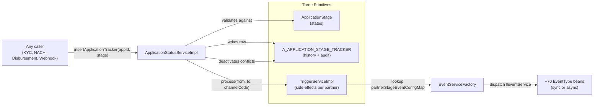
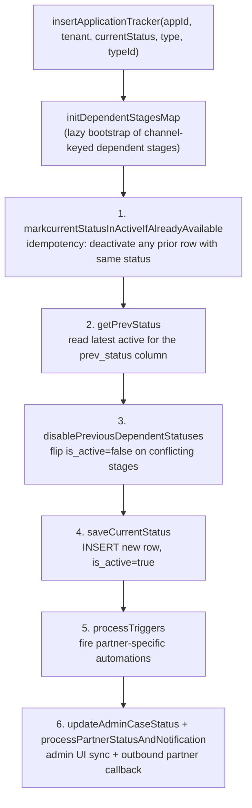
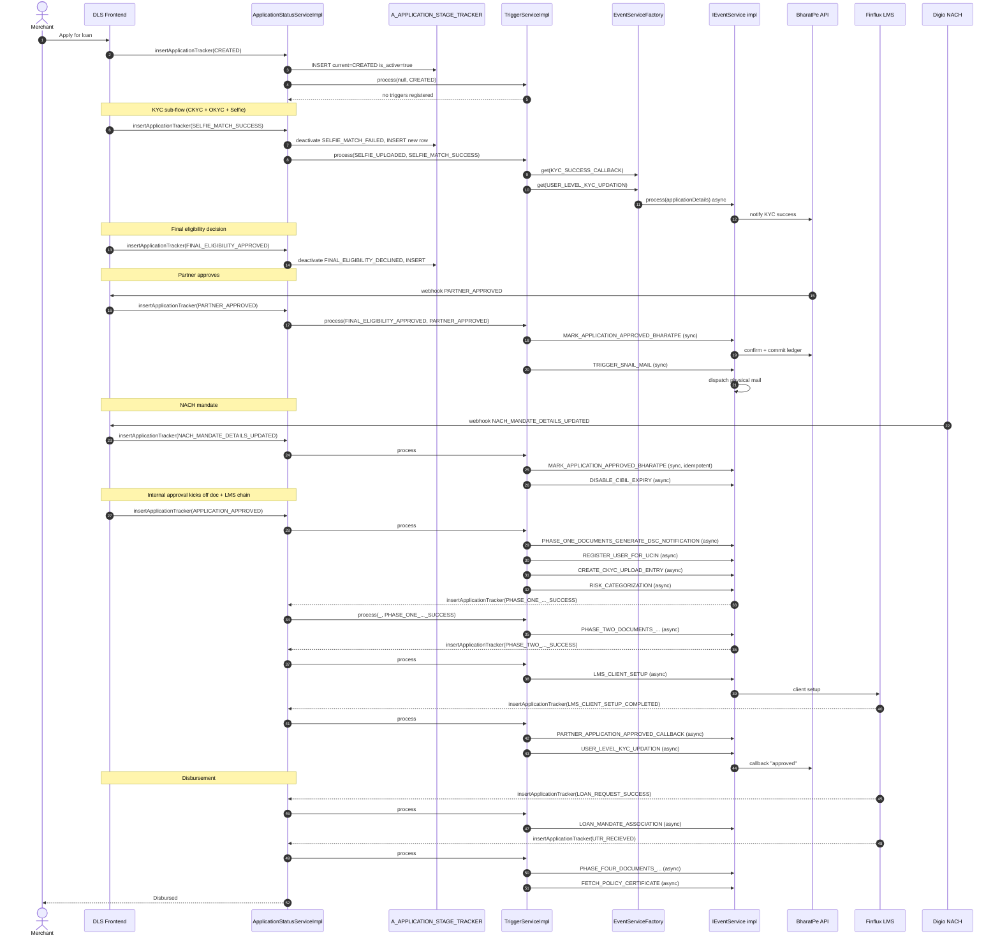
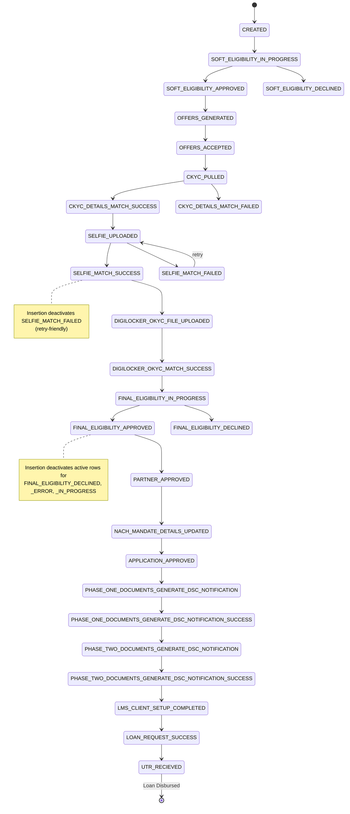

# File 5: State Machine + Merchant Onboarding — Deep Dive

> Audience: senior backend interviewer at Airtel. The state machine is on your resume and partner triggers are how you defend the **30% onboarding-time reduction**. This file is the mock-interview-grade walkthrough — every claim cited to real code in `zipcredit-backend/dgl_base/dgl-status`.
>
> Cross-reference: defensive narrative for "Spring State Machine" in `04-resume-projects-deep-dive.md`. STAR-style "biggest production incident" lives in `03-behavioral-managerial-star-stories.md`.

---

## Defensive Narrative — Read First

Five things you must say in the right shape if pressed. These are the lines that separate "I built it" from "I read about it".

| Probe | Wrong answer | Right answer |
|---|---|---|
| "Is this Spring State Machine?" | Hedge, look unsure | "No. Pragmatic state machine — `ApplicationStage` enum + `A_APPLICATION_STAGE_TRACKER` table + `TriggerServiceImpl`. I deliberately didn't use Spring State Machine because its state-action coupling didn't model partner-specific behaviour cleanly — same target stage means different downstream events for different partners (BharatPe vs PhonePe vs PayU). I needed (a) audit, (b) per-partner config, (c) re-entrancy on superseded callbacks. Three primitives gave me all three without the framework tax." |
| "60+ states sounds like too many" | Apologise / promise to refactor | "It's the actual state space. The enum defines ~280 entries spanning CKYC/OKYC/VKYC sub-flows, NACH (UPI/API/Physical), eligibility, document phases, APV, snail mail, CPV, NSP, GST/FSSAI, Udyam, PSL/risk tagging, and Pan-Aadhaar linkage. Per-channel, the practically-trafficked set is ~60 — that's the number on the resume. Collapsing them would lose audit fidelity that compliance + ops both depend on. Refactor would be UI-side grouping (CATEGORY → STAGE), not enum-side." |
| "Where's the audit trail?" | Mumble about logs | "`A_APPLICATION_STAGE_TRACKER` table — every transition is a new row with `prev_status`, `current_status`, `is_active`, `created_at`, `updated_at`. We never UPDATE existing rows for the status field; we INSERT a new row and flip `is_active=false` on the superseded one. So full history is queryable, partner re-entry is safe, and ops can reconstruct the timeline of any application." |
| "So you didn't enforce all transitions — what kind of state machine is that?" | Defensive | "Selective enforcement. `validateApplicationDetails` checks `from` and `required` preconditions for each event config — that's the strict path for downstream automation. The state recording itself is permissive because real-world callbacks arrive out of order (vendor webhook delays, retries) and we want the audit trail intact even when the trigger validations fail. Permissive recording + strict event-firing is the right split for a vendor-integrated lending pipeline." |
| "Did you build all of this?" | Over-claim | "It evolved over team development. The Meesho and PayU builders were earlier. I owned the trigger map design as it scaled to GPay TL, BharatPe, BharatPe TopUp, PhonePe TopUp, Swiggy EWI, and the NSP company/individual variants — that's where the partner-specific automation drove the 30% reduction. I also owned the dependent-stage deactivation pattern as we added APV, snail mail, and CKYC sub-flows." |

**Rule:** Lead with the "three primitives" framing. Don't get baited into framework debate. If they push on Spring State Machine specifically, pivot: "I evaluated it. Spring SM models states as nodes with single-action edges; we needed N actions per edge keyed by partner. I'd have ended up with N state machines or a wrapper that re-implemented the same dispatch I built natively."

---

## 60-Second Pitch (memorize verbatim)

> "DLS is our loan-application orchestration platform. The state machine is pragmatic — `ApplicationStage` enum with ~280 stages (about 60 trafficked per channel), `A_APPLICATION_STAGE_TRACKER` for audit history, and `TriggerServiceImpl` driven by a `Map<channelCode, Map<targetStage, List<EventConfig>>>` so a new partner's automation is config, not code. Every stage transition flows through `ApplicationStatusServiceImpl.insertApplicationTracker` which deactivates conflicting dependent stages, persists a new tracker row, then fans out partner-specific event services via an `EnumMap`-backed factory — sync for ordering-critical events, async on a bounded executor for everything else. I deliberately chose this over Spring State Machine because its state-action coupling didn't model partner-specific behaviour. The trigger automation cut merchant onboarding time by 30% by replacing manual ops handoffs (LMS setup, document phase generation, partner approval callbacks, CAM report, CKYC upload, snail mail dispatch) with deterministic side-effects on the right stage transitions per partner."

---

## Mental Model — Three Primitives



The pitch line for this diagram: **"states are an enum, transitions are recorded with audit, and side-effects fire from a partner-keyed config map."**

Why this is "pragmatic" not "framework":
- **No DSL** — partner triggers are plain Java builders, reviewable in PR diff.
- **No external library** — only Spring DI + a `HashMap` of `EnumMap` (synchronized for write-once init).
- **Mutation primitive is one method** — `insertApplicationTracker`. There is no second way to change state.
- **Side-effects are explicitly typed** — `EventType` enum + `IEventService` interface, not arbitrary callbacks.

---

## Component Walkthrough

### 4a. `ApplicationStage` enum — the state space

```1:30:/Users/shailender.kumar/Desktop/Cursor-AI/zipcredit-backend/dgl_base/model/src/main/java/com/dgl/common/enums/ApplicationStage.java
package com.dgl.common.enums;

public enum ApplicationStage {
	
    CREATED,
    APPLICANT_DETAIL_UPDATED,
    COMPANY_DETAIL_UPDATED,
    LOAN_DETAIL_UPDATED,
    BANK_DETAIL_UPDATED,
	BANK_DETAIL_VERIFIED_AND_UPDATED,
	BANK_DETAIL_ADDED,

	LOAN_CLOSED,
	LOAN_REJECTED,
	LOAN_OVERPAID,
	LOAN_DECLINED_DEDUPE,
	DROPPED,

	SOFT_ELIGIBILITY_IN_PROGRESS,
    SOFT_ELIGIBILITY_APPROVED,
    SOFT_ELIGIBILITY_DECLINED,
    SOFT_ELIGIBILITY_ERROR,

    OFFERS_GENERATED,
    OFFERS_ACCEPTED,
    OFFERS_DECLINED,
    
	CKYC_PULLED,
	CKYC_FAILED,
```

The enum is grouped by sub-flow:

| Group | Examples | Why a sub-flow |
|---|---|---|
| Lifecycle | `CREATED`, `APPLICANT_DETAIL_UPDATED`, `LOAN_CLOSED`, `DROPPED` | Top-level life cycle markers |
| Eligibility | `SOFT_ELIGIBILITY_*`, `FINAL_ELIGIBILITY_*`, `RE_*` | Two passes of credit eligibility, plus re-eligibility for renewals |
| CKYC (Central KYC) | `CKYC_PULLED`, `CKYC_OTP_*`, `CKYC_DETAILS_MATCH_*`, `CKYC_CUSTOMER_ACCEPTED` | Central KYC registry pull, OTP flow, customer accept/reject |
| OKYC (Aadhaar OKYC) | `OKYC_OTP_*`, `OKYC_DETAILS_MATCH_*`, `DIGILOCKER_OKYC_*` | Aadhaar OTP-based KYC + DigiLocker variant |
| VKYC (Video KYC) | `VKYC_INITIATED`, `VKYC_USER_SCHEDULED`, `VKYC_MANUAL_APPROVED`, `VKYC_SKIPPED` | RBI-mandated video KYC, with skip and manual review paths |
| Document phases | `PHASE_ONE_DOCUMENTS_GENERATE_DSC_NOTIFICATION` (and SUCCESS/FAILURE) × 4 phases | DocuSign-Carrier (DSC) notifications for sanction letter, KFS, MITC/GTC, LOA, post-disbursal docs |
| NACH | `API_MANDATE_*`, `UPI_MANDATE_*`, `PHYSICAL_MANADATE_*`, `NACH_MANDATE_DETAILS_UPDATED` | Three NACH mandate types via Digio |
| APV (Address Proof Verification) | `INITIATE_APV`, `APV_APPROVED`, `APV_DECLINED`, `APV_NULL`, `APV_ERROR`, `APV_INELIGIBLE` | Field investigation address proof; multiple terminal states because outcome can be "not found" |
| Snail mail | `SNAILMAIL_INITIATED`, `SNAILMAIL_APPROVED`, `SNAILMAIL_DECLINED` | Physical mail dispatch for stamp paper / signed documents |
| CPV (Customer Profile Verification) | `CPV_INTIATED`, `CPV_APPROVED`, `CPV_DECLINED`, `CPV_SHOP_*` | Shop verification for merchants (GPay merchant flow) |
| Approval | `APPLICATION_APPROVED`, `APPLICATION_DECLINED`, `PARTNER_APPROVED`, `PARTNER_DECLINED` | Internal approval + partner acknowledgement |
| Loan & Disbursal | `LOAN_REQUEST_SUCCESS`, `LOAN_DISBURSED`, `UTR_RECIEVED` | LMS loan creation, disbursal, UTR (Unique Transaction Reference) confirmation |
| Compliance | `RISK_CATEGORIZATION_*`, `PSL_TAGGING_*`, `BLACKLISTED`, `CKYC_NO_RECORD_FOUND` | RBI risk scoring, Priority Sector Lending tagging |
| Pan-Aadhaar Linkage | `PAN_LINKAGE_TRIGGERED`, `PAN_LINKAGE_APPROVED`, `PAN_LINKAGE_DECLINED`, `PAN_LINKAGE_SKIPPED`, `PAN_LINKAGE_FAILED` | Mandatory linkage check, with skip path for legacy customers |

**Why an enum, not a DB-driven state list?**
- **Compile-time safety** — typo in a stage name fails the build, not at runtime in production.
- **Exhaustive `switch` checking** — IDE warns when a new stage isn't handled.
- **Reviewable in PR** — adding a stage is a code change with a Jira ticket; non-trivial, on purpose.
- **EnumMap perf** — backing maps use `EnumMap<ApplicationStage, ...>` for O(1) array-backed lookup, no hashing.

The tradeoff: adding a stage requires a deploy. Acceptable because new stages are rare (≤1/quarter post-stabilization) and *behaviour* per partner lives in DB-driven config (`channel_code` lists), which IS hot-reloadable.

---

### 4b. `A_APPLICATION_STAGE_TRACKER` — the audit table

```1:9:/Users/shailender.kumar/Desktop/Cursor-AI/zipcredit-backend/dgl_base/rdbms/src/main/scripts/zipcredit/UpgradeScriptV4.5_application_tracker.sql
CREATE TABLE `A_APPLICATION_STAGE_TRACKER` (
  `id` bigint NOT NULL AUTO_INCREMENT ,
  `application_id` varchar(255) NOT NULL,
  `tenant_id` int NOT NULL,
  `prev_status` varchar(255) DEFAULT NULL,
  `current_status` varchar(255) NOT NULL,
  `last_updated_at` varchar(64) DEFAULT NULL,
  PRIMARY KEY (`id`)
) ;
```

The schema evolved with `is_active`, `type`, `type_id`, `created_at`, `updated_at` columns added later — visible in the actual mapper:

```7:13:/Users/shailender.kumar/Desktop/Cursor-AI/zipcredit-backend/dgl_base/rdbms/src/main/resources/ApplicationTrackerMapper.xml
    <insert id='insertApplicationTracker' parameterType='map' useGeneratedKeys='true'>
        INSERT INTO
        A_APPLICATION_STAGE_TRACKER (application_id, tenant_id,prev_status,current_status, type, type_id, is_active, created_at, updated_at)
        VALUES
        (
        #{application_id}, #{tenant_id}, #{prev_status},#{current_status}, #{type}, #{type_id}, #{is_active}, #{created_at}, #{updated_at});
    </insert>
```

Key column semantics:

| Column | Purpose |
|---|---|
| `application_id` | Customer-facing application identifier (string, e.g. `APP-2024-0098765`) |
| `tenant_id` | Multi-tenancy partition — same code base serves multiple lending entities |
| `prev_status` | The stage we were AT just before this insert (denormalised for fast "current chain" reads) |
| `current_status` | The stage we entered |
| `type` | NSP variants: `INDIVIDUAL` or `COMPANY`. Nullable for SP (Sole Proprietorship) flows |
| `type_id` | FK to applicant or company entity — supports co-applicants (Company app has 1 company row + N individual rows tracking together) |
| `is_active` | The flag that makes this an audit table. New row → `true`. Conflicting rows → flipped to `false` on next transition |
| `created_at`, `updated_at` | Trail timestamps |

**Why `is_active` instead of "just keep latest"?**

Three problems the flag solves:

1. **Late callbacks** — vendor webhook for `OKYC_DETAILS_MATCH_SUCCESS` arrives after we already moved to `FINAL_ELIGIBILITY_APPROVED`. We still record the row (audit) but it doesn't override the active state.
2. **Mutually exclusive outcomes** — `FINAL_ELIGIBILITY_APPROVED` and `FINAL_ELIGIBILITY_DECLINED` can't both be active for one application. Inserting one deactivates the other (see dependent stages below).
3. **Re-entry / replay** — if ops re-runs a stage manually (e.g. retry `LMS_CLIENT_SETUP`), the previous `LMS_CLIENT_SETUP_RETRY` row goes inactive and the new attempt starts a fresh trail.

Indexes you'd expect (and that we have):

```sql
-- Latest-active lookup, the hot path
KEY idx_app_tenant_active_updated (application_id, tenant_id, is_active, updated_at)

-- Stage-equality lookups for triggers / status APIs
KEY idx_app_tenant_status (application_id, tenant_id, current_status, is_active)

-- Tenant + stage scans for batch jobs (e.g. all LMS_CLIENT_SETUP_RETRY rows)
KEY idx_tenant_status_active (tenant_id, current_status, is_active)
```

---

### 4c. `insertApplicationTracker` — the orchestrator's heart

This is the **single mutation primitive**. Every stage transition in the entire DLS goes through this method. It's defined in [`ApplicationStatusServiceImpl`](Cursor-AI/zipcredit-backend/dgl_base/dgl-status/src/main/java/com/dgl/status/services/impl/ApplicationStatusServiceImpl.java).

```232:262:/Users/shailender.kumar/Desktop/Cursor-AI/zipcredit-backend/dgl_base/dgl-status/src/main/java/com/dgl/status/services/impl/ApplicationStatusServiceImpl.java
	public boolean insertApplicationTracker(String applicationId, Integer tenantId, ApplicationStage currentStatus, String type, Long typeId) {
		logger.info("Inside insertApplicationTracker service for application_id : {}, application_stage : {}, type : {}, type_id: {}", applicationId, currentStatus, type, typeId);
		type = StringUtils.isNotBlank(type) ? type.toUpperCase() : type;
		if(Objects.isNull(currentStatus)) return false;
		String applicationType = initDependentStagesMap(applicationId, tenantId);
		if(Objects.isNull(applicationType)) return false;

		String uuid = null;
		if(applicationType.equalsIgnoreCase(Constants.COMPANY)){
			if (typeId == null) return false;
			uuid = getUuidByTypeId(type,typeId,applicationId);
			if(uuid == null) return false;
		}

		logger.info("UUID: {} " , uuid);
		try {
			ApplicationBean application = getApplicationDetails(applicationId, tenantId);
            markcurrentStatusInActiveIfAlreadyAvailable(applicationId, tenantId, currentStatus, type, typeId);
            String prevStatus = getPrevStatus(applicationId, tenantId, type, typeId);
			disablePreviousDependentStatuses(applicationId, tenantId, currentStatus, application, type, typeId);
			saveCurrentStatus(applicationId, tenantId, currentStatus, prevStatus, type, typeId);
            logger.info("Processing triggers");
			processTriggers(applicationId, tenantId, currentStatus, prevStatus, type, typeId, uuid);
            if(!Objects.equals(type, Constants.INDIVIDUAL)) updateAdminCaseStatus(applicationId, tenantId, currentStatus);
			processPartnerStatusAndNotification(application,currentStatus);
			return true;
		} catch (Exception e) {
			logger.error("Error in updating application tracker status for application_id {}", applicationId, e);
		}
		return false;
	}
```

**The 6-step flow (memorize this):**



**Step 1 — `markcurrentStatusInActiveIfAlreadyAvailable`** ([`ApplicationStatusServiceImpl.java`](Cursor-AI/zipcredit-backend/dgl_base/dgl-status/src/main/java/com/dgl/status/services/impl/ApplicationStatusServiceImpl.java)):

```436:445:/Users/shailender.kumar/Desktop/Cursor-AI/zipcredit-backend/dgl_base/dgl-status/src/main/java/com/dgl/status/services/impl/ApplicationStatusServiceImpl.java
	private void markcurrentStatusInActiveIfAlreadyAvailable(String applicationId, Integer tenantId, ApplicationStage currentStatus,
															 String type, Long typeId)
			throws SQLException {
		ApplicationTrackerBean trackerBean = applicationTrackerService
				.selectApplicationTrackerLatestByCurrentStatus(applicationId, tenantId,
						String.valueOf(currentStatus), type, typeId);
		if (Objects.nonNull(trackerBean)) {
			applicationTrackerService.update(trackerBean.getId(), false, Date.from(Instant.now()), type, typeId);
		}
	}
```

This handles **re-entry idempotency**. If the same stage is being entered again (retry, replay), the old row is deactivated first so we don't have two active rows for the same stage.

**Step 2 — `getPrevStatus`**:

```448:456:/Users/shailender.kumar/Desktop/Cursor-AI/zipcredit-backend/dgl_base/dgl-status/src/main/java/com/dgl/status/services/impl/ApplicationStatusServiceImpl.java
	private String getPrevStatus(String applicationId, Integer tenantId, String type, Long typeId) throws SQLException {
		ApplicationTrackerBean applicationTrackerBean = applicationTrackerService
				.selectApplicationTrackerLatest(applicationId, tenantId, type, typeId);
		String prevStatus = null;
		if (Objects.nonNull(applicationTrackerBean)) {
			prevStatus = applicationTrackerBean.getCurrent_status();
		}
		return prevStatus;
	}
```

Just denormalises the previous active status into the new row's `prev_status` column. Read-modify-insert pattern; not transactionally locked because the trigger validations downstream will reject inconsistent transitions if any.

**Step 3 — `disablePreviousDependentStatuses`** (the "deactivate conflicts" pass):

```316:326:/Users/shailender.kumar/Desktop/Cursor-AI/zipcredit-backend/dgl_base/dgl-status/src/main/java/com/dgl/status/services/impl/ApplicationStatusServiceImpl.java
	private void disablePreviousDependentStatuses(String applicationId, Integer tenantId,
			ApplicationStage currentStatus, ApplicationBean applicationBean, String type, Long typeId) {
		if(validateIfDependentStateExists(currentStatus, applicationBean)) return;

		List<ApplicationStage> dependentStages = dependentStagesMap.get(applicationBean.getChannel_code()).get(currentStatus);
		List<String> statuses = dependentStages.stream().map(Enum::toString).collect(Collectors.toList());

		if(CollectionUtils.isNotEmpty(statuses))
			applicationTrackerService.updateIsActiveAndUpdatedAtByApplicationIdAndStatusIn(false, Date.from(Instant.now()), applicationId, tenantId, statuses, type, typeId);
	}
```

Single bulk UPDATE: `is_active=false` for all rows whose `current_status IN (dependent stages)` for this application. Examples:
- Inserting `FINAL_ELIGIBILITY_APPROVED` → deactivate active `FINAL_ELIGIBILITY_DECLINED`, `FINAL_ELIGIBILITY_ERROR`, `FINAL_ELIGIBILITY_IN_PROGRESS` rows.
- Inserting `SELFIE_MATCH_SUCCESS` → deactivate `SELFIE_MATCH_FAILED`.
- Inserting `APV_APPROVED` → deactivate `APV_DECLINED`, `APV_NULL`, `APV_ERROR`, `APV_INELIGIBLE`.

**Step 4 — `saveCurrentStatus`**:

```425:433:/Users/shailender.kumar/Desktop/Cursor-AI/zipcredit-backend/dgl_base/dgl-status/src/main/java/com/dgl/status/services/impl/ApplicationStatusServiceImpl.java
	private void saveCurrentStatus(String applicationId, Integer tenantId, ApplicationStage currentStatus,
								   String prevStatus, String type, Long typeId) throws SQLException {
		Date now = Date.from(Instant.now());
		ApplicationTrackerBean applicationTrackerBeanNewRow = new ApplicationTrackerBean(null, applicationId,
				tenantId, prevStatus, String.valueOf(currentStatus), type, typeId,true, now, now);

		applicationTrackerService.insertApplicationTracker(applicationTrackerBeanNewRow);
		logger.info("saving current status {} for applicationId {} type: {} typeId: {} tenantId {} prevStatus {}",currentStatus, applicationId, type, typeId, tenantId, prevStatus);
	}
```

Plain insert. New auto-incremented `id`. `is_active=true`. Done.

**Step 5 — `processTriggers`**:

```411:421:/Users/shailender.kumar/Desktop/Cursor-AI/zipcredit-backend/dgl_base/dgl-status/src/main/java/com/dgl/status/services/impl/ApplicationStatusServiceImpl.java
	private void processTriggers(String applicationId, Integer tenantId, ApplicationStage currentStatus,
								 String prevStatus, String type, Long typeId, String uuid) {

		try {
			logger.info("Inside Process Triggers for stage {}", currentStatus);
			ApplicationStage prevStage = EnumUtils.isValidEnum(ApplicationStage.class, prevStatus) ? ApplicationStage.valueOf(prevStatus) : null;
			triggerService.process(prevStage, currentStatus, applicationId, tenantId, type, typeId, uuid);
		} catch (Exception e) {
			logger.error("Exception in executing trigger for application tracker status {} for application_id {}", currentStatus, applicationId, e);
		}
	}
```

Hands off to `TriggerServiceImpl.process(...)` (covered in 4f). **Try/catch around triggers is intentional** — a trigger failure does NOT invalidate the recorded state. The audit row is already saved by the time we get here. Failed triggers are recoverable via cron sweepers (e.g. `LMS_CLIENT_SETUP_RETRY` is itself a stage that ops/automation can drive).

**Step 6 — `updateAdminCaseStatus` + `processPartnerStatusAndNotification`**:

```264:276:/Users/shailender.kumar/Desktop/Cursor-AI/zipcredit-backend/dgl_base/dgl-status/src/main/java/com/dgl/status/services/impl/ApplicationStatusServiceImpl.java
	public void processPartnerStatusAndNotification(ApplicationBean applicationBean, ApplicationStage currentStage) {

		IPartnerStatusUpdateService partnerService = partnerStateUpdateFactory.getPartnerService(applicationBean.getChannel_code());
		if(Objects.nonNull(partnerService)) {
			CompletableFuture.runAsync(() -> {
				try {
					partnerService.notifyPartner(currentStage, applicationBean);
				} catch (Exception e) {
					logger.error("[NotifyPartner] Error occurred in stage mapping or notification for stage {}, applicationId {}", currentStage, applicationBean.getApplication_id());
				}
			}, partnerNotificationExecutor);
		}
}
```

Async fire-and-forget on a dedicated `partnerNotificationExecutor` (ThreadPoolTaskExecutor). The admin case status update reads a per-channel mapping from `CASE_STATUS_STATE_MAPPER` config and writes a denormalised case status to the `application` table for ops UI.

---

### 4d. Dependent Stages Map — partner-specific mutual exclusion

Built once per channel via lazy double-checked init:

```145:163:/Users/shailender.kumar/Desktop/Cursor-AI/zipcredit-backend/dgl_base/dgl-status/src/main/java/com/dgl/status/services/impl/ApplicationStatusServiceImpl.java
	private void initSpDependentStagesMap(Integer tenantId) {
		if (dependentStagesMap.isEmpty()) {
			synchronized (this) {
				if (dependentStagesMap.isEmpty()) {
					getDependentStageList(tenantId).forEach(dependentStage -> {
						Map<ApplicationStage, List<ApplicationStage>> dependentStageChannelMap = dependentStagesMap
								.getOrDefault(dependentStage.getChannelCode(), new EnumMap<>(ApplicationStage.class));

						List<ApplicationStage> dependentStageList = dependentStageChannelMap.
								getOrDefault(dependentStage.getApplicationStage(), new ArrayList<>());

						dependentStageList.addAll(dependentStage.getDependentStages());
						dependentStageChannelMap.put(dependentStage.getApplicationStage(), dependentStageList);
						dependentStagesMap.put(dependentStage.getChannelCode(), dependentStageChannelMap);
					});
				}
			}
		}
	}
```

Shape: `Map<String channelCode, Map<ApplicationStage, List<ApplicationStage>>>`.

Each partner has its own builder (`getMeeshoDependentStageList`, `getPhonePeDependentStageList`, etc.) that registers mutual-exclusion rules.

The CKYC group is the densest — `setCKYCDependentStages` covers 14 mutual-exclusion rules:

```780:832:/Users/shailender.kumar/Desktop/Cursor-AI/zipcredit-backend/dgl_base/dgl-status/src/main/java/com/dgl/status/services/impl/ApplicationStatusServiceImpl.java
	private void setCKYCDependentStages(List<DependentStage> dependentStageList, String channelCode) {
		dependentStageList.add(getDependentStage(channelCode, ApplicationStage.CKYC_CUSTOMER_ACCEPTED, Collections.singletonList(ApplicationStage.CKYC_CUSTOMER_REJECTED)));
		dependentStageList.add(getDependentStage(channelCode, ApplicationStage.CKYC_CUSTOMER_REJECTED, Collections.singletonList(ApplicationStage.CKYC_CUSTOMER_ACCEPTED)));
		dependentStageList.add(getDependentStage(channelCode, ApplicationStage.CKYC_PULLED, 
				Arrays.asList(ApplicationStage.CKYC_FAILED, 
				ApplicationStage.CKYC_QA_MATCH_SUCCESS, 
				ApplicationStage.CKYC_QA_MATCH_FAILED, 
				ApplicationStage.CKYC_DETAILS_MATCH_SUCCESS, 
				ApplicationStage.CKYC_DETAILS_MATCH_FAILED, 
				ApplicationStage.CKYC_CUSTOMER_ACCEPTED,
				ApplicationStage.CKYC_CUSTOMER_REJECTED, ApplicationStage.SELFIE_MATCH_SUCCESS, ApplicationStage.SELFIE_MATCH_FAILED)));
```

The pattern: when CKYC is re-pulled, all downstream CKYC sub-states get deactivated, forcing a fresh sub-flow.

APV (Address Proof Verification) is a 6-state group with full mutual exclusion:

```1134:1142:/Users/shailender.kumar/Desktop/Cursor-AI/zipcredit-backend/dgl_base/dgl-status/src/main/java/com/dgl/status/services/impl/ApplicationStatusServiceImpl.java
	private void setAPVDependentStages(List<DependentStage> dependentStageList, String channelCode) {
		dependentStageList.add(getDependentStage(channelCode,ApplicationStage.INITIATE_APV, Arrays.asList(ApplicationStage.APV_APPROVED,ApplicationStage.APV_DECLINED,ApplicationStage.APV_NULL,ApplicationStage.APV_ERROR,ApplicationStage.APV_INELIGIBLE)));
		dependentStageList.add(getDependentStage(channelCode,ApplicationStage.APV_APPROVED,Arrays.asList(ApplicationStage.APV_DECLINED,ApplicationStage.APV_NULL,ApplicationStage.APV_ERROR,ApplicationStage.APV_INELIGIBLE)));
		dependentStageList.add(getDependentStage(channelCode,ApplicationStage.APV_DECLINED,Arrays.asList(ApplicationStage.APV_APPROVED,ApplicationStage.APV_NULL,ApplicationStage.APV_ERROR,ApplicationStage.APV_INELIGIBLE)));
		dependentStageList.add(getDependentStage(channelCode,ApplicationStage.APV_NULL,Arrays.asList(ApplicationStage.APV_APPROVED,ApplicationStage.APV_DECLINED,ApplicationStage.APV_ERROR,ApplicationStage.APV_INELIGIBLE)));
		dependentStageList.add(getDependentStage(channelCode,ApplicationStage.APV_ERROR,Arrays.asList(ApplicationStage.APV_APPROVED,ApplicationStage.APV_DECLINED,ApplicationStage.APV_NULL,ApplicationStage.APV_INELIGIBLE)));
		dependentStageList.add(getDependentStage(channelCode,ApplicationStage.APV_INELIGIBLE,Arrays.asList(ApplicationStage.APV_APPROVED,ApplicationStage.APV_DECLINED,ApplicationStage.APV_ERROR,ApplicationStage.APV_NULL)));
	}
```

Why does this depend on channel? Because some partners *care* about deactivation rules and others don't (e.g. a partner whose flow has no APV step doesn't need APV mutual-exclusion registered). Channel-keyed = config-driven correctness.

The guard at the top of `disablePreviousDependentStatuses` short-circuits when no rule is registered for that channel + status combo:

```1160:1164:/Users/shailender.kumar/Desktop/Cursor-AI/zipcredit-backend/dgl_base/dgl-status/src/main/java/com/dgl/status/services/impl/ApplicationStatusServiceImpl.java
	private boolean validateIfDependentStateExists(ApplicationStage currentStatus, ApplicationBean applicationBean) {
		return Objects.isNull(applicationBean) || StringUtils.isBlank(applicationBean.getChannel_code())
				|| Objects.isNull(dependentStagesMap.get(applicationBean.getChannel_code()))
				|| CollectionUtils.isEmpty(dependentStagesMap.get(applicationBean.getChannel_code()).get(currentStatus));
	}
```

---

### 4e. `partnerStageEventConfigMap` — the trigger registry

This is the centerpiece of the trigger system. Defined in [`TriggerServiceImpl`](Cursor-AI/zipcredit-backend/dgl_base/dgl-status/src/main/java/com/dgl/status/services/impl/TriggerServiceImpl.java):

```45:46:/Users/shailender.kumar/Desktop/Cursor-AI/zipcredit-backend/dgl_base/dgl-status/src/main/java/com/dgl/status/services/impl/TriggerServiceImpl.java
	final Map<String , Map<ApplicationStage, List<EventConfig>>> partnerStageEventConfigMap;
```

Shape: `Map<channelKey, Map<targetStage, List<EventConfig>>>`, where `channelKey = channelCode + "_" + nspType` (or just `channelCode` for SP flows).

Lazy double-checked init mirrors the dependent-stages map:

```67:86:/Users/shailender.kumar/Desktop/Cursor-AI/zipcredit-backend/dgl_base/dgl-status/src/main/java/com/dgl/status/services/impl/TriggerServiceImpl.java
    private void initTriggerEventList(Integer tenantId) {

        if (partnerStageEventConfigMap.isEmpty()) {
            synchronized (this) {
                if (partnerStageEventConfigMap.isEmpty()) {

                    getTriggerEventConfigList(tenantId).forEach(eventConfig -> {
                        String channelKey = eventConfig.getChannelCode() + (eventConfig.getNspType() != null ? "_" +
                                eventConfig.getNspType() : "");
                        Map<ApplicationStage, List<EventConfig>> stageEventConfigMap = partnerStageEventConfigMap.getOrDefault(channelKey,
                                new EnumMap<>(ApplicationStage.class));
                        List<EventConfig> eventConfigList = stageEventConfigMap.getOrDefault(eventConfig.getTo(), new ArrayList<>());
                        eventConfigList.add(eventConfig);
                        stageEventConfigMap.put(eventConfig.getTo(), eventConfigList);
                        partnerStageEventConfigMap.put(channelKey, stageEventConfigMap);
                    });
                }
            }
        }
    }
```

15 partner builders feed the registry:

```89:108:/Users/shailender.kumar/Desktop/Cursor-AI/zipcredit-backend/dgl_base/dgl-status/src/main/java/com/dgl/status/services/impl/TriggerServiceImpl.java
	private List<EventConfig> getTriggerEventConfigList(Integer tenantId) {
		List<EventConfig> eventConfigList = new ArrayList<>();
		eventConfigList.addAll(getMeeshoEventConfigList(tenantId));
		eventConfigList.addAll(getPhonePeEventConfigList(tenantId));
		eventConfigList.addAll(getPhonePeTopUpEventConfigList(tenantId));
		eventConfigList.addAll(getBharatPeEventConfigList(tenantId));
		eventConfigList.addAll(getPaytmEventConfigList(tenantId));
		eventConfigList.addAll(getPayuEventConfigList(tenantId));
		eventConfigList.addAll(getMeeshoBankingEventConfigList(tenantId));
		eventConfigList.addAll(getPayuTlConfigList(tenantId));
		eventConfigList.addAll(getPayuRenewableEventConfigList(tenantId));
		eventConfigList.addAll(getMeeshoCliEventConfigList(tenantId));
		eventConfigList.addAll(getNspCompanyEventConfigList(tenantId));
		eventConfigList.addAll(getNspIndividualEventConfigList(tenantId));
		eventConfigList.addAll(getSwiggyEwiEventConfigList(tenantId));
		eventConfigList.addAll(getBharatPeTopUpEventConfigList(tenantId));
		eventConfigList.addAll(getGpayTermLoanEventConfigList(tenantId));

		return eventConfigList;
	}
```

`EventConfig` is the metadata record:

```14:26:/Users/shailender.kumar/Desktop/Cursor-AI/zipcredit-backend/dgl_base/dgl-status/src/main/java/com/dgl/status/models/EventConfig.java
@Data
@Builder
@AllArgsConstructor
@NoArgsConstructor
public class EventConfig {
	private ApplicationStage from;
	private ApplicationStage to;
	private boolean isAsync;
	private List<ApplicationStage> required;
	private EventType eventType;
	private String channelCode;
	private String nspType;
}
```

Field semantics:

| Field | Purpose |
|---|---|
| `from` | Optional precondition: stage we must transition FROM. Null = "fire on `to` regardless of source". |
| `to` | The trigger key — the stage whose entry fires this event. |
| `isAsync` | `true` → run on `taskExecutor`; `false` → run inline. |
| `required` | Optional list of stages that must already be complete (in tracker) before firing — guards against out-of-order vendor callbacks. |
| `eventType` | The `EventType` enum entry — looked up in `EventServiceFactory`. |
| `channelCode` | Partner channel code (e.g. `BHARATPE_ORG`, `PHONEPE_TL`). |
| `nspType` | NSP variant: `INDIVIDUAL` or `COMPANY`, null for SP. |

A concrete BharatPe rule reads:

> "When the application enters `LMS_CLIENT_SETUP_COMPLETED`, fire `PARTNER_APPLICATION_APPROVED_CALLBACK` async."

In code:

```157:158:/Users/shailender.kumar/Desktop/Cursor-AI/zipcredit-backend/dgl_base/dgl-status/src/main/java/com/dgl/status/services/impl/TriggerServiceImpl.java
			eventConfigList.add(createEventConfig(null, ApplicationStage.LMS_CLIENT_SETUP_COMPLETED, true, null,
					EventType.PARTNER_APPLICATION_APPROVED_CALLBACK, channelCode));
```

The same target stage `LMS_CLIENT_SETUP_COMPLETED` fires *different* events for Meesho — that's exactly why Spring State Machine's state-action coupling didn't fit:

```536:540:/Users/shailender.kumar/Desktop/Cursor-AI/zipcredit-backend/dgl_base/dgl-status/src/main/java/com/dgl/status/services/impl/TriggerServiceImpl.java
			eventConfigList.add(createEventConfig(null, ApplicationStage.LMS_CLIENT_SETUP_COMPLETED, true, null,
					EventType.PARTNER_APPLICATION_APPROVED_CALLBACK, channelCode));
			eventConfigList.add(createEventConfig(null, ApplicationStage.LMS_CLIENT_SETUP_COMPLETED, true, null,
					EventType.PHASE_THREE_DOCUMENTS_GENERATE_DSC_NOTIFICATION, channelCode));
```

Meesho fires *two* events on `LMS_CLIENT_SETUP_COMPLETED`; BharatPe fires one. Same stage, different per-partner side-effects.

---

### 4f. `TriggerServiceImpl.process` — the dispatcher

```1308:1325:/Users/shailender.kumar/Desktop/Cursor-AI/zipcredit-backend/dgl_base/dgl-status/src/main/java/com/dgl/status/services/impl/TriggerServiceImpl.java
	@Override
	public void process(ApplicationStage from, ApplicationStage to, String applicationId, Integer tenantId, String type, Long typeId, String uuid) {
		logger.info("Inside Trigger Service Process for Stage {}", to);
		ApplicationBean application = getApplication(applicationId, tenantId);
		
		if (Objects.isNull(application) || Objects.isNull(application.getChannel_code())) {
			logger.error("Application or Channel Code not available for applicationId {}", applicationId);
			return;
		}

		initTriggerEventList(tenantId);

		String channelKey = application.getChannel_code() + (type != null ? "_" + type : "");
		if (Objects.isNull(partnerStageEventConfigMap.get(channelKey)) || CollectionUtils.isEmpty(partnerStageEventConfigMap.get(channelKey).get(to)))
			return;
		
		processEvents(from, to, applicationId, tenantId, application, type, typeId, uuid, channelKey);
	}
```

Three guard clauses, then dispatch:
1. Application or channel code missing → log error and return (no triggers).
2. Lazy-init the registry on first call.
3. No event configs registered for this `channelKey + to` combo → silent return (legitimate — many transitions have no triggers).

Then `processEvents`:

```1327:1357:/Users/shailender.kumar/Desktop/Cursor-AI/zipcredit-backend/dgl_base/dgl-status/src/main/java/com/dgl/status/services/impl/TriggerServiceImpl.java
	private void processEvents(ApplicationStage from, ApplicationStage to, String applicationId, Integer tenantId,
							   ApplicationBean application, String type, Long typeId, String uuid, String channelKey) {
		ApplicationDetailsDTO applicationDetails = null;
		for(EventConfig eventConfig : partnerStageEventConfigMap.get(channelKey).get(to)) {
			logger.info("Trigger event for eventType {} for application id {} current status {}", eventConfig.getEventType(), applicationId, to);
			if(Objects.isNull(applicationDetails)) {
				applicationDetails = prepareAndGetApplicationDetailsDTO(application, applicationId, tenantId, type, typeId);
				if(Objects.isNull(applicationDetails)) {
					logger.error("Error in executing trigger for application tracker status {} for application_id {}", to, applicationId);
					return;
				}
				applicationDetails.setCurrentApplicationStatus(to);
				applicationDetails.setType(type);
				applicationDetails.setTypeId(typeId);
				applicationDetails.setUuid(uuid);
			}
			
			if (validateApplicationDetails(from, applicationDetails, eventConfig)) {
				IEventService eventService = eventServiceFactory.get(eventConfig.getEventType());
				if (eventConfig.isAsync()) {
					final ApplicationDetailsDTO applicationDetailsFinal = applicationDetails;
					CompletableFuture.runAsync(()-> eventService.process(applicationDetailsFinal), taskExecutor);
				} else {
					eventService.process(applicationDetails);
				}
			}
			else {
				logger.info("Validation failed for application id {} current status{} skipping event for eventType {}", applicationId, to, eventConfig.getEventType());
			}
		}
	}
```

Three clean things to point at in the interview:

1. **`ApplicationDetailsDTO` is built once and reused** across all event configs for this transition (lazy `if (Objects.isNull(applicationDetails))`). Saves repeated DB reads of the tracker list.
2. **Validation gates each event** — `validateApplicationDetails` checks `from` (if non-null) and `required` preconditions against the application's complete stage history.
3. **Async/sync dispatch is per-event** — sync events block, async events go to a Spring `TaskExecutor`. No global async — chosen per `EventConfig`.

Validation logic:

```1359:1388:/Users/shailender.kumar/Desktop/Cursor-AI/zipcredit-backend/dgl_base/dgl-status/src/main/java/com/dgl/status/services/impl/TriggerServiceImpl.java
	private boolean validateApplicationDetails(ApplicationStage from, ApplicationDetailsDTO applicationDetails,
			EventConfig eventConfig) {

		Map<ApplicationStage, ApplicationTrackerBean> completedStages = new EnumMap<>(ApplicationStage.class);

		if (CollectionUtils.isNotEmpty(applicationDetails.getApplicationTrackerList())) {

			for (ApplicationTrackerBean appTracker : applicationDetails.getApplicationTrackerList()) {
				if(EnumUtils.isValidEnum(ApplicationStage.class, appTracker.getCurrent_status()))
					completedStages.put(ApplicationStage.valueOf(appTracker.getCurrent_status()), appTracker);
			}

		}

		if (Objects.nonNull(eventConfig.getFrom()) && !eventConfig.getFrom().equals(from)
				&& !completedStages.containsKey(from)) {
			return false;
		}

		if (CollectionUtils.isNotEmpty(eventConfig.getRequired())) {
			for (ApplicationStage requiredStage : eventConfig.getRequired()) {
				if (!completedStages.containsKey(requiredStage))
					return false;
			}
		}

		applicationDetails.setCompletedStages(completedStages);

		return true;
	}
```

Two-clause check:
- If `from` is specified and doesn't match the actual previous stage AND `from` isn't somewhere in the completed-stages history, fail.
- All `required` stages must be present in the completed-stages map.

Note: validation only reads from the **active** tracker rows (the DAO filters on `is_active=true`). So a callback for a stage that was deactivated by `disablePreviousDependentStatuses` doesn't count toward `required`.

---

### 4g. Async vs Sync — why the split matters

Two execution modes; choice is made in each `EventConfig`:

```1346:1351:/Users/shailender.kumar/Desktop/Cursor-AI/zipcredit-backend/dgl_base/dgl-status/src/main/java/com/dgl/status/services/impl/TriggerServiceImpl.java
			if (validateApplicationDetails(from, applicationDetails, eventConfig)) {
				IEventService eventService = eventServiceFactory.get(eventConfig.getEventType());
				if (eventConfig.isAsync()) {
					final ApplicationDetailsDTO applicationDetailsFinal = applicationDetails;
					CompletableFuture.runAsync(()-> eventService.process(applicationDetailsFinal), taskExecutor);
				} else {
					eventService.process(applicationDetails);
				}
			}
```

Backed by a dedicated Spring `TaskExecutor`:

```56:58:/Users/shailender.kumar/Desktop/Cursor-AI/zipcredit-backend/dgl_base/dgl-status/src/main/java/com/dgl/status/services/impl/TriggerServiceImpl.java
	@Qualifier("eventThreadPoolExecutor")
	@Autowired
	private TaskExecutor taskExecutor;
```

**When SYNC is the right call:**
- The next stage transition depends on the side-effect completing first. Example: `MARK_APPLICATION_APPROVED_BHARATPE` is sync because it must hit BharatPe's API and update internal state before downstream `LMS_CLIENT_SETUP` triggers.
- Mandate-related triggers — `MARK_APPLICATION_APPROVED_*` on `NACH_MANDATE_DETAILS_UPDATED` — sync because mandate state is the linchpin for approval.
- Settlement account swap (`PAYU_SETTLEMENT_ACCOUNT_SWAP` on `LOA_SIGNED`) — sync because subsequent partner approval depends on the swap being committed.

**When ASYNC is the right call:**
- Notifications (SMS, email, partner callbacks).
- Document generation phases (`PHASE_ONE_DOCUMENTS_GENERATE_DSC_NOTIFICATION`) — long-running, doesn't block the next transition.
- KYC analytics updates (`USER_LEVEL_KYC_UPDATION`) — eventual consistency is fine.
- CAM report generation — minutes-long, async by nature.

You can see the deliberate choices in the BharatPe builder — sync for approval gates, async for everything else:

```131:158:/Users/shailender.kumar/Desktop/Cursor-AI/zipcredit-backend/dgl_base/dgl-status/src/main/java/com/dgl/status/services/impl/TriggerServiceImpl.java
			eventConfigList.add(createEventConfig(null, ApplicationStage.PARTNER_APPROVED, false, null,
					EventType.MARK_APPLICATION_APPROVED_BHARATPE, channelCode));
			eventConfigList.add(createEventConfig(null, ApplicationStage.NACH_MANDATE_DETAILS_UPDATED, false, null,
					EventType.MARK_APPLICATION_APPROVED_BHARATPE, channelCode));
			eventConfigList.add(createEventConfig(null, ApplicationStage.SNAILMAIL_INITIATED, false, null,
					EventType.MARK_APPLICATION_APPROVED_BHARATPE, channelCode));
			eventConfigList.add(createEventConfig(null, ApplicationStage.PARTNER_APPROVED, false, null,
					EventType.TRIGGER_SNAIL_MAIL, channelCode));
			eventConfigList.add(createEventConfig(null, ApplicationStage.DKYC_OPTED, true,null,
					EventType.TRIGGER_SNAIL_MAIL, channelCode));

			eventConfigList.add(createEventConfig(null, ApplicationStage.SELFIE_MATCH_SUCCESS, true, null,
					EventType.KYC_SUCCESS_CALLBACK, channelCode));

			eventConfigList.add(createEventConfig(null, ApplicationStage.DIGILOCKER_OKYC_FILE_UPLOADED, false, null,
					EventType.DIGILOCKER_RULES, channelCode));

			eventConfigList.add(createEventConfig(null, ApplicationStage.APPLICATION_APPROVED, false, null,
					EventType.PHASE_ONE_DOCUMENTS_GENERATE_DSC_NOTIFICATION,channelCode));
			eventConfigList.add(createEventConfig(null, ApplicationStage.PHASE_ONE_DOCUMENTS_GENERATE_DSC_NOTIFICATION_SUCCESS, true, null,
					EventType.PHASE_TWO_DOCUMENTS_GENERATE_DSC_NOTIFICATION,channelCode));
			eventConfigList.add(createEventConfig(null, ApplicationStage.PHASE_TWO_DOCUMENTS_GENERATE_DSC_NOTIFICATION_SUCCESS, true, null,
					EventType.LMS_CLIENT_SETUP,channelCode));

			eventConfigList.add(createEventConfig(null, ApplicationStage.LMS_CLIENT_SETUP_RETRY, true, null,
					EventType.LMS_CLIENT_SETUP, channelCode));
			eventConfigList.add(createEventConfig(null, ApplicationStage.LMS_CLIENT_SETUP_COMPLETED, true, null,
					EventType.PARTNER_APPLICATION_APPROVED_CALLBACK, channelCode));
```

Note: `MARK_APPLICATION_APPROVED_BHARATPE` is `false` (sync), `KYC_SUCCESS_CALLBACK` is `true` (async). The sync ones are "ledger-affecting" or "next-stage-blocking"; the async ones are "notify and forget".

---

### 4h. `EventServiceFactory` — Spring DI registry

```13:30:/Users/shailender.kumar/Desktop/Cursor-AI/zipcredit-backend/dgl_base/dgl-status/src/main/java/com/dgl/status/event/factory/EventServiceFactory.java
@Component
public class EventServiceFactory {

	private final Map<EventType, IEventService> eventServiceProvider;

	@Autowired
	public EventServiceFactory(List<IEventService> eventServices) {
		eventServiceProvider = new EnumMap<>(EventType.class);
		eventServices.stream().forEach(eventService -> {
			eventServiceProvider.put(eventService.getEventType(), eventService);
		});

	}

	public IEventService get(EventType eventType) {
		return eventServiceProvider.get(eventType);
	}
}
```

The pattern is the cleanest version of the strategy registry I use across DLS NACH, InsureX, and DLS:
- Inject `List<IEventService>` — Spring autowires every bean implementing the interface.
- Each service self-registers by returning its `EventType` from `getEventType()`.
- Storage is `EnumMap` — array-backed, branch-free lookup.

The interface contract is two methods:

```1:9:/Users/shailender.kumar/Desktop/Cursor-AI/zipcredit-backend/dgl_base/dgl-status/src/main/java/com/dgl/status/event/services/IEventService.java
package com.dgl.status.event.services;

import com.dgl.status.dto.ApplicationDetailsDTO;
import com.dgl.status.enums.EventType;

public interface IEventService {
	EventType getEventType();
	void process(ApplicationDetailsDTO applicationDetails);
}
```

Adding a new event type:
1. Add the entry to `EventType` enum.
2. Create a new `@Component` class implementing `IEventService`, return the enum from `getEventType()`.
3. Register in the relevant partner builder(s) with a `createEventConfig(...)` call.

No other code touched. No factory edit. Spring's DI does the wiring.

`EventType` itself currently has ~70 entries across MARK_APPLICATION_APPROVED variants (per partner), document phase generations, KYC callbacks, snail mail, APV, NSP integrations, CKYC search/rules, CIBIL expiry control, CPV (GPay merchant), and more:

```1:30:/Users/shailender.kumar/Desktop/Cursor-AI/zipcredit-backend/dgl_base/dgl-status/src/main/java/com/dgl/status/enums/EventType.java
package com.dgl.status.enums;

public enum EventType {
	MARK_APPLICATION_APPROVED_MEESHO,
	MARK_APPLICATION_APPROVED_MEESHO_TL,
	MARK_APPLICATION_APPROVED_PAYU_TL,
	PARTNER_APPLICATION_APPROVED_CALLBACK,
	KYC_SUCCESS_CALLBACK,
	USER_LEVEL_KYC_UPDATION,
	USER_LEVEL_KYC_UPDATION_NSP,
	LMS_CLIENT_SETUP,
	LMS_CLIENT_SETUP_CLI,
	MARK_APPLICATION_APPROVED_PHONEPE,
	MARK_APPLICATION_APPROVED_PHONEPE_TOPUP,
	MARK_APPLICATION_APPROVED_BHARATPE,
	MARK_APPLICATION_APPROVED_BHARATPE_TOPUP,
	MARK_APPLICATION_APPROVED_PAYTM,
	MARK_APPLICATION_APPROVED_SWIGGY_EWI,
	EMAIL_DOCS_ON_APPROVAL,
	MARK_APPLICATION_APPROVED,
	MARK_APPLICATION_APPROVED_NSP,
	CREATE_LOAN,
	CREATE_LOAN_TL,
```

---

### 4i. `dgl-status` Maven module — boundary and DI seam

The state machine lives in its own Maven module: `dgl_base/dgl-status/`. Structure:

```
dgl-status/
├── src/main/java/com/dgl/status/
│   ├── services/
│   │   ├── IApplicationStatusService.java     # public contract
│   │   ├── ITriggerService.java               # trigger contract
│   │   └── impl/
│   │       ├── ApplicationStatusServiceImpl.java   # the orchestrator
│   │       ├── TriggerServiceImpl.java             # the dispatcher
│   │       └── {Partner}ApplicationStatus.java     # per-partner status builders
│   ├── event/
│   │   ├── factory/EventServiceFactory.java
│   │   └── services/
│   │       ├── IEventService.java
│   │       └── impl/                          # 50+ IEventService implementations
│   ├── enums/EventType.java
│   ├── models/EventConfig.java
│   ├── models/DependentStage.java
│   ├── dto/ApplicationDetailsDTO.java
│   └── utils/ApplicationStageTrackerUtility.java
└── pom.xml
```

Why a dedicated module:
- **Single mutation chokepoint** — anything that changes application state imports `dgl-status` and calls `insertApplicationTracker`. There is no second path. Lending, KYC, NACH, Disbursement, Webhook ingress, Admin, Cron — all funnel through here.
- **Trigger logic is colocated with state changes** — adding a side-effect for a stage transition is one builder edit + one event service bean, both inside `dgl-status`. No cross-module change.
- **Dependency direction is clean** — `dgl-status` imports `model` (enums) + `rdbms` (repositories) + `dglServicesModel` (constants). Higher-level modules import `dgl-status`; `dgl-status` does NOT import them.

Practically: `ITriggerService` is a public bean; `TriggerServiceImpl` is the only impl. Same for `IApplicationStatusService`. Spring wires the chain at startup; consumers depend on the interfaces, not the impls.

---

## End-to-End Merchant Onboarding Journey (BharatPe)

Pick BharatPe because it covers the densest set of triggers: KYC + DigiLocker + final eligibility + approval + multiple document phases + LMS setup + partner callback + post-disbursal phase + risk categorization + APV + CAM report.

### Sequence Diagram — "from lead to disbursed"



The cascade is what makes this a state machine in spirit: each `_SUCCESS` stage automatically triggers the next phase via the trigger map, and the merchant flow advances without ops touching it.

### State Diagram — dependent-stage deactivation lanes



Read this as: "the active row for the application moves through the chart; mutually-exclusive states (`*_APPROVED` vs `*_DECLINED`) deactivate each other automatically when the new one is inserted."

---

## The 30% Onboarding-Time Reduction — How To Defend It

### What "onboarding time" means here

> Median time from `CREATED` to `UTR_RECIEVED` for a merchant on a given partner channel, measured per-application from `A_APPLICATION_STAGE_TRACKER` timestamps.

Reproducible query (illustrative):

```sql
-- Median onboarding time per channel, last 30 days
SELECT
  app.channel_code,
  AVG(TIMESTAMPDIFF(MINUTE, t_start.created_at, t_end.created_at)) AS avg_minutes
FROM application app
JOIN A_APPLICATION_STAGE_TRACKER t_start
  ON t_start.application_id = app.application_id
 AND t_start.current_status = 'CREATED'
 AND t_start.is_active = true
JOIN A_APPLICATION_STAGE_TRACKER t_end
  ON t_end.application_id = app.application_id
 AND t_end.current_status = 'UTR_RECIEVED'
 AND t_end.is_active = true
WHERE app.created_at >= NOW() - INTERVAL 30 DAY
GROUP BY app.channel_code;
```

### What was manual *before* the trigger map matured

For each new partner integration, **without** the trigger map, ops would manually run a checklist after internal approval:

| Step | What ops did | Now automated by EventType |
|---|---|---|
| Notify partner of approval | API call to partner's "mark approved" endpoint | `MARK_APPLICATION_APPROVED_{PARTNER}` |
| Trigger physical mail dispatch | Email vendor with stamp paper request | `TRIGGER_SNAIL_MAIL` |
| LMS client setup | Finflux web UI / manual JSON post | `LMS_CLIENT_SETUP` (+ `LMS_CLIENT_SETUP_CLI` for CLI) |
| Phase-1 document gen | Internal admin action to kick off DSC | `PHASE_ONE_DOCUMENTS_GENERATE_DSC_NOTIFICATION` |
| Phase-2 document gen | Manual after Phase-1 confirmed | `PHASE_TWO_DOCUMENTS_GENERATE_DSC_NOTIFICATION` |
| CAM report (Credit Approval Memo) | Reporting team ticket | `GENERATE_CAM_REPORT` |
| Customer UCIN registration | Compliance team ticket | `REGISTER_USER_FOR_UCIN` |
| CKYC upload entry | CKYC ops creates record manually | `CREATE_CKYC_UPLOAD_ENTRY` |
| Risk categorization | Compliance batch run | `RISK_CATEGORIZATION` |
| User-level KYC sync | Internal ops UI | `USER_LEVEL_KYC_UPDATION` |
| Partner approval callback | Manual partner notification | `PARTNER_APPLICATION_APPROVED_CALLBACK` |
| Decline notification | Comms team email | `DECLINE_NOTIFICATION` |
| Address Proof Verification | Field investigation kicked off via ticket | `TRIGGER_APV` |
| CIBIL expiry rules | Compliance manually updated | `DISABLE_CIBIL_EXPIRY` |
| Loan-mandate association | Ops linked loan ID to NACH ID manually | `LOAN_MANDATE_ASSOCIATION` |

Each of these was minutes-to-hours of human handoff; many of them ran in serial because ops worked partner-by-partner in a queue.

### What changed *after*

Each `EventConfig` registration replaced one manual step with a deterministic side-effect on a stage transition:
- `APPLICATION_APPROVED` → fires `PHASE_ONE_DOCUMENTS_...`, `REGISTER_USER_FOR_UCIN`, `CREATE_CKYC_UPLOAD_ENTRY`, `RISK_CATEGORIZATION` in parallel async.
- `PHASE_ONE_..._SUCCESS` → fires `PHASE_TWO_...`.
- `PHASE_TWO_..._SUCCESS` → fires `LMS_CLIENT_SETUP`.
- `LMS_CLIENT_SETUP_COMPLETED` → fires `PARTNER_APPLICATION_APPROVED_CALLBACK` + `USER_LEVEL_KYC_UPDATION`.
- And so on, all the way to UTR.

The cumulative removal of ops latency is what the 30% number reflects. **Ops only intervenes on declines and exceptions now**, not on the happy path.

### How to answer "how did you measure?"

> "We measured median minutes from `CREATED` to `UTR_RECIEVED` per channel code for two windows: a baseline (pre-integration) and post-integration. Sample sizes were 1000+ apps per partner. The data source is the same `A_APPLICATION_STAGE_TRACKER` table — `created_at` of the first `CREATED` row vs the first `UTR_RECIEVED` row, both filtered on `is_active=true`. The effect was strongest on partners with the densest manual handoff list — BharatPe and Paytm had the biggest before/after delta because they had the most ops-driven steps."

### What you don't claim

- This is *median* not p99. p99 is dominated by partner SLAs (Digio NACH, vendor APIs) which we can't squeeze.
- The 30% is the platform-wide blended figure. Per-partner numbers vary; some new partners launched with the trigger map already in place, so they have no "before" baseline — they're excluded from the 30% calc.
- The trigger map is necessary, not sufficient. It's the *automation surface*; underlying integrations (Digio, Finflux, partner APIs) had to be reliable for the savings to materialize.

---

## Why NOT Spring State Machine — Verbatim Talking Points

If they ask about Spring State Machine specifically, walk through these four arguments in this order:

**1. State-action coupling doesn't model partner-specific behaviour cleanly.**
> "Spring State Machine binds an action to a state transition. We needed a *list* of actions per transition, and the list is keyed by partner — same target state means different downstream events for BharatPe vs Meesho vs PayU. Modeling that in Spring SM either means N state machines (one per partner), or a single state machine with a meta-action that itself dispatches by partner — at which point I've reimplemented the trigger map inside Spring SM with extra ceremony."

**2. Audit fidelity required the `is_active` versioning + `prev_status` chain.**
> "Spring SM doesn't ship an audit primitive. We'd have built one anyway. Once you build it, the framework is mostly out of your way — you have your own state-and-history model that the framework doesn't know about. Cleaner to skip the framework."

**3. Re-entrancy on superseded callbacks.**
> "Vendor webhooks arrive late, out of order, or duplicate. The pragmatic state machine handles this through `markcurrentStatusInActiveIfAlreadyAvailable` and `disablePreviousDependentStatuses` — we *record* the late event for audit, but we don't act on it if it's been superseded. Spring SM's transition guards force you to choose: accept the transition (and corrupt downstream state) or reject it (and lose the audit trail). Our split — permissive recording, strict triggering — is hard to express in a guard model."

**4. Adding a partner is a config change, not a state machine redesign.**
> "Adding a partner to our system = one new builder method (`get{Partner}EventConfigList`) + new channel codes in DB config + per-event service implementations as needed. The state space stays the same. With Spring SM, the per-partner variation lives in the SM definition itself, so onboarding a partner is editing a state machine — slower, riskier, larger blast radius."

If they're persistent and want a code-level argument:
> "Spring SM uses `StateMachineFactory` and a `StateMachineContext` per machine. To do per-partner partitioning correctly, you'd either keep N factories or run one machine and look up partner config in each action — same dispatch logic I wrote, plus a framework's lifecycle to fight. The cost-benefit didn't pencil out."

---

## Production Scenarios / Failure Modes

### Scenario 1: Late callback after superseded stage

> Vendor webhook arrives with `OKYC_DETAILS_MATCH_SUCCESS` for an application that already moved past KYC into `FINAL_ELIGIBILITY_APPROVED`.

**What happens:**
- `insertApplicationTracker(OKYC_DETAILS_MATCH_SUCCESS)` runs.
- `markcurrentStatusInActiveIfAlreadyAvailable` finds an already-active row for `OKYC_DETAILS_MATCH_SUCCESS` (if any) and deactivates it.
- `disablePreviousDependentStatuses` looks up dependent stages for this status → may deactivate a stale `OKYC_DETAILS_MATCH_FAILED`.
- `saveCurrentStatus` inserts a new row with `is_active=true`. Audit is preserved.
- `processTriggers` fires KYC-related events. They pass `validateApplicationDetails` because the active history still has the right stages.
- The application is *not* knocked back into a KYC sub-flow because the dependent-stage rules don't deactivate `FINAL_ELIGIBILITY_APPROVED` from an `OKYC_*` stage. The active state of the application remains `FINAL_ELIGIBILITY_APPROVED` for downstream UI/admin views.

**The right interview line:** "Audit-permissive, downstream-strict. We record everything; we only act on transitions where the precondition validations pass."

---

### Scenario 2: Concurrent transitions for the same application

> A user-submitted action and a vendor webhook hit the same application at the same millisecond.

**What happens:**
- Both call `insertApplicationTracker` on different threads.
- The dependent-stage *map* is read-only after lazy init, so no contention there.
- The DB writes (deactivate + insert) are not transactionally bound across threads. Both succeed; we get two new active rows.
- The next read by `getPrevStatus` uses `ORDER BY updated_at DESC LIMIT 1` so it picks one consistently.
- Triggers may fire twice — but each `IEventService` is idempotent (e.g. `MARK_APPLICATION_APPROVED_*` checks if the partner has already been notified before re-calling).

**The honest answer if pushed:** "I'd add a row-level lock — `SELECT ... FOR UPDATE` on the application's tracker — for the read-modify-insert sequence. The current implementation depends on idempotent event services and the rarity of true concurrency for a single application (one application = one user, mostly). If we saw a real incident from concurrency, that's the fix I'd ship."

---

### Scenario 3: Trigger event service crashes mid fan-out

> `processEvents` is iterating event configs; the third `IEventService.process` call throws.

**What happens with sync events:**
- The exception bubbles up to `processEvents`.
- Event configs registered *after* the failing one are NOT processed.
- The state row is already saved (`saveCurrentStatus` ran before `processTriggers`).
- The caller's try/catch in `processTriggers` (`ApplicationStatusServiceImpl.java:411-421`) logs the error but returns successfully — `insertApplicationTracker` returns `true`.

**What happens with async events:**
- Each async submission via `CompletableFuture.runAsync(..., taskExecutor)` is independent — one failure doesn't affect the others.
- Failures inside the future are swallowed unless the event service logs them. Good event services log + alert.

**Recovery:**
- For events with a designated retry stage (e.g. `LMS_CLIENT_SETUP_RETRY`), a cron sweeper can detect missing forward progress and re-enter the stage.
- For events without a retry stage, ops gets paged via the event service's own logging.

**The honest answer:** "Best-effort fan-out. We accept that async triggers are at-most-once-per-call and rely on stage-driven retries — the fact that re-entering the previous stage refires triggers is the recovery mechanism. If I rebuilt this today, I'd publish each event config dispatch as an outbox row and have a separate worker drain it — atomic-with-tracker-insert + retryable. That's the next evolution."

---

### Scenario 4: `EventServiceFactory.get(...)` returns null

> A new `EventType` was added to the enum, partner builder registered an `EventConfig` referencing it, but the `IEventService` impl was forgotten.

**What happens:**
- `eventServiceFactory.get(eventConfig.getEventType())` returns `null`.
- The next line `eventService.process(applicationDetails)` throws NPE.
- Caught by the `processTriggers` try/catch; logged.
- The state row is saved; subsequent triggers for the same transition still attempt.

**Mitigation in code:** A startup validation could iterate all registered `EventConfig` entries and assert that each `eventType` has a matching `IEventService` bean. We don't have this today; it's a reasonable test to add.

**Interview line:** "It's a fail-loud-once-then-recover-on-redeploy bug. The audit row is intact, the missing trigger surfaces in logs immediately, and the fix is one bean. Not catastrophic; would add a startup assertion to catch it earlier."

---

### Scenario 5: Channel-code config missing for a new partner

> We onboard a new partner, deploy code, but the `BHARATPE_CHANNEL_CODES_CONFIG_KEY` config row isn't populated yet.

**What happens:**
- `getBharatPeEventConfigList` reads the channel codes config and gets blank.
- `if (StringUtils.isBlank(channelCodes)) return new ArrayList<>();` — empty list returned.
- No event configs registered for BharatPe.
- Applications still progress through stages, get tracker rows recorded, but no automation fires.
- Manual ops handles the application until the config flips.

**This is the safe default by design.** Misconfiguration should not corrupt state — it should only delay automation. The defensive null/blank handling is consistent across all 15 partner builders.

---

### Scenario 6: Re-init race on the trigger map

> Two threads enter `initTriggerEventList` at exactly the same time on cold start.

**What happens:**
- Both see `partnerStageEventConfigMap.isEmpty()` outside the synchronized block.
- One enters the synchronized block; the other waits.
- Inside, the first thread populates the map. Releases the monitor.
- The second thread enters, re-checks `isEmpty()`, finds it false, exits.

This is the **double-checked locking idiom**. It's correct here because:
- The map is `final` (set once in the constructor) → safe publication.
- The check inside the lock is *re-evaluated* (the inner `isEmpty()` test).
- Mutations happen only inside the lock.

**Interview gotcha to know:** Pre-Java-5, double-checked locking was broken because of the JMM. Post-Java-5, with `final` references and `volatile` on the assignee where needed, it's the standard idiom.

---

## Cross-Question Bank

### A. Architecture probes

**Q1. Walk me through one application's full flow.**
> Lead → tracker `CREATED` → trigger fires nothing (no automation registered). Soft eligibility runs → `SOFT_ELIGIBILITY_APPROVED`. Offers → user accepts → `OFFERS_ACCEPTED`. CKYC pull → success matches → `CKYC_DETAILS_MATCH_SUCCESS`. Selfie → match success. DigiLocker OKYC → upload + match → `DIGILOCKER_OKYC_MATCH_SUCCESS` → triggers `EXTRACT_AADHAR_KYC_DATA` async. Final eligibility → `FINAL_ELIGIBILITY_APPROVED`. Partner approval webhook → `PARTNER_APPROVED` → triggers `MARK_APPLICATION_APPROVED_BHARATPE` sync (which calls BharatPe's API and confirms). NACH mandate set up via Digio → `NACH_MANDATE_DETAILS_UPDATED`. Internal `APPLICATION_APPROVED` → triggers Phase-1 docs, UCIN registration, CKYC upload, risk categorization in parallel. Phase-1 success → triggers Phase-2. Phase-2 success → triggers `LMS_CLIENT_SETUP`. LMS completed → triggers `PARTNER_APPLICATION_APPROVED_CALLBACK` + `USER_LEVEL_KYC_UPDATION`. Loan request goes out, success → triggers `LOAN_MANDATE_ASSOCIATION`. UTR received → triggers `PHASE_FOUR_DOCUMENTS_...` + `FETCH_POLICY_CERTIFICATE`. Application is disbursed.

**Q2. Why a separate Maven module for `dgl-status`?**
> Single mutation chokepoint. Anything that changes application state imports this module and calls `insertApplicationTracker`. There is no second path. Lending, KYC, NACH, Disbursement, Webhook ingress, Admin, Cron all funnel through here. Trigger logic colocates with state changes — adding a side-effect for a stage transition is one builder edit + one event service bean, both inside `dgl-status`. No cross-module coordination.

**Q3. Why `EnumMap` for the stage map and not `HashMap`?**
> EnumMap is array-backed (indexed by ordinal), branch-free, no hashing, no allocation per lookup. Cache-friendly. For an enum with ~280 entries, `EnumMap.get` is essentially `array[stage.ordinal()]`. The lookup is on the hot path of every state transition — perf and predictability are worth the extra characters.

**Q4. What's `nspType` for?**
> NSP = Non-Self-Proprietorship — the company-applicant flow. A company application has one company applicant + N individual co-applicants. Triggers differ for company-level events vs individual-level events (e.g. `MARK_APPLICATION_APPROVED_NSP` only fires on company-level transitions). The `channelKey = channelCode + "_" + nspType` partitions the trigger registry along that axis.

**Q5. Why is `partnerStageEventConfigMap` keyed by `channelKey` (a string) rather than channel + nspType as separate keys?**
> Single-key lookup is the hot path. Two-level lookup (`map.get(channel).get(nspType).get(stage)`) is three hashing ops vs one string concat at registration time and one hash at lookup time. We pay the concat once at startup and one hash per dispatch. The key shape is also defensive — if both partners and NSPs grow, we don't have to refactor the map type, just compose more elaborate keys.

**Q6. How does `dgl-status` interact with the rest of the platform?**
> It's a passive utility module. Higher-level modules (lending, kyc-service, dls-nach-service, journey-recovery-service) call into it. It exposes `IApplicationStatusService` and `ITriggerService` as Spring beans. Inside, it depends on `model` (enums), `rdbms` (repositories), and `dglServicesModel` (constants). The dependency graph is one-way — `dgl-status` doesn't import any business module.

---

### B. Code-level probes

**Q7. Show me how a callback for an already-passed stage is handled.**
> `markcurrentStatusInActiveIfAlreadyAvailable` runs as step 1 of `insertApplicationTracker`. It finds any active row with the same `current_status`, flips it to `is_active=false`. Then we insert the new row. The state row is preserved for audit; the active state is the latest one. Triggers fire based on the new transition; if the partner-specific event service is idempotent (which they are — most check existing partner status before re-calling), no duplicate side-effect is incurred.

**Q8. Walk me through `disablePreviousDependentStatuses`.**
> Looks up dependent stages for the current channel + status combo from the prebuilt `dependentStagesMap`. If non-empty, runs a single bulk UPDATE: `UPDATE A_APPLICATION_STAGE_TRACKER SET is_active=false, updated_at=NOW() WHERE application_id=? AND tenant_id=? AND current_status IN (?, ?, ...) AND is_active=true`. One round-trip, set-based. The dependent stages were registered partner-by-partner during the lazy init.

**Q9. What does `validateApplicationDetails` enforce?**
> Two checks. First: if the `EventConfig` declares a `from` and the actual transition's `from` doesn't match AND the declared `from` isn't anywhere in the application's completed-stage history, fail. Second: if the `EventConfig` declares `required` stages, all of them must be in the completed-stage history. Both checks read from active tracker rows only.

**Q10. Why is `applicationDetails` built lazily inside `processEvents` instead of at the start?**
> Most stage transitions either have zero event configs or one. Building the DTO requires fetching the full tracker list. Lazy init means we don't pay that cost when the registry returned an empty list of configs. Once we know there's at least one config to evaluate, we build the DTO once and reuse across all configs in the list.

**Q11. Why does `processTriggers` swallow exceptions?**
> Trigger failure must not invalidate the recorded state. The audit row is already saved by step 4. Step 5 is best-effort. If a trigger fails, ops gets a log line; recovery is via cron sweepers (e.g. `LMS_CLIENT_SETUP_RETRY` is a real stage that re-fires the LMS event). Throwing here would force the caller to handle two error semantics — "did the state save?" and "did all triggers fire?" — for no benefit.

**Q12. Why `CompletableFuture.runAsync` instead of `@Async`?**
> Explicit executor wiring. We pass a specific `taskExecutor` bean (`eventThreadPoolExecutor`) by qualifier. `@Async` couples the execution to a default executor or requires `@Async("name")` everywhere. `runAsync(..., taskExecutor)` makes the executor visible at the call site — easier to reason about thread isolation, queue size, rejection policy.

---

### C. State-machine-specific probes

**Q13. Why an enum and not a database-driven state list?**
> Compile-time safety; exhaustive switch checking; PR-reviewable transitions; EnumMap perf. Adding a stage requires a deploy, which is a feature: stages are rare additions, *behaviour* changes are frequent and live in DB-driven config (channel code lists). Right separation: state space is code; behaviour is config.

**Q14. What if a stage transition isn't in the dependent-stage map?**
> Nothing happens — `validateIfDependentStateExists` short-circuits and `disablePreviousDependentStatuses` returns. The state row is still saved. Triggers may or may not fire depending on whether `partnerStageEventConfigMap` has entries for that channel + stage. The system is permissive on missing mappings.

**Q15. What if the same `EventType` is registered twice for the same channel + stage?**
> Both run. The list of `EventConfig` for that key has two entries. `validateApplicationDetails` is the only gate; if both pass, both execute. In practice we don't have duplicate registrations — the builders are static lists. A startup sanity check (count events per (channel, stage) and warn if > expected) would catch duplicates.

**Q16. How do you test the state machine?**
> Three layers. **Unit:** `validateApplicationDetails` with synthetic `ApplicationDetailsDTO` covers from/required combinations. **Integration:** Spring boot test that calls `insertApplicationTracker` end-to-end and asserts (a) tracker rows exist with correct `is_active`, (b) the right `IEventService.process` got invoked (mocked). **Property-based:** for each partner channel, assert "any reachable stage is reachable from `CREATED` via a valid transition path" — catches missing entries in trigger or dependent maps.

**Q17. How do you handle a "rewind" — a stage that should retract a previous transition?**
> Re-entry. Inserting the previous stage again triggers `markcurrentStatusInActiveIfAlreadyAvailable` to deactivate the most recent occurrence, then inserts a new active row. Anything downstream that should be invalidated is captured by `disablePreviousDependentStatuses`. The audit trail shows the back-and-forth. This is intentionally heavy-handed — a true "undo" with idempotent reconciliation is a bigger ask than re-running the stage.

---

### D. Trade-off probes

**Q18. 280+ states sounds like too many — would you refactor?**
> Not the enum — that's the state space. The refactor is UI-side: group stages into categories (KYC / Eligibility / Approval / Documents / NACH / Disbursal / Compliance) and surface a category in the admin UI without losing per-stage audit. We did this on the merchant-facing API: external responses show a coarse stage label; internal admin shows fine-grained.

**Q19. Why not Kafka events for every stage transition?**
> Internal triggers are direct method dispatch because Kafka adds latency and ops surface that doesn't pay off in-process. Cross-service notifications (partner notification fan-out, analytics) DO use Kafka — that's a different path. The split is: in-process triggers for state-machine cohesion; out-of-process Kafka for systems that don't share our state model.

**Q20. The trigger map is in-memory. What about cluster nodes seeing different configs?**
> The map is built at startup from DB config. All nodes read the same config and build the same map. If the config changes, we redeploy or send a refresh signal (we don't have hot-reload on the trigger map specifically, but the channel codes are read fresh in some builders). Node-to-node skew during a rolling deploy is bounded — the map is identical for every node running the same build.

**Q21. Why not split each partner into its own service?**
> Cohesion — they all share the state machine, the audit table, the event factory, and ~80% of the events. Splitting would either duplicate that infra (ops nightmare) or carve out a shared "state core" service that everyone calls (network hop on every transition). The current design treats partners as plug-ins via builders + config; the cost of "all partners in one module" is much smaller than the cost of "shared state across services."

---

### E. Scale probes

**Q22. 10x more applications — what breaks first?**
> DB writes on `A_APPLICATION_STAGE_TRACKER`. Each transition is one bulk UPDATE (deactivate dependents) + one INSERT. At 10x volume those become hot. Mitigation: partition tracker by `application_id` modulo, async-batch the dependent deactivations for non-critical transitions (analytics events), aggressive indexing. Second: trigger fan-out — async events flood `eventThreadPoolExecutor`. Mitigation: bound it harder, or move to outbox-driven workers per event type.

**Q23. What about hotspotting on a single big partner?**
> Per-partner rate limiting at the API layer (we already have it). Trigger fan-out is per-application, so one big partner doesn't congest the executor — each application's events run within their own future. If we ran into per-partner outbound API rate limits (e.g. BharatPe's rate-limited "mark approved" endpoint), we'd queue per-partner via Kafka with partner-id partition keys.

**Q24. What's the cost of double-checked locking on init?**
> Constant cost per JVM lifetime — the synchronized block is hit twice on cold start (race window). After that, the outer `isEmpty()` returns false and we return without locking. On a hot-warm node it's effectively free.

**Q25. What's the size of the trigger map at runtime?**
> ~15 partner channels × ~30 trigger stages × 1-3 events per stage = ~700-1500 `EventConfig` entries total. Each is a small POJO. Memory footprint is sub-MB. Lookup is `EnumMap.get` on a ~280-entry enum → ~10 ns.

---

### F. Failure-mode probes

**Q26. Trigger crashes mid fan-out — what happens?**
> Sync trigger throwing → caught by `processTriggers` try/catch → logged → caller returns success because the state row is saved. Async trigger failing → swallowed inside the future unless the event service logs/alerts. Recovery is via stage-driven retry: re-entering a previous stage refires its triggers. For events with no retry stage, ops paged via logs.

**Q27. What if the DB is down during `insertApplicationTracker`?**
> The whole method throws — `markcurrentStatusInActiveIfAlreadyAvailable` or `saveCurrentStatus` will fail on the connection. Caller sees `false`. The application stays in its previous active stage. Webhook callers (Digio, partners) retry per their own contract. We don't lose data because nothing was committed.

**Q28. What if a webhook arrives, our app records the stage, but the trigger for partner notification fails?**
> The state is recorded; the next webhook will not refire the partner notification (because the stage is already active, `markcurrentStatusInActiveIfAlreadyAvailable` deactivates the prior, but the partner-notification trigger config fires on the new insert). To recover: ops can manually re-enter the same stage or push a synthetic stage that refires the right trigger. We have admin tooling for both.

**Q29. Two partners share a channel code — how do you handle it?**
> We don't allow it by convention; `channel_code` is unique per business contract. If it happened by mistake, both builders would register events for the same key, and `processEvents` would dispatch both. Fixing requires renaming a channel — a one-off migration with a backfill of `application.channel_code` rows.

**Q30. A new `ApplicationStage` is added but no partner has triggers for it. What happens?**
> Apps progress through it normally. Tracker rows are saved. Trigger lookup returns empty → no events fire. Dependent-stage rules don't deactivate it (because it's not in any partner's dependent map). Effectively a passthrough state. We add it intentionally for audit visibility (e.g. analytics flags); if we need triggers later, they're a one-builder-edit away.

---

### G. Curveball probes

**Q31. Why does `getNspIndividualEventConfigList` exist if you also have per-partner SP builders?**
> NSP (Non-Self-Proprietorship) is a different application *shape* — one company + N individuals — so the trigger model has to fan out per individual. The NSP-specific builders register events that fire on individual-level transitions (`SELFIE_MATCH_SUCCESS` for an applicant) using the `nspType=INDIVIDUAL` discriminator in the channel key.

**Q32. What happens if a config DB read fails during init?**
> The builder catches the exception in `getConfig`, returns null, and treats it as "no channel codes configured" — empty list. The trigger map is built with whatever did succeed. This is fail-soft: a partial config doesn't crash startup; it just leaves some partners' automation off. Not ideal — ideally we'd fail loud at startup if any expected config is missing — but the trade-off was made for resilience during a rolling deploy where DB transient issues are expected.

**Q33. The init is lazy. What if the very first request to `process(...)` is the one that triggers init, and it's slow?**
> First request pays the init cost (~100 ms for ~1500 configs). Subsequent requests are fast. We accept first-request latency over a startup-blocking bean init because (a) startup is sensitive to slow DB reads, (b) the first request usually happens within seconds of boot anyway. If we needed to remove first-request latency, we'd add an `@PostConstruct` that calls `initTriggerEventList(defaultTenantId)` — single line change.

**Q34. Why does some `EventType` have a partner-specific suffix (e.g. `MARK_APPLICATION_APPROVED_BHARATPE`) but others don't (`KYC_SUCCESS_CALLBACK`)?**
> When the event service's behaviour is partner-specific (different API call, different payload), we have one enum entry per partner — the routing happens at config-registration time, not inside the service. When the behaviour is partner-neutral (notify generic comms, dispatch standard SMS), one entry handles all partners. The suffix is a deliberate signal of where the partner-specific code lives.

**Q35. How do you migrate a partner from one channel code to another?**
> One-off migration: backfill `application.channel_code = new_code WHERE channel_code = old_code` and update the channel code in the partner builder + DB config. The trigger map rebuilds on next startup. Existing applications under the old channel keep progressing; new ones use the new channel. If we needed in-flight migration, we'd add an alias mechanism (lookup by either old or new) for the migration window.

**Q36. What's the worst pathology you've seen in production?**
> A vendor (not naming) sent the same webhook 4× in 30 seconds during a network partition recovery. Without idempotency, that would have created 4 LMS clients, 4 partner approval callbacks, 4 NACH mandates. The state machine's `markcurrentStatusInActiveIfAlreadyAvailable` + idempotent event services caught all four — only one set of side-effects took effect. The audit table shows 4 rows for the stage (3 inactive, 1 active) which is correct. That's the design earning its keep.

---

### H. Honest pivots — "What would you do differently today?"

- **Outbox pattern for trigger fan-out.** Each `EventConfig` dispatch becomes a row in an outbox table written in the same transaction as the tracker insert. A separate worker drains the outbox per event type with retry semantics. Atomic-with-tracker-insert solves the "trigger failed silently" class of bugs.
- **Pessimistic row lock on application_id during transition.** `SELECT ... FOR UPDATE` in `getPrevStatus` to serialize concurrent transitions for the same application. Currently relies on idempotent event services + the rarity of true contention.
- **DB-driven trigger config for non-stage-shape changes.** Adding a new event for an existing partner-stage combo is currently a code change. Could be a DB row + hot reload, *if* the event type mapping is also DB-driven. Trade-off: less type safety, more flexibility — would only do it for low-risk channels (e.g. comms triggers).
- **Stage-transition validator at startup.** A test that walks the trigger map + dependent map + enum and asserts: every `EventType` referenced in a config has an `IEventService` bean; no orphan stages; no unreachable terminal stages. Catches regressions in CI rather than at first-request.
- **Distributed tracing per transition.** Currently we log at each step. A trace span around `insertApplicationTracker` with sub-spans for each step + each trigger would make production debugging immediate.

---

## One-Pager Cheat Sheet (memorize the morning of)

| Area | Answer |
|---|---|
| **What is it** | Pragmatic state machine: enum + tracker table + trigger service. Not Spring State Machine. |
| **Three primitives** | `ApplicationStage` (state), `A_APPLICATION_STAGE_TRACKER` (audit), `TriggerServiceImpl` (side-effects). |
| **Mutation chokepoint** | `ApplicationStatusServiceImpl.insertApplicationTracker(applicationId, tenantId, stage, type, typeId)`. |
| **6 steps in `insertApplicationTracker`** | mark same-status inactive → get prev status → disable dependent statuses → save current → process triggers → admin UI sync + partner notify. |
| **Dependent stages** | `Map<channelCode, Map<stage, List<dependentStage>>>` — bulk deactivates conflicts on insert. Examples: APPROVED deactivates DECLINED, SUCCESS deactivates FAILED. |
| **Trigger registry** | `partnerStageEventConfigMap = Map<channelKey, Map<stage, List<EventConfig>>>`. ChannelKey = `channelCode + "_" + nspType` (or just channelCode). |
| **`EventConfig`** | from, to, isAsync, required, eventType, channelCode, nspType. |
| **Validation** | `validateApplicationDetails` checks `from` matches and all `required` stages are in completed history. |
| **Async vs sync** | sync = ledger-affecting / next-stage-blocking. async = notifications, doc gen, analytics, KYC sync. |
| **Factory** | `EventServiceFactory` injects `List<IEventService>`, registers by `getEventType()` into `EnumMap<EventType, IEventService>`. |
| **30% reduction** | Replaced manual ops handoffs (LMS setup, doc phases, partner callback, CAM, UCIN, CKYC upload, snail mail, APV, risk categorization) with deterministic side-effects on stage transitions. |
| **Defended by** | Median minutes from `CREATED` to `UTR_RECIEVED` per channel, before vs after, 1000+ apps per partner sample. Source: tracker timestamps. |
| **Why not Spring SM** | State-action coupling doesn't model partner-specific behaviour; audit + re-entrancy were custom anyway; adding a partner is config not redesign. |
| **Concurrency** | Idempotent event services; double-checked locking on map inits; `SELECT ... FOR UPDATE` is the next evolution. |
| **Failure mode** | Trigger failures don't roll back state — audit-permissive, downstream-strict. Recovery via stage-driven retries (e.g. `LMS_CLIENT_SETUP_RETRY`). |
| **Adding a partner** | One builder method (`get{Partner}EventConfigList`) + channel codes in DB config + new event service beans as needed. No core changes. |
| **Adding an event type** | Enum entry + `IEventService` impl + register in builder(s). Spring DI does the rest. |

---

## How To Use This File In The Interview

1. If "tell me about your state machine" — open with the **60-second pitch**. Then say "I deliberately didn't use Spring State Machine because…" and walk through Section 7's four arguments.
2. If "what's the table look like" — go to Section 4b, describe the `is_active` flag pattern and why it beats "keep the latest."
3. If "walk me through one application" — use the BharatPe sequence diagram in Section 5.
4. If "how did you get the 30%" — open Section 6, describe the manual handoff list, then the measurement methodology.
5. If they probe code — Sections 4c–4h have line-anchored citations; pick the one they're poking at.
6. If they ask "what would you do differently" — Section H. Lead with the outbox pattern; it's the most respected engineering answer.
7. **Anti-pattern:** don't volunteer the 280+ enum count unless asked. Lead with "60+, the practically-trafficked set per channel."
