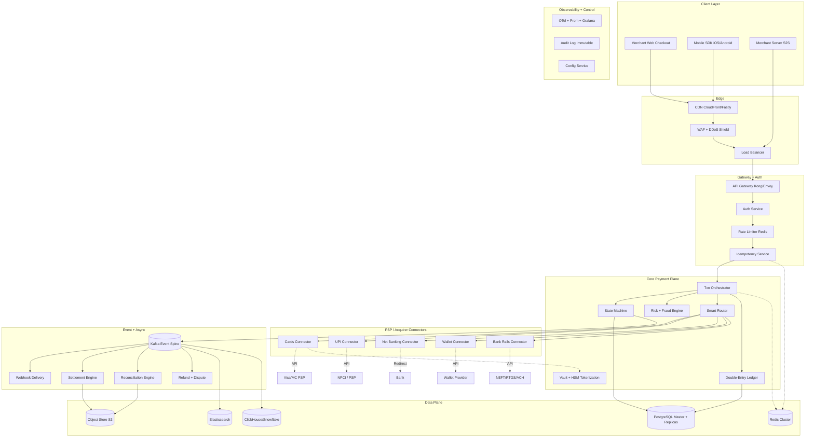
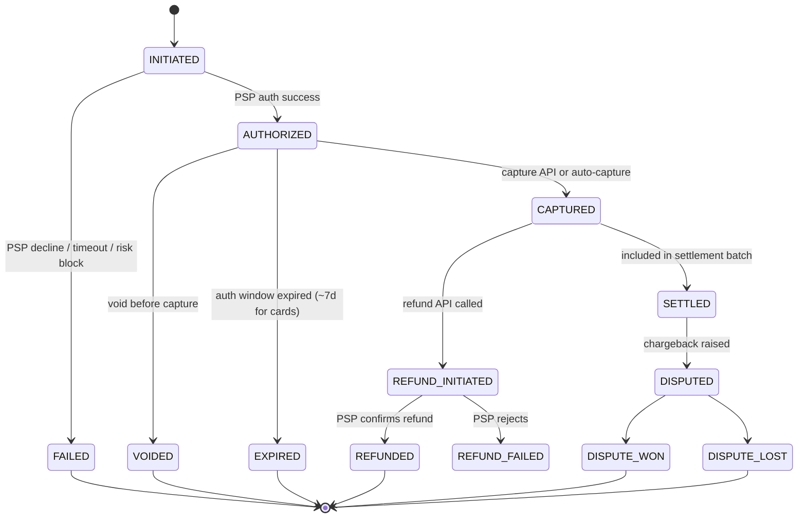
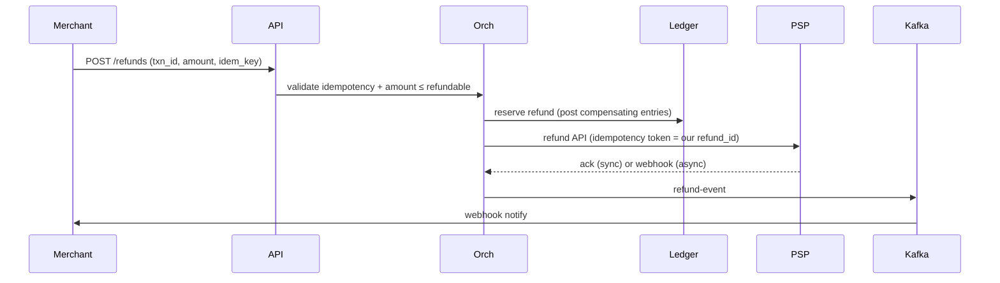

# File 19: Payment Gateway System Design — Generic Industry Reference

> Vendor-neutral, MNC-grade payment gateway design as it would be presented in a senior system-design interview at Stripe, Adyen, PayPal, Razorpay, or any large fintech.
>
> No project-specific anchors. No internal class names. Pure "this is how the industry builds it" reference.

---

## SECTION 0 — THE 30-SECOND PITCH

> *A payment gateway is a regulated, high-availability, money-moving system that accepts a payment instruction from a merchant, routes it to the correct payment rail (card network, UPI, bank), captures the customer's authorization, settles funds to the merchant, and produces an immutable, reconciled, auditable record of every cent moved.*

The reference architecture in 9 layers:

1. **Edge** — TLS termination, DDoS, WAF, CDN.
2. **API gateway** — routing, throttling, versioning, observability.
3. **Authentication + authorization** — API key, HMAC, mTLS, OAuth, JWT.
4. **Idempotency layer** — caller-supplied key, server-side dedup.
5. **Transaction orchestrator** — state machine, saga, double-entry ledger.
6. **Smart router + PSP/acquirer connectors** — per-rail handlers.
7. **Risk + fraud engine** — synchronous rules + async ML scoring.
8. **Vault + HSM + tokenization** — PCI-DSS scope reduction.
9. **Event spine + downstream services** — Kafka into webhooks, settlement, reconciliation, analytics, reporting.

Every senior interviewer expects you to be able to draw these 9 layers and reason about the choices at each one.

---

## SECTION 1 — REQUIREMENTS

### 1.1 Functional requirements

**Acceptance (collect / pay-in):**
- Cards — debit, credit, prepaid; domestic + cross-border; 3DS 2.0 challenge or frictionless.
- UPI — collect, push, QR (static/dynamic), AutoPay mandate (recurring).
- Net banking — bank redirect flow for ~50 banks (India) or equivalent locally.
- Wallets — Paytm, Apple Pay, Google Pay, PayPal balance, etc.
- EMI / BNPL — bank EMI, no-cost EMI, cardless EMI, Pay-Later partners.
- Bank transfer — direct debit, ACH (US), SEPA (EU), NEFT (India).

**Payouts (pay-out / disbursal):**
- Card payouts, UPI payouts, bank transfers (NEFT / RTGS / IMPS / ACH / SEPA / SWIFT).
- Beneficiary verification (penny-drop).
- Bulk payouts (batch upload).

**Lifecycle:**
- Authorization + capture (separate or combined).
- Void (pre-capture cancel).
- Refund (full + partial, single + multi).
- Dispute / chargeback management.
- Settlement (T+0 / T+1 / configurable).
- Reconciliation (per PSP, per rail, per bank).

**Merchant-facing:**
- Merchant onboarding (KYC, KYB, risk underwriting).
- Dashboard (txns, settlements, refunds, disputes, reports).
- API + SDKs (server SDK in Java/Python/Node/Go/PHP; client SDK for web + iOS + Android).
- Hosted checkout (PSP-hosted page so merchant stays out of PCI scope).
- Webhooks.

### 1.2 Non-functional requirements

| Concern | Target |
|---|---|
| Throughput (steady state) | 5,000 - 20,000 RPS (Stripe-tier; lower for regional) |
| Throughput (peak / sale events) | 10x steady state, design for 100K+ RPS |
| Latency p99 (auth path) | < 500 ms end-to-end including PSP call |
| Latency p99 (refund / async paths) | < 5 sec |
| Availability | 99.99% (52 min/year) for accept path; 99.95% for non-critical paths |
| Money correctness | Zero loss. Every paise/cent must be accounted for. |
| Compliance | PCI-DSS Level 1; regional (RBI, PSD2, FFIEC, GDPR, SOC 2 Type II) |
| Data retention | 7 years for txn data; 90 days for raw logs; longer for compliance subsets |
| RPO / RTO | RPO ≤ 1 min; RTO ≤ 5 min for accept path |

### 1.3 Capacity math (do this out loud in the interview)

Assume target: **20,000 RPS peak, 5,000 RPS steady, 500M txns/day**.

```
500M txns/day ÷ 86,400 s = ~5,800 TPS steady
Peak factor 4x = ~23,000 TPS peak

DB write amplification per txn:
  1 txn row + 1 state-machine row + 1 ledger entry (debit) + 1 ledger entry (credit)
  + 1 idempotency row + 1 outbox row = 6 writes
  ≈ 30K writes/sec at steady, 140K writes/sec at peak

Storage growth:
  500M rows/day × ~2KB avg = 1 TB/day raw
  With indexes + audit + ledger ≈ 3-5 TB/day
  Retain hot 30 days, warm 11 months, cold 6 years (S3/Glacier)
```

**Conclusion:** at this scale you need horizontal sharding, multi-region active-active, and aggressive partitioning. At 1/10th of this (50M txns/day), a well-tuned single primary + replicas suffices.

### 1.4 Out of scope (call this out in the interview)

- Card-network internals (Visa/Mastercard authorization).
- Bank core-banking systems (we integrate via APIs).
- KYC document AI processing (separate vertical).
- Merchant-side checkout UX (we provide SDKs; merchant builds UI).

---

## SECTION 2 — HIGH-LEVEL DESIGN

### 2.1 The reference diagram



### 2.2 The happy-path flow (memorize)

1. **Client → Edge.** TLS 1.3 terminates at the LB; DDoS rules filter junk traffic.
2. **Edge → API gateway.** Routes by URL (`/v1/payments`), enforces basic rate limit.
3. **Gateway → Auth service.** Validates API key + HMAC signature; resolves merchant context.
4. **Auth → Rate limiter.** Token-bucket per merchant in Redis (Lua-scripted atomic).
5. **Rate limiter → Idempotency layer.** Checks `Idempotency-Key`; returns cached response if seen.
6. **Idempotency → Orchestrator.** Creates txn record; persists `CREATED` state; commits with outbox event.
7. **Orchestrator → Risk engine.** Synchronous rules + ML score; block / challenge / allow.
8. **Orchestrator → Smart router.** Picks PSP based on mode + cost + success-rate + health.
9. **Router → PSP connector → PSP API.** Tokenized payload; mTLS; circuit-breaker wrapped.
10. **PSP response → State machine.** Transitions `CREATED → AUTHORIZED` (or `FAILED`).
11. **State machine → Ledger.** Double-entry posting: debit suspense, credit merchant payable.
12. **State machine → Outbox → Kafka.** Event published; downstream consumers light up.
13. **Webhook delivery → Merchant.** HMAC-signed; retry with exponential backoff.
14. **Customer sync response.** Client receives `authorized` or `failed` in ~500ms p99.

Async paths that fire from the same Kafka event:
- Settlement engine accumulates `CAPTURED` txns for daily payout.
- Reconciliation engine matches PSP-side daily files vs internal ledger.
- Analytics pipeline streams via CDC to ClickHouse/Snowflake.
- Search index (Elasticsearch) updated for dashboard txn search.

### 2.3 Why this layering matters

Each horizontal layer has **one job** and **one failure domain**:
- Edge fails → degraded availability but no money loss.
- Auth fails → all traffic stops cleanly; no half-auth txns.
- Idempotency fails → safe to fall back to DB unique constraint.
- Orchestrator fails → state machine is recoverable from durable log.
- Connector fails → smart router fails over to next PSP.
- Async services fail → Kafka replay covers the gap.

**Compositional resilience.** A senior interviewer is listening for this framing.

---

## SECTION 3 — COMPONENT-BY-COMPONENT DEEP DIVE

Each component is presented as: **What it is → Why it exists → How it's built → What it would look like at a big MNC.**

### 3.1 Edge (CDN + WAF + DDoS + Load Balancer)

**What:** the first hop from public internet into our perimeter.

**Why:** absorbs volumetric attacks, terminates TLS, routes geo-locally, caches static assets, blocks known bad actors before they touch our compute.

**How:**
- **CDN** — CloudFront, Fastly, or Akamai. Caches checkout-page static assets (CSS, JS, fonts) at the edge.
- **WAF** — AWS WAF, Cloudflare, Imperva. Rule sets for OWASP Top 10 (SQLi, XSS), bot mitigation, rate-based rules.
- **DDoS** — AWS Shield Advanced, Cloudflare Magic Transit, Akamai Prolexic. Always-on volumetric defense at L3-L4.
- **Load balancer** — AWS ALB / GCP HTTPS LB / Envoy. L7 routing, mTLS termination for B2B, health checks every 5s.

**MNC reality:**
- Two geo-regions minimum (active-active or active-passive).
- TLS 1.3 only; ciphers hardened.
- mTLS available as an option for enterprise B2B merchants.
- Health check tied to deep readiness probe (DB + Redis + Kafka reachable).

### 3.2 API gateway

**What:** the single entry point into the platform.

**Why:** decouples public API surface from internal services; centralizes cross-cutting concerns (auth, rate limit, observability, versioning); makes service evolution safer.

**How:**
- Pick: **Kong**, **Envoy**, **Spring Cloud Gateway**, or **AWS API Gateway**.
- Plugin chain: auth → rate-limit → request transform → upstream route → response transform → log.
- Latency budget: < 10 ms p99.
- Horizontally scaled; stateless.

**MNC reality:**
- API versioning via URL prefix (`/v1`, `/v2`); old versions deprecated on 12-month notice.
- Schema validation at the gateway (OpenAPI / Protobuf) — invalid requests fail at the perimeter.
- Per-route SLOs; gateway dashboards split by route + merchant.

**Why not Nginx alone:** Nginx is a great reverse proxy but lacks the plugin ecosystem (declarative auth, advanced rate limit, observability). You'd end up rebuilding the gateway.

### 3.3 Authentication + authorization

**What:** verifies the caller and resolves merchant context.

**Why:** every payment must be attributable to a known merchant with a defined risk profile, fee structure, and entitlement.

**How (multi-mode):**

| Mode | Used by | Mechanism |
|---|---|---|
| **API key + HMAC-SHA256** | Server-to-server | Header `X-API-Key`, body signed with HMAC; timestamp window ≤ 5 min prevents replay |
| **JWT (RS256)** | Hosted checkout sessions | Short-lived (15 min) access token + refresh; verified via rotating JWKS |
| **OAuth 2.0** | Customer-consent flows | Authorization Code + PKCE for SPAs; refresh tokens for installed apps |
| **mTLS** | Bank-grade B2B | Client cert at edge; cert thumbprint → merchant mapping |

**MNC reality:**
- A dedicated `auth-service`, not just a gateway plugin. Caches credentials in Redis; supports instant revocation via revocation list.
- Audit log every auth decision (success + failure) with PII scrubbed.
- Key rotation enforced quarterly; old keys grace-period 30 days.
- Roles: a merchant has multiple API keys with scopes (`payments:write`, `payouts:write`, `refunds:write`).

### 3.4 Rate limiting

**What:** prevents abuse and protects downstream from accidental DOS.

**Why:** a misconfigured merchant cron or a runaway script can melt the system; we never want a single merchant to take down others.

**How:**
- Algorithm: **token bucket** (smooth bursts) or **sliding window log** (strict).
- Implementation: Redis Lua script for atomic refill + decrement.
- Per-merchant + per-route limits; tiered (Free, Standard, Enterprise, Custom).
- Quotas published to merchants via `X-RateLimit-Remaining` header; `429` with `Retry-After` on exceed.

**MNC reality:**
- Two limits enforced together: per-second (burst) and per-day (quota).
- Hard limits + soft limits; soft sends a warning webhook; hard rejects.
- Bypassable for trusted internal merchants via signed token (e.g., during a planned sale event).

### 3.5 Idempotency layer

**What:** ensures a duplicate request (caused by network retry, client bug, or operator retry) does not result in a duplicate payment.

**Why:** money-moving systems cannot afford double-charges. Idempotency is the single most important property of a payment API.

**How (Stripe's canonical pattern, copied industry-wide):**

1. Caller sends an `Idempotency-Key` header (UUID, recommended scope: per-attempt).
2. Server stores `(merchant_id, idempotency_key)` → full response in a fast store (Redis) with 24h TTL.
3. **Three layers of dedup:**
   - **Redis cached response** (fast path, sub-ms).
   - **Distributed lock** keyed by idempotency key (serializes concurrent first-runs).
   - **DB unique constraint** on `(merchant_id, idempotency_key)` (correctness net if Redis is lost).
4. Server returns the **same response body** for the same key — even if the underlying request body differs (some implementations reject mismatched bodies as `409`).

**MNC reality:**
- Stripe holds idempotency results 24h; Adyen up to 7 days. Industry norm is 24h - 7d.
- The lock is short-lived (≤ 30s); long-lived locks cause stampedes if the first attempt is slow.
- Mismatched-body handling is a contract decision: silently return cached vs `409 Conflict`. Most modern APIs return `409`.

### 3.6 Transaction orchestrator + state machine

**What:** the brain of the platform. Drives a payment through its lifecycle.

**Why:** payments have many intermediate states (initiated, authorized, captured, settled, refunded, disputed). A flat boolean model breaks down fast. A state machine gives compile-time-checkable transitions + clean audit.

**Canonical state diagram:**



**How:**
- All state mutations go through one method (`transition(txnId, newState, reason, actor)`).
- Each transition validates source state, writes the new state, appends an audit row, emits a domain event via the outbox.
- Forbidden transitions throw — `CAPTURED → INITIATED` is impossible.

**MNC reality:**
- The state machine is enforced in code AND in the DB (CHECK constraint on a `status` column, or a generated column that fails on invalid transitions in a trigger).
- The audit / history table is immutable, append-only; one row per transition; queries answer "show me the timeline of txn X" in O(1).
- Saga compensation is built on the same primitive — failed downstream emits a compensating transition.

### 3.7 Smart router (PSP routing)

**What:** decides which PSP / acquirer handles a given txn.

**Why:** in real fintech you integrate with 5-20 PSPs per region. They differ in cost (MDR), success rate per bank/issuer, geography, mode coverage, and uptime. Routing intelligence is a competitive moat.

**Routing inputs:**

| Input | Why it matters |
|---|---|
| Payment mode | Cards-only PSPs cannot do UPI |
| Currency + country | Cross-border may need a specific acquirer |
| Issuer BIN | Some PSPs have better success-rates per issuer |
| Merchant config | Some merchants on-boarded to specific PSPs only |
| Cost (MDR) | Pick cheaper PSP all else equal |
| Real-time success-rate (last 5 min) | Prefer healthier PSP |
| Circuit-breaker state per PSP | Skip OPEN circuits |
| Volume + tier | High-volume merchants get the best PSP relationships |

**How:**
- Each PSP has a connector implementing a common interface (`charge`, `refund`, `void`, `query`).
- Spring-style component registry auto-discovers connectors by `@PaymentMode("CARD")`.
- Routing strategy is a **priority list** with health filtering, cost ordering, then random tie-breaker (for load distribution).
- Resilience4j circuit breaker per PSP-mode combo: open after 5 consecutive failures or SR < 95% over last 100 attempts; half-open after 30s with one probe.
- Bulkhead per PSP (separate thread pool / connection pool) so a slow PSP cannot starve the others.

**MNC reality:**
- The routing decision is logged for every txn (`psp_decision_log`) so post-incident "why did this txn go to PSP X" is one query.
- Failover retries the **same txn** with the **same idempotency key** at the next PSP — but with the **PSP's own idempotency token** scoped to that PSP. Double-routing risk is mitigated at the reconciliation layer.
- A/B testing of routing rules via shadow-traffic before promotion.

### 3.8 Mode handlers (per-rail logic)

#### Cards

- Auth-only vs auth+capture vs auth then later capture.
- 3DS 2.0 — frictionless (issuer scores risk silently) for ~80% of txns; challenge (OTP / biometric) for the rest.
- Tokenization mandate: store network tokens (Visa Token Service, Mastercard MDES), never raw PAN. Reduces PCI scope.
- 3DS liability shift: authenticated txn shifts chargeback liability to issuer.

#### UPI / Pix / instant-rails

- Push (merchant initiates) vs pull (customer scans QR or enters VPA).
- Webhook-driven; PSP fires our callback when bank confirms.
- Status polling fallback (every 30s for up to 5 min) if webhook is dropped.
- AutoPay mandate flows: regulator-mandated 24h notification before recurring charge (India RBI rule).

#### Net banking

- Bank-hosted redirect; customer leaves our domain.
- Per-bank quirks (50+ Indian banks each have idiosyncratic APIs); abstraction layer + per-bank adapter is mandatory.
- Webhooks unreliable for ~5% of banks; polling is the default.

#### Wallets

- Redirect-then-callback similar to net banking, but auth is wallet-native (PIN, biometric).
- Some support direct token exchange without redirect (Paytm, Apple Pay).

#### EMI

- Three flavors: bank EMI (card auth, bank converts), no-cost EMI (merchant subsidizes), cardless EMI (NBFC underwrites at checkout — effectively a loan flow).

#### B2B / payouts

| Rail | Mode | Limits | Cost | Settlement |
|---|---|---|---|---|
| IMPS | Real-time 24×7 | ≤ ₹5L | ₹2-5 | Instant |
| NEFT | Half-hourly batch | None | ₹1-2 | Same day |
| RTGS | Real-time, biz hours | ≥ ₹2L | ₹15-50 | Instant |
| UPI payout | Real-time 24×7 | ≤ ₹1L | Free | Instant |
| ACH (US) | Daily batch | None | Cents | T+1-T+3 |
| SEPA (EU) | Instant or batch | None | Cents | Instant or T+1 |
| SWIFT (cross-border) | Wire | None | $15-50 | T+1-T+5 |

Beneficiary verification (penny-drop) before first payout to any new account.

### 3.9 Risk + fraud engine

**What:** decides allow / block / challenge for each txn.

**Why:** fraud rates in card-not-present are 5-10x card-present. ML-driven risk scoring is a competitive lever and a compliance requirement.

**How (three-tier defence):**

1. **Synchronous rules engine** (< 50 ms): hard rules (BIN blocklist, IP blocklist, velocity, amount > merchant limit). Decisioning is `BLOCK / CHALLENGE / ALLOW`.
2. **Synchronous ML risk score** (< 100 ms): gradient-boosted tree (XGBoost / LightGBM) or neural net trained on labeled historical data. Score 0-1; threshold-driven action (e.g., > 0.8 → challenge with 3DS).
3. **Asynchronous pattern detection**: Kafka stream → Flink job → detects velocity anomalies (same card across 5 merchants in 10 min), bot patterns, mule-account graphs. Updates blocklists + retrains model.

**MNC reality:**
- Stripe Radar, Adyen RevenueProtect, Razorpay Thirdwatch — all are this pattern.
- Per-merchant tunable risk thresholds (a sneaker drop tolerates higher risk than a high-AOV electronics merchant).
- Explainability for compliance: every block / challenge has a reason code logged.
- Human-in-loop review queue for borderline scores in regulated segments.

### 3.10 Tokenization + Vault + HSM

**What:** anywhere a Primary Account Number (PAN), CVV, or PIN block must be handled, it is isolated in a hardened, PCI-DSS-segmented zone.

**Why:** PAN storage triggers full PCI-DSS scope. Tokenization moves the regulated boundary to a small, well-audited subsystem; the rest of the platform handles tokens, drastically reducing audit surface and breach blast-radius.

**How:**
- First card txn: PSP returns a **network token** (Visa Token Service / MDES) on first capture. We persist `(token, last_4, brand, expiry, merchant_id)`. We never see raw PAN beyond the moment it transits our tokenization service.
- HSM (AWS CloudHSM, Thales nShield, Azure Dedicated HSM) handles cryptographic operations: PIN block encryption, CVV verification, key wrap. Keys never leave the HSM in plaintext.
- Vault (HashiCorp Vault, AWS Secrets Manager) handles all non-card secrets: PSP API keys, merchant signing keys, DB credentials. Dynamic / short-lived credentials wherever possible.

**MNC reality:**
- A tiny `tokenization-service` is the only service inside the PCI cardholder data environment (CDE). 95%+ of the platform is **out of PCI scope**.
- PAN-bearing logs are blocked at structured-logging middleware (mask on field name pattern `(card|pan|cvv|cvc)`).
- KMS-rooted encryption at rest for every DB, S3 bucket, EBS volume.
- Annual third-party PT (Synack, Cobalt) + bug bounty (HackerOne).

### 3.11 Double-entry ledger

**What:** the canonical source of "who owes what to whom" at any point in time.

**Why:** payment systems must produce a balance sheet that always balances. Single-entry "we charged the customer X" is not enough — you also need to track merchant payable, PSP receivable, fees, taxes, refund reserves, dispute holds. Double-entry is the time-tested abstraction.

**How:**
- Two tables: `account` (entity, type, currency) and `posting` (debit account, credit account, amount, txn_id, posted_at, idempotency_key).
- Every txn produces a balanced journal entry: debits = credits.
- Example (a successful card capture for ₹1000 with ₹20 fee):

  | Debit | Credit | Amount | Note |
  |---|---|---|---|
  | Customer-card-receivable | Suspense | 1000 | Authorization |
  | Suspense | Merchant-payable | 980 | Capture, net of fee |
  | Suspense | Platform-fee-income | 20 | Fee recognition |

- Account balances are derived (sum of postings), not stored — eliminates a class of bugs where a stored balance drifts from the postings.
- For performance at scale, materialized balance views are refreshed via CDC.

**MNC reality:**
- Stripe (TigerBeetle inspirations), Razorpay, Square, every neobank — all have a ledger service.
- Ledger is **append-only**. Mistakes are corrected via reversing entries, never updates.
- Daily ledger close: every account balance reconciled against bank statements + PSP files.
- Ledger is the **second source of truth** alongside the txn table; recon proves they agree.

### 3.12 Settlement engine

**What:** moves money from our holding account to merchant bank accounts on a schedule.

**Why:** between capture and merchant payout, funds sit in our nodal/escrow account (regulator requirement). Settlement is the scheduled sweep.

**How (T+1 daily example):**

```
06:00  Lock the settlement window for date D (yesterday)
06:05  Aggregate by merchant: gross captured - refunds - chargeback debits - fees - GST = net payable
06:15  Idempotently create settlement_batch (UNIQUE on merchant_id + date) + per-txn settlement_item
06:30  Initiate B2B transfer (NEFT/IMPS/ACH) per merchant
07:00  On bank confirmation, write reverse ledger entry + fire webhook to merchant
07:30  Upload settlement statement PDF/CSV to merchant dashboard
```

**MNC reality:**
- Multiple settlement cycles per day (T+0, T+1, T+7 — merchant-configurable).
- Per-merchant reserve / rolling reserve (% of volume held for chargeback exposure).
- Currency conversion handled at the settlement boundary (we collected USD, merchant settles in INR; FX margin booked to FX-income account).
- Settlement statement is regulator-grade (SOX-auditable in US; equivalent locally).

### 3.13 Reconciliation engine

**What:** matches our internal ledger against the PSP / bank / network counterparties.

**Why:** truth lives in three places — our books, the PSP's books, the bank's books. They must agree. Where they disagree (the "exception queue"), humans investigate before money is misallocated.

**How:**
1. Each PSP / bank sends a daily SFTP file (CSV / JSON / XML).
2. Parser loads rows into `recon_raw` staging.
3. Three-way match by `(psp_reference, amount, date)`:
   - **MATCHED** — internal + PSP + bank all agree. Archive.
   - **PSP_ONLY** — PSP has it, we don't. Replay (missed webhook).
   - **INTERNAL_ONLY** — we have it, PSP doesn't. Investigate (manual queue).
   - **BANK_ONLY** — bank settled something neither side knows about. Investigate.
4. Auto-resolve configured patterns (timezone offsets, fee rounding, T-boundary cases).
5. Manual queue for everything else; SLA: cleared by next business day.

**MNC reality:**
- Recon match rate is a top-line SRE metric. SLO: > 99.5% auto-matched within 24h.
- Exception queue value is bounded (e.g., < ₹10L unresolved at any time) — breaching the bound is a P1 alert.
- Recon is the **independent check** that double-entry ledger and live txn table agree.

### 3.14 Webhook delivery

**What:** notifies merchants asynchronously when a txn state changes.

**Why:** merchant servers cannot poll us every second for every txn. Webhooks make the system push-based and merchant-friendly.

**How:**
- State transition writes to `webhook_outbox` in the **same DB transaction** as the txn state change (outbox pattern — eliminates dual-write inconsistency).
- Outbox dispatcher (separate worker) reads outbox, posts to merchant URL, signs with HMAC-SHA256, retries with backoff.
- Schedule: 1m → 5m → 15m → 1h → 6h → 24h. Six attempts, ~31h total window.
- After max attempts → dead-letter queue (manual replay tool for ops).
- HMAC over `timestamp + body`; merchant verifies on their side with their secret. `X-Timestamp` window 5 min prevents replay.

**MNC reality:**
- At-least-once delivery — merchants must be idempotent on their side. We document this.
- Per-merchant delivery isolation (one slow merchant URL doesn't block others) via per-merchant queues or sharded workers.
- Webhook delivery dashboard for merchants: see attempts, failures, replay manually.
- Signature versioning (`v1=...`) so we can rotate algorithms later.

### 3.15 Refund + dispute / chargeback

**Refund flow** (orchestrated saga):



- If PSP refund fails post-ledger-reservation, **compensating ledger entries** unwind the reserve.
- Customer-facing wording: "Refund will reflect in 5-7 business days" (RBI / regional guidance).

**Dispute / chargeback lifecycle:**

| Stage | Trigger | Action |
|---|---|---|
| Retrieval request | Issuer asks for txn details | Auto-respond with receipt + proof |
| Chargeback raised | Customer disputes via issuer | Reverse merchant balance; debit dispute holding |
| Pre-arbitration / representment | Merchant submits evidence | Forward to PSP / network |
| Arbitration | Network rules | Final disposition |
| Outcome | Won / lost | Final ledger postings |

**MNC reality:**
- Dispute rate is a key risk metric (Visa caps at 1%, MC at 1.5%); merchants exceeding thresholds get fee penalties or termination.
- Evidence collection is automated (auto-bundle receipts, shipping proofs, customer comms) and submitted via PSP API.

### 3.16 Analytics + reporting

**What:** offline / near-real-time aggregates for merchants and internal BI.

**Why:** dashboards must answer "last 30 days revenue by mode" in seconds. Doing this on the OLTP master is a guaranteed outage.

**How:**
- CDC from Postgres via Debezium → Kafka → ClickHouse or Snowflake sink.
- Hot data (7 days) in ClickHouse / Snowflake's "hot" tier; warm (90 days) in standard; cold (years) in S3 (Parquet).
- Merchant dashboard reads aggregates from the OLAP store.
- Internal BI uses Metabase / Looker / Tableau on top.
- Elasticsearch for txn search (faceted: by status, mode, time range, customer).

**MNC reality:**
- Dual write to OLTP and OLAP is **never** done directly from app code — always via CDC. Avoids inconsistency.
- Schema evolution in OLAP is decoupled from OLTP via a transform layer (dbt / Airflow).

---

## SECTION 4 — DATA MODEL

### 4.1 Core tables

```sql
-- The transaction
CREATE TABLE txn (
    txn_id          UUID PRIMARY KEY,
    merchant_id     UUID NOT NULL,
    amount          BIGINT NOT NULL,       -- minor units (paise / cents)
    currency        CHAR(3) NOT NULL,
    payment_mode    VARCHAR(20) NOT NULL,
    status          VARCHAR(30) NOT NULL,
    psp_name        VARCHAR(50),
    psp_txn_id      VARCHAR(100),
    customer_ref    VARCHAR(64),           -- masked / tokenized
    metadata        JSONB,
    created_at      TIMESTAMPTZ NOT NULL DEFAULT now(),
    updated_at      TIMESTAMPTZ NOT NULL DEFAULT now(),
    INDEX idx_merchant_created (merchant_id, created_at DESC),
    INDEX idx_psp (psp_name, psp_txn_id),
    INDEX idx_status_created (status, created_at)
) PARTITION BY RANGE (created_at);

-- Audit / state history (append-only, immutable)
CREATE TABLE txn_event (
    event_id        BIGSERIAL PRIMARY KEY,
    txn_id          UUID NOT NULL,
    prev_status     VARCHAR(30),
    new_status      VARCHAR(30) NOT NULL,
    actor           VARCHAR(50) NOT NULL,
    reason          VARCHAR(200),
    metadata        JSONB,
    created_at      TIMESTAMPTZ NOT NULL DEFAULT now(),
    INDEX idx_txn_created (txn_id, created_at)
) PARTITION BY RANGE (created_at);

-- Idempotency dedup
CREATE TABLE idempotency_record (
    merchant_id     UUID NOT NULL,
    idempotency_key VARCHAR(128) NOT NULL,
    txn_id          UUID NOT NULL,
    request_hash    CHAR(64) NOT NULL,     -- SHA-256 of canonicalized request
    response_body   JSONB NOT NULL,
    created_at      TIMESTAMPTZ NOT NULL DEFAULT now(),
    expires_at      TIMESTAMPTZ NOT NULL,
    PRIMARY KEY (merchant_id, idempotency_key)
);

-- Double-entry ledger
CREATE TABLE ledger_account (
    account_id      UUID PRIMARY KEY,
    entity_type     VARCHAR(20),           -- MERCHANT / CUSTOMER / PLATFORM / PSP / SUSPENSE
    entity_id       UUID,
    currency        CHAR(3),
    UNIQUE (entity_type, entity_id, currency)
);

CREATE TABLE ledger_posting (
    posting_id      BIGSERIAL PRIMARY KEY,
    journal_id      UUID NOT NULL,          -- groups balanced entries
    debit_account   UUID NOT NULL,
    credit_account  UUID NOT NULL,
    amount          BIGINT NOT NULL,
    currency        CHAR(3) NOT NULL,
    txn_id          UUID,
    posted_at       TIMESTAMPTZ NOT NULL DEFAULT now(),
    idempotency_key VARCHAR(128) NOT NULL,
    UNIQUE (idempotency_key)
);

-- Webhook outbox
CREATE TABLE webhook_outbox (
    outbox_id       UUID PRIMARY KEY,
    merchant_id     UUID NOT NULL,
    event_type      VARCHAR(50) NOT NULL,
    payload         JSONB NOT NULL,
    status          VARCHAR(20) NOT NULL,   -- PENDING / RETRYING / DELIVERED / FAILED
    attempts        INT NOT NULL DEFAULT 0,
    next_attempt_at TIMESTAMPTZ,
    delivered_at    TIMESTAMPTZ,
    created_at      TIMESTAMPTZ NOT NULL DEFAULT now(),
    INDEX idx_status_next (status, next_attempt_at)
);

-- Settlement
CREATE TABLE settlement_batch (
    batch_id        UUID PRIMARY KEY,
    merchant_id     UUID NOT NULL,
    settlement_date DATE NOT NULL,
    gross_amount    BIGINT NOT NULL,
    fee_amount      BIGINT NOT NULL,
    tax_amount      BIGINT NOT NULL,
    refund_amount   BIGINT NOT NULL,
    net_amount      BIGINT NOT NULL,
    status          VARCHAR(20) NOT NULL,
    bank_utr        VARCHAR(64),
    UNIQUE (merchant_id, settlement_date)    -- idempotency at the table level
);
```

### 4.2 Partitioning + sharding strategy

| Table | Partition / shard scheme | Why |
|---|---|---|
| `txn` | Partition by `created_at` month | Hot vs cold separation; cheap archive |
| `txn_event` | Partition by `created_at` month | Append-only; massive volume; drop old partitions to S3 |
| `ledger_posting` | Partition by `posted_at` month | Same |
| `idempotency_record` | Partition by `expires_at` day | Drop expired partitions wholesale |
| `webhook_outbox` | None initially; partition if needed | Bounded set; cleared on delivery |

**Sharding by merchant:**
- Threshold: single primary cannot keep up with write rate (~5K-10K writes/sec) or storage (~5 TB).
- Pick **merchant_id** as shard key — every authenticated call carries the merchant; cross-merchant queries are rare (ops only).
- Tooling: **Vitess** for transparent MySQL sharding, **Citus** for Postgres, or app-level shard router.
- Never shard by `txn_id` hash — kills per-merchant dashboards.

### 4.3 Data retention

| Data | Retention | Storage |
|---|---|---|
| Hot txn / events / ledger | 30 days | Postgres OLTP |
| Warm txn / events / ledger | 11 months | Postgres + read replicas |
| Cold | 6 years (regulator) | S3 Parquet, queried via Athena / Trino |
| Idempotency | 24h - 7d | Redis + Postgres |
| Audit / compliance | 7 years | S3 with Object Lock (immutable) |
| Raw logs (with PII masked) | 90 days | Coralogix / Datadog / ELK |

---

## SECTION 5 — MIDDLEWARE & TECHNOLOGY PICKS

### 5.1 The full picks table

| Concern | Industry pick | Why this, not the alternative |
|---|---|---|
| **OLTP database** | PostgreSQL (Citus for shard) or MySQL (Vitess for shard) | Mature, ACID, ecosystem. Aurora / Cloud SQL acceptable managed flavors. |
| **Event spine** | Apache Kafka (RF=3, min.insync.replicas=2, acks=all) | Durable replayable log; partitions for per-key ordering. Pulsar a fine alternative. RabbitMQ inadequate (no replay). SQS too thin (no consumer groups, 14-day cap). |
| **Cache + locks + rate limit** | Redis Cluster + Redisson | Sub-ms p99; rich data structures; Redisson gives `RLock`, `RRateLimiter`, `RBucket` out of box. Memcached too thin. |
| **Search** | Elasticsearch (via Debezium CDC) | Faceted txn search, fast aggregations. Never source of truth. |
| **OLAP / BI** | ClickHouse, Snowflake, or BigQuery | 100x faster than OLTP for aggregates. Snowflake managed; ClickHouse cheaper at scale. |
| **Object store** | AWS S3 (with Object Lock) | Recon files, receipts, evidence, audit archive. PCI-friendly. |
| **Secrets** | HashiCorp Vault + AWS KMS | Dynamic creds, rotation, audit. |
| **HSM** | AWS CloudHSM, Thales nShield | FIPS 140-2 L3 for card crypto. |
| **API gateway** | Kong or Envoy or Spring Cloud Gateway | Auth + rate limit + routing + observability in one. |
| **Service mesh (optional)** | Istio or Linkerd | mTLS between services; canary; tracing. |
| **Circuit breaker** | Resilience4j | Per-PSP isolation; lightweight; Hystrix EOL. |
| **Distributed tracing** | OpenTelemetry → Tempo / Jaeger / Datadog | Vendor-neutral SDKs. |
| **Metrics** | Prometheus + Grafana | De-facto standard. |
| **Logs** | OpenTelemetry logs → Loki / Datadog / Splunk | Structured JSON; PII-mask middleware. |
| **Container orchestration** | Kubernetes (EKS / GKE / AKS) | Industry standard. |
| **CDC** | Debezium (Kafka Connect) | Binlog/WAL-based; avoids dual-writes. |
| **Schema migrations** | Liquibase or Flyway + gh-ost / pg_repack for online DDL | Audit trail; no replication-lag spikes. |
| **Feature flags / config** | LaunchDarkly, Unleash, or in-house | Per-merchant, per-region toggles; safe rollbacks. |
| **CI/CD** | GitHub Actions + ArgoCD or Spinnaker | GitOps; drift detection; multi-env promotion. |
| **WAF + DDoS** | Cloudflare + AWS WAF + AWS Shield Advanced | Defense in depth. |
| **CDN** | CloudFront / Fastly / Akamai | Static asset edge cache. |

### 5.2 Defensible alternative choices

- **Postgres vs MySQL** — both fine. Postgres has stronger consistency primitives (advisory locks, SKIP LOCKED, partial indexes). MySQL has more mature sharding tooling (Vitess). Pick based on team familiarity.
- **Kafka vs Pulsar** — Pulsar's tiered storage is nicer at extreme scale; Kafka's ecosystem is bigger; Kafka wins on hiring + tooling.
- **Vault vs AWS Secrets Manager** — Vault is more powerful (dynamic creds for any backend); ASM is simpler if you're all-AWS.
- **Self-hosted Kubernetes vs ECS / Cloud Run** — K8s is industry-standard; managed alternatives reduce ops burden at the cost of flexibility.

---

## SECTION 6 — CRITICAL PATTERNS (cross-cutting)

### 6.1 The pattern catalog

| Pattern | Used in | Why |
|---|---|---|
| **Idempotency** | Every mutating endpoint | Safe retries; the most important property in payments |
| **State machine** | Txn lifecycle, refund lifecycle, dispute lifecycle | Compile-time + runtime-enforced transitions |
| **Outbox** | Any cross-system event emission | Atomic state-change + event; no dual-write inconsistency |
| **Saga (orchestration)** | Refund, dispute, multi-step payouts | Long-running distributed txns with compensating actions |
| **Circuit breaker** | Per PSP, per external dep | Stop hammering a dying dependency |
| **Bulkhead** | Per-PSP thread pools / connection pools | One slow PSP doesn't starve others |
| **Retry with exponential backoff + jitter** | Async retries (webhooks, PSP polling) | Avoids thundering herd |
| **CQRS** | Write to Postgres OLTP; read txn search from Elasticsearch | Different stores for different access patterns |
| **CDC** | Postgres → Kafka → ES, CH, search | Avoids dual-writes; eventually consistent projections |
| **Double-entry ledger** | All money movement | Balance sheet always balances by invariant |
| **Defensive cache eviction at write site** | Anywhere a write must be visible to next read | TTL is availability, not coherence |
| **Tokenization** | PAN / sensitive data | PCI scope reduction |
| **Always-200 webhook intake from PSPs** | All PSP callbacks | Decouple intake from processing; persist first, process async |
| **Always-secure webhook delivery to merchants** | All outbound webhooks | HMAC + timestamp + retry + DLQ |

### 6.2 The outbox pattern (worth its own subsection)

**Problem:** "I just updated the txn to CAPTURED in Postgres. Now I publish to Kafka. Kafka publish fails. Postgres is committed. Downstream never knows. ❌"

**Solution:**
1. In the same DB transaction as the state change, write a row to `outbox` table with the event payload.
2. A separate worker tails the outbox (via CDC or polling), publishes to Kafka, marks the row delivered.
3. At-least-once delivery to Kafka guaranteed because outbox is the source of truth.

**Why it matters:** every interview-quality payment design has this. Without it, you have dual-write inconsistency between DB and Kafka. With it, the system is provably consistent.

---

## SECTION 7 — SCALE & PERFORMANCE

### 7.1 The scaling ladder

A senior interviewer wants to hear: "we don't optimize prematurely. We start with vertical, then read scale, then cache, then shard, then split services."

```
Level 1 (≤ 1K RPS)
  Single primary DB + 1 replica + Redis + Kafka small cluster
  Single region. All-on-one-K8s-cluster.

Level 2 (1K - 10K RPS)
  Beefier primary; 2-4 read replicas; route reads off master with AOP / proxy.
  Redis Sentinel or Cluster (small).
  Multi-AZ within one region.

Level 3 (10K - 50K RPS)
  Multi-AZ HA Postgres (Patroni or managed Aurora);
  Redis Cluster with replication; Kafka 6+ brokers.
  Service splits by domain (txn, ledger, recon, webhook, settlement).

Level 4 (50K - 200K RPS)
  Shard OLTP by merchant_id (Vitess / Citus).
  Multi-region active-active with per-merchant region affinity.
  Kafka cross-region replication via MirrorMaker 2.

Level 5 (> 200K RPS)
  Custom in-memory ledger (TigerBeetle style);
  Cell-based architecture (per-cell merchant assignment, blast-radius bounded);
  Active-active across 3+ regions.
```

### 7.2 Per-component capacity sketch (at 20K RPS peak)

| Component | Pods / nodes | Notes |
|---|---|---|
| Edge / LB | 2-3 per region | Bandwidth-bound |
| API Gateway | 8-12 | CPU on auth + rate limit |
| Auth service | 4-6 | Redis lookup-bound |
| Orchestrator | 16-24 | DB write-bound |
| Smart router | 8-12 | PSP latency-bound |
| Connectors | 4-8 per mode | PSP-API-latency-bound |
| Webhook delivery | 4-6 (async) | Outbound HTTP-bound |
| Settlement | 1 (cron) | Batch window |
| Recon | 1 (cron) | Batch window |
| Postgres primary | 1 + standby | r5.4xlarge or larger |
| Postgres replicas | 4-6 | One per heavy read consumer |
| Redis | 6-node Cluster | Memory-bound |
| Kafka | 6-9 brokers | Disk IO + network bound |

### 7.3 Caching strategy by use case

| Cache | Pattern | TTL | Why |
|---|---|---|---|
| Idempotency key → response | Write-through | 24h - 7d | Must survive restart |
| Merchant config | Refresh-ahead | 5 min | Rare update; freshness matters |
| API key → merchant | Cache-aside | 15 min | Read-heavy |
| PSP routing config | Refresh-ahead | 5 min | Hot reload on change |
| Txn status (read-after-write) | Cache-aside + evict-on-write | 60 s | TTL is availability, not coherence |
| Rate-limit counters | Atomic (Lua) | n/a | Storage only |

### 7.4 Sync vs async paths

| Path | Sync / async | Why |
|---|---|---|
| Auth + capture | Sync (≤ 500 ms) | Customer is waiting |
| Refund initiation | Sync ack + async PSP | PSP refund APIs often async |
| Webhook delivery | Async | Merchant may be slow / down |
| Settlement | Async (cron) | Daily; nobody waiting |
| Recon | Async (cron) | EOD batch |
| Notifications (SMS / email) | Async | Best-effort |
| Analytics ingestion | Async (CDC) | Don't add latency to write path |

### 7.5 Autoscaling

- **HPA on K8s** by CPU + custom metric (Kafka consumer lag, queue depth).
- **KEDA** for event-driven scaling (Kafka lag, SQS depth).
- **Predictive scaling** for known events (Black Friday, salary day, sale launches). Pre-scale 30 min before.
- **Database does NOT autoscale** — provision for 2x steady-state peak, alert at 70% to plan vertical or shard.

---

## SECTION 8 — SECURITY + COMPLIANCE

### 8.1 PCI-DSS Level 1 obligations

- Network segmentation between Cardholder Data Environment (CDE) and rest of platform.
- Quarterly internal vulnerability scans + annual external pen test by QSA.
- Encryption at rest (AES-256) + in transit (TLS 1.2+, 1.3 preferred).
- Strong access control (MFA, least privilege).
- Logs retained 1 year (immediate access 3 months).
- Annual SAQ-D or RoC.

**Scope reduction strategy:** keep PAN out of all services except the tokenization-service. Use network tokens (Visa Token Service, MDES) end-to-end.

### 8.2 Layered defense

| Layer | Control |
|---|---|
| Network | VPC isolation, security groups, NACLs, private subnets, no public DB |
| Transport | TLS 1.3 mandatory; mTLS for B2B; HSTS |
| API | API key + HMAC + timestamp + nonce |
| Payload | Optional PGP-encrypted fields for ultra-sensitive integrations |
| Auth | OAuth + JWT (RS256, rotating JWKS); MFA on merchant dashboard |
| Authorization | RBAC + ABAC; scoped API keys |
| Data at rest | AES-256 via KMS; HSM-backed keys for cardholder data |
| Secrets | Vault dynamic creds; no static creds in code or env |
| Logging | PII masking at structured log middleware; no PAN, CVV, OTP in logs |
| Monitoring | SIEM (Splunk, Datadog SIEM); anomaly alerts |
| Pen testing | Annual third-party + continuous bug bounty |

### 8.3 Regional compliance (call this out)

| Region | Key compliance items |
|---|---|
| India | RBI tokenization mandate, RBI data-localization, NPCI rules, IT Act |
| EU | PSD2 (SCA), GDPR, EBA RTS |
| US | PCI-DSS, FFIEC, state-level (NYDFS), GLBA, CCPA |
| Global | PCI-DSS, ISO 27001, SOC 2 Type II |

### 8.4 Operational security

- Production access via session-recorded bastion (Teleport, AWS Session Manager).
- Change management: separation of duties (developer + reviewer + approver are distinct).
- Encryption keys rotated annually; secrets rotated quarterly.
- Disaster recovery drills quarterly; chaos engineering exercises monthly.

---

## SECTION 9 — RELIABILITY

### 9.1 Availability targets

| Path | SLO | Error budget |
|---|---|---|
| Accept (charge) | 99.99% | 4.4 min / month |
| Payout / refund | 99.95% | 21.9 min / month |
| Dashboard / reporting | 99.9% | 43.8 min / month |
| Webhook delivery (success within 1h) | 99.5% | n/a |

### 9.2 Multi-region topology

- **Active-active** preferred for accept path (lower RTO).
- **Active-passive** acceptable for back-office (settlement, recon).
- **Region affinity** by merchant — merchant X always served from region A; failover to region B on disaster.
- **Data replication** — Postgres logical replication or cross-region read replica; Kafka MirrorMaker; Redis Enterprise active-active (CRDTs) or per-region clusters.

### 9.3 Failure scenarios and responses

| Failure | Detection | Response |
|---|---|---|
| PSP outage | Circuit breaker opens (5 failures or SR < 95%) | Failover to next PSP; idempotency-keyed retry |
| Postgres primary failure | Patroni / RDS Multi-AZ monitor | Auto-failover in 30-60 s |
| Redis node failure | Sentinel / Cluster detection | Auto-failover in 10-30 s |
| Kafka broker failure | Partition leader re-election | Producer retry; consumer rebalance |
| Region outage | Route 53 health check + DNS failover | 60 s DNS shift; in-region failover within minutes |
| Webhook consumer down | Kafka consumer lag alert | Replay on recovery; no lost events (outbox + Kafka durability) |
| Settlement cron failure | Job runner alert | Re-run idempotently (UNIQUE on merchant+date prevents double pay) |

### 9.4 Chaos engineering practices

- Kill random pods (LitmusChaos).
- Network latency injection (Toxiproxy, Chaos Mesh).
- Block a PSP at the firewall to test routing failover.
- DB failover drills (planned, monthly).
- Region failover drills (planned, quarterly).

---

## SECTION 10 — OBSERVABILITY

### 10.1 The three pillars

- **Metrics** — Prometheus + Grafana. RED method (Rate, Errors, Duration) per service per route per PSP.
- **Traces** — OpenTelemetry → Tempo / Jaeger / Datadog APM. Span every external call.
- **Logs** — Structured JSON, OTel collector, ship to Loki / Datadog / Splunk. PII-masked at source.

### 10.2 SLOs and burn-rate alerts

| SLO | Target | Burn-rate alert |
|---|---|---|
| Accept-path availability | 99.99% | 14.4x burn over 1h → page |
| Accept-path p99 latency | < 500 ms | 1h sustained breach → page |
| Webhook delivery within 5 min | 99% | 4h sustained breach |
| Settlement on-time | 99.5% | Any miss |
| Recon auto-match rate | > 99.5% | 24h sustained < 99% |

### 10.3 Dashboards

- Per-service: RED + saturation.
- Per-PSP: success rate, latency, circuit state.
- Per-merchant (for top merchants): volume, error rate, dispute rate.
- Money: ledger account balances vs expected; recon exception count.
- Capacity: DB connections, Redis memory, Kafka consumer lag, K8s pod count.

### 10.4 Alert tiers

| Tier | Examples | Channel |
|---|---|---|
| P0 (page) | Accept path down; DB primary unreachable; money mismatch detected | PagerDuty + SMS + Slack |
| P1 (on-call) | PSP circuit open > 5 min; settlement failure; webhook DLQ > 100 | Slack + email |
| P2 (next biz day) | Cache hit rate degraded; p99 budget burn 5% | Email + Jira |

---

## SECTION 11 — CROSS-QUESTIONS WITH DETAILED ANSWERS

### CQ1. "Walk me through a card payment end-to-end."

*"Customer enters card → client SDK tokenizes via PSP → our API receives token + amount + merchant_id + idempotency key → auth, rate-limit, idempotency checks → orchestrator persists `INITIATED` + outbox event in one transaction → risk engine scores → smart router picks PSP → connector calls PSP (`charge` API with PSP idempotency token) → PSP authorizes; we transition to `AUTHORIZED` and post ledger entries (customer-card-receivable debit, suspense credit) → outbox event fires; webhook to merchant; client receives sync response. p99 < 500 ms."*

### CQ2. "How do you ensure exactly-once or at-least-once semantics across the system?"

We design for **at-least-once at the messaging layer + exactly-once at the effect layer via idempotency**. Concretely:

- API: idempotency-key on every mutating request; same key → same response.
- DB: state-machine guards + unique constraints prevent duplicate effects (e.g., capturing the same authorization twice).
- Outbox: each event published at-least-once; consumers are idempotent.
- PSP calls: each carries a PSP-side idempotency token; PSP dedups.
- Ledger postings: unique idempotency key per posting; duplicate post → no-op.

"Exactly-once" as a wire-level guarantee is largely a myth; we build **observable exactly-once outcomes** via idempotency everywhere.

### CQ3. "Why a state machine for the txn lifecycle?"

Three reasons:

1. **Compile-time + runtime correctness.** Invalid transitions are rejected (you cannot `REFUND` a `FAILED` txn).
2. **Auditability.** The history is an append-only log; auditors / regulators ask "show me the timeline of txn X" — one query.
3. **Single mutation chokepoint.** All side-effects (events, ledger entries, webhooks) hang off the same `transition()` call, eliminating drift between "status changed in DB" and "downstream notified".

### CQ4. "How do you handle a PSP outage mid-payment?"

Three layers:

1. **Detection** — Resilience4j circuit breaker per PSP-mode combo; opens after 5 consecutive failures or SR < 95% over last 100.
2. **Failover** — smart router skips OPEN circuits; next-priority PSP picked. The retry uses the **same client idempotency key** so we don't double-charge; the connector generates a **new PSP-side idempotency token** scoped to that PSP.
3. **Recovery** — half-open every 30 s; one probe; close on success.

Edge case: PSP1 actually charged the card but timed out responding; we route to PSP2 which also charges. Reconciliation catches this (PSP1 file shows the txn we don't have in our books). Auto-refund triggered. **Rare; bounded; recoverable.**

### CQ5. "How do you ensure no double-charge?"

Four lines of defense:

1. **Client-supplied idempotency key** at API boundary (Section 3.5).
2. **PSP-side idempotency token** in every connector call.
3. **State-machine guards** prevent re-execution of a completed state.
4. **Daily reconciliation** as the final independent check; mismatches auto-refund.

A single layer can fail; four layers in series virtually cannot.

### CQ6. "PCI-DSS scope — what's in, what's out?"

**In scope:** anything handling raw PAN, CVV, magnetic stripe, PIN block. In our design, this is **only** the tokenization-service.

**Out of scope:** everything that handles tokens, last-4, expiry, brand.

We never let PAN past the tokenization-service. The orchestrator, ledger, webhook delivery, settlement, recon, analytics — all out of PCI scope. **The audit surface is reduced from the entire platform to one service.**

### CQ7. "How do you scale to 100K RPS?"

Apply the scaling ladder (Section 7.1):

1. Vertical first — biggest Postgres instance you can buy.
2. Read replicas exhaustively — 80%+ of reads off primary.
3. Aggressive caching — 95%+ hit rate on hot reads.
4. Shard OLTP by `merchant_id` (Vitess / Citus).
5. Kafka partition expansion + consumer parallelism.
6. Split services by domain (txn, ledger, recon, webhook, settlement own their own DBs).
7. Multi-region active-active with merchant affinity.
8. Cell-based architecture — assign merchants to cells; each cell is independent.

Avoid: rewriting Postgres → Cassandra. Wrong shape for OLTP money workloads.

### CQ8. "Why Kafka, not RabbitMQ or SQS?"

- **Replayability** — Kafka retains for days/weeks; RabbitMQ deletes on ack; SQS 14-day cap.
- **Per-key ordering** — Kafka partitions; RabbitMQ FIFO queues exist but don't scale similarly.
- **Throughput** — Kafka 100K+ msg/s per broker.
- **Consumer groups** — first-class; RabbitMQ needs work.

RabbitMQ wins for complex routing (topic exchanges) and per-message ack. Not our shape.

### CQ9. "Why PostgreSQL / MySQL, not Cassandra or MongoDB?"

Money workloads need ACID + joins + ad-hoc queries. Cassandra / MongoDB force denormalization per query pattern, punish ad-hoc reporting, and have weak transactional semantics across multiple keys. Postgres / MySQL with replicas + cache + ES for search + ClickHouse for OLAP beats NoSQL on this shape.

### CQ10. "Idempotency key — request-scoped or attempt-scoped?"

**Per-attempt** is the Stripe-recommended pattern. The client generates a new key per logical operation; retries of the same operation reuse the same key. This way:

- Network retries of the same operation → same key → safe.
- Two distinct purchases by the same customer at the same merchant → distinct keys → both processed.

A common bug is to reuse the same key across distinct operations (e.g., one key per customer-session) — then the second purchase silently returns the first response.

### CQ11. "How do you handle a refund when the PSP is down?"

Refunds are inherently async (RBI / regulator allows 5-7 business days). Flow:

1. Persist `REFUND_INITIATED`; ledger reserve (compensating entries); customer-message "5-7 days".
2. PSP call inside circuit breaker.
3. If PSP open → queue in `refund_retry` with `next_attempt_at = now + 1h`.
4. Retry hourly for up to 72h.
5. After 72h still open → P1 alert; manual fallback (NEFT/IMPS direct).
6. On success: `REFUND_COMPLETED`; reverse the reserve entries.
7. On hard fail: `REFUND_FAILED`; release the reserve; alert.

Refund SLO is generous; correctness > speed.

### CQ12. "Sharding strategy — pick a key and defend it."

**Pick `merchant_id`.** Every authenticated call carries the merchant; per-merchant queries are common; cross-merchant queries are rare (ops only, can go to OLAP).

**Not `txn_id`** — kills per-merchant dashboards (fanout to all shards).

**Not `created_at`** — creates a permanent hot shard (current month gets all writes).

**Hash-based or range-based?** Hash for even distribution; range only if temporal locality matters (rarely does for payments).

**Resharding** — Vitess / Citus support online resharding. Plan for 4x current shard count to avoid frequent reshards.

### CQ13. "How does the outbox pattern work, and why is it necessary?"

**Necessary because** otherwise you have a dual-write between DB and Kafka. If DB commits and Kafka fails, downstream never knows. Reversed, you publish-then-commit, and the DB write fails, leaving a phantom event.

**How:**
1. In the same DB txn as the state change, insert a row into `outbox` with the event payload.
2. A background worker (or Debezium CDC reading the WAL/binlog) reads outbox, publishes to Kafka, marks delivered.
3. At-least-once to Kafka; consumers are idempotent.

This is the most-tested industry pattern for "atomic state-change + event emission." Every senior interviewer expects it.

### CQ14. "How do you implement a double-entry ledger? Why?"

**Why:** payment systems must produce a balance sheet that always balances. Stored balances drift; derived balances from immutable postings cannot.

**How:**

- Two tables: `account`, `posting`.
- Every business event produces one or more **journal entries** — sets of postings that net to zero.
- Postings are append-only; corrections are reversing entries.
- Balance = SUM(credits) - SUM(debits) for the account, optionally materialized for performance.

**Worked example:** Capture ₹1000 with ₹20 fee:

| Debit account | Credit account | Amount |
|---|---|---|
| Customer-card-receivable | Suspense | 1000 |
| Suspense | Merchant-payable | 980 |
| Suspense | Platform-fee | 20 |

Sum of debits = sum of credits = 2000. Suspense nets to zero. Invariants verifiable any time.

### CQ15. "How do you do reconciliation? Why is it needed if your DB is correct?"

**Why:** truth lives in three places — our books, the PSP's books, the bank's books. The only way to *prove* they agree is to compare them.

**How:** daily three-way match by `(psp_reference, amount, date)`:

- MATCHED — archive.
- PSP_ONLY — we missed a webhook; replay.
- INTERNAL_ONLY — possible PSP failure post our state change; investigate.
- BANK_ONLY — bank settled something neither side knows; investigate.

Auto-resolve known patterns; manual queue for the rest. SLO: 99.5% auto-match rate. This is the system's **independent check** on its own correctness.

### CQ16. "How do you handle webhook delivery failures?"

- Outbox pattern persists the event atomically with the state change.
- Delivery worker posts with HMAC signature + timestamp.
- Schedule: 1m → 5m → 15m → 1h → 6h → 24h. Six attempts.
- After max attempts → DLQ; ops replay tool.
- Per-merchant isolation (one slow merchant doesn't block others).

### CQ17. "Webhook signature — what algorithm and why?"

**HMAC-SHA256** over `timestamp + ‘.’ + body`, with the merchant's shared secret. Merchant verifies on receipt.

Why HMAC vs RSA: HMAC is sub-millisecond; key management is per-merchant shared secret; rotation is trivial. RSA is ~10x slower and requires public-key distribution.

Timestamp + 5-min window prevents replay. Versioned signatures (`v1=...`) allow algorithm rotation.

### CQ18. "How does 3DS 2.0 differ from 3DS 1.0?"

| | 3DS 1.0 | 3DS 2.0 |
|---|---|---|
| Friction | Always OTP redirect | Frictionless for ~80% (issuer scores risk silently) |
| Mobile | Bad UX, redirect | Native SDK, no redirect |
| Data | Limited | 150+ data points sent to issuer |
| Drop-off | ~30% | ~5% |
| Mandate | Optional | Mandated in many regions (PSD2 SCA, RBI for cross-border) |
| Liability | Shifts to issuer when challenged | Shifts on frictionless and challenged |

### CQ19. "What's tokenization and why did the RBI 2022 mandate change everything?"

**Tokenization** = replacing PAN with a network-issued token unique to (PAN, merchant). PSP / network mints; we store the token + last-4 + expiry + brand.

**RBI 2022 mandate** (Sep 30, 2022): merchants and aggregators in India can no longer store Card-on-File (CoF) data. Network tokens must replace stored PANs. Acquirers / PSPs implement CoFT (Card-on-File Tokenization) via VTS / MDES.

**What we gain:** PCI scope shrinks dramatically; PAN compromise at one merchant doesn't cascade.

**What we lose:** tokens are PSP-bound. Switching PSPs means re-tokenizing customers.

### CQ20. "How would you implement a rate limiter at this scale?"

**Token bucket via Redis Lua** for sub-ms atomic CAS:

```lua
-- KEYS[1] = bucket key
-- ARGV[1] = capacity, ARGV[2] = refill rate/sec, ARGV[3] = now_ms, ARGV[4] = tokens requested
local bucket = redis.call('HMGET', KEYS[1], 'tokens', 'last_refill')
local tokens = tonumber(bucket[1]) or tonumber(ARGV[1])
local last = tonumber(bucket[2]) or tonumber(ARGV[3])
local elapsed = math.max(0, tonumber(ARGV[3]) - last)
tokens = math.min(tonumber(ARGV[1]), tokens + elapsed * tonumber(ARGV[2]) / 1000)
if tokens >= tonumber(ARGV[4]) then
    tokens = tokens - tonumber(ARGV[4])
    redis.call('HMSET', KEYS[1], 'tokens', tokens, 'last_refill', ARGV[3])
    redis.call('EXPIRE', KEYS[1], 3600)
    return 1
else
    return 0
end
```

Per-merchant + per-route keys. Tiered limits. Two limits enforced (per-second burst + per-day quota). Headers (`X-RateLimit-Remaining`, `Retry-After`) communicate quotas to clients.

### CQ21. "Multi-region active-active vs active-passive?"

| | Active-Active | Active-Passive |
|---|---|---|
| Latency | Each region serves local traffic | Failover region cold |
| RTO | Seconds (DNS shift) | Minutes (warm-up) |
| Complexity | High (conflict resolution, replication topology) | Lower |
| Cost | 2x compute | 1.2x compute |
| Data | Eventually consistent across regions; merchant pinning helps | Replicated; failover promotes |

**Pick active-active for accept path** (latency + RTO). **Active-passive acceptable for back-office** (settlement, recon, dashboard).

**Conflict resolution** — pin each merchant to a primary region. Failover region serves writes only during disaster; conflict window is tiny.

### CQ22. "How do you handle a chargeback?"

```mermaid
sequenceDiagram
    participant Issuer
    participant Network
    participant PSP
    participant Us
    participant Merchant

    Issuer->>Network: Chargeback raised
    Network->>PSP: Notification
    PSP->>Us: Webhook (dispute event)
    Us->>Merchant: Webhook (alert)
    Us->>Us: Debit merchant payable; credit dispute holding
    Merchant->>Us: Submit evidence (within deadline, e.g. 7 days)
    Us->>PSP: Forward evidence
    PSP->>Network: Representment
    Network->>Issuer: Re-evaluate
    Issuer-->>Network: Win or lose
    Network-->>PSP: Outcome
    PSP-->>Us: Final webhook
    Us->>Us: Final ledger entries (refund holding, or post to loss)
    Us->>Merchant: Webhook outcome
```

Chargeback rate is monitored per merchant; thresholds (Visa 1%, MC 1.5%) trigger fee penalties.

### CQ23. "How do you do canary releases for a payment service?"

- **Internal traffic** (synthetic test merchants) — 100% of canary capacity for 10 min.
- **Per-merchant pin** — small low-risk merchants routed to canary for 1 hour.
- **Percentage rollout** — 5% → 25% → 50% → 100% over 4 hours.
- **Guardrails** — auto-rollback on p99 latency increase > 20%, error rate > baseline + 0.5%, PSP success-rate drop > 1%.
- **Tooling** — Argo Rollouts; metrics from Prometheus / Datadog.

Never instant 100%. Money-moving systems prefer slow rollouts.

### CQ24. "How do you handle a customer who claims they were charged but the merchant says no?"

The reconciliation engine answers this in seconds. We query:
- Our `txn` table by `customer_ref` + amount + date.
- The matching ledger postings.
- The PSP-side recon file row.
- The bank-side settlement file row.

If all four agree on "captured": the merchant order system has a bug. We share the txn proof.
If we have it but the bank doesn't: stuck at PSP; we initiate auto-refund.
If bank has it but we don't: investigate (should be very rare; recon-flagged).

The triple-source-of-truth is exactly designed to resolve this without ambiguity.

### CQ25. "How would you build a split-payment / marketplace flow?"

**One inbound charge, multiple settlement entries.** Customer pays X to a marketplace; settlement-time, the amount splits per merchant config (e.g., 80% to seller, 15% to platform, 5% to courier).

- Inbound charge is **single** at the PSP. Single PSP risk is bounded.
- The split happens at the **ledger + settlement layer** atomically. Sum of splits must equal the captured amount minus fees.
- Beneficiary verification (penny-drop) for each split target before first payout.
- Recon checks `SUM(split.amount) == txn.amount` per source.

**Avoid:** doing the split at the inbound charge layer with multiple PSP calls. Edge cases multiply (PSP1 succeeds, PSP2 fails, partial state). Keep the inbound simple; split at the controllable layer.

---

## SECTION 12 — RAPID-FIRE Q BANK (30 one-liners)

1. **MDR?** → Merchant Discount Rate; fee charged by acquirer for processing.
2. **UTR?** → Unique Transaction Reference; bank-generated for inter-bank transfers.
3. **ARN?** → Acquirer Reference Number; card-network identifier.
4. **BIN?** → Bank Identification Number; first 6-8 digits of PAN; identifies issuer.
5. **CoF?** → Card-on-File; storing card details for later use; now must be tokenized in India.
6. **PCI Level 1?** → Highest tier (> 6M card txns/year); quarterly scans + annual QSA audit.
7. **3DS frictionless?** → Issuer silently scores risk; no OTP for ~80% of txns.
8. **3DS challenge?** → OTP / biometric prompt; ~20% of txns; mandatory for high-risk.
9. **Tokenization?** → Replace PAN with network token; reduces PCI scope.
10. **Nodal account?** → Regulator-mandated escrow account; cannot co-mingle with company funds.
11. **Penny-drop?** → Send minimal amount to verify beneficiary name match before bulk payouts.
12. **Sub-merchant?** → Aggregator's merchants; each gets a unique sub-merchant ID.
13. **Payment intent?** → Stripe-style abstraction representing "I intend to charge X".
14. **Setup-for-future-usage?** → Save card on file for merchant-initiated charges (subscriptions).
15. **SCA?** → Strong Customer Authentication; PSD2 (EU); two of three factors.
16. **Hosted checkout?** → PSP-hosted page; keeps merchant out of PCI scope.
17. **Pay-by-link?** → Async link sent to customer; pay any time before expiry.
18. **T+0 vs T+1 settlement?** → Same-day vs next-day payout to merchant.
19. **Void vs refund?** → Void = cancel pre-capture (no money moved); refund = return captured money.
20. **CNP vs CP?** → Card-not-present (online) vs card-present (in-store); CNP has higher fraud risk.
21. **EMV chip?** → Smartcard chip on physical card; card-present only.
22. **Pay-In vs Pay-Out?** → Collect from customer vs disburse to merchant/beneficiary.
23. **Escrow period?** → Hold between capture and settlement; usually T+1.
24. **Settlement reserve?** → % of volume held by gateway for chargeback exposure; merchant-tier-specific.
25. **Rolling reserve?** → Reserve released over time (e.g., 5% held for 90 days).
26. **KYC?** → Know-Your-Customer; identity + risk verification at onboarding.
27. **KYB?** → Know-Your-Business; merchant identity + ownership + UBO verification.
28. **Mandate?** → Pre-authorization for recurring debits (UPI AutoPay, e-NACH, ACH debit).
29. **Soft decline vs hard decline?** → Soft = retry-able (insufficient funds); hard = no retry (block, fraud).
30. **AOV?** → Average Order Value; key risk-tiering input.

---

## SECTION 13 — TRADE-OFFS TO STATE OUT LOUD

Senior interviewers love these. Mention them proactively.

| Choice | Wins | Loses |
|---|---|---|
| **Stateless services + Postgres OLTP** | Simple, well-understood, ACID | Single point of write contention until sharded |
| **Kafka for event spine** | Replay, ordering, throughput | Ops complexity; consumer offset management |
| **Idempotency everywhere** | Safe retries; correctness | Storage + lock overhead |
| **Double-entry ledger** | Provable balance correctness | Extra writes per txn (2-4 postings) |
| **Multi-region active-active** | Best latency + RTO | Replication topology, conflict resolution |
| **Tokenization for PCI scope reduction** | Smaller audit surface | PSP-bound tokens; switching PSP cost |
| **Network tokens (post RBI 2022)** | Compliance, security | Re-tokenization on PSP switch |
| **Smart routing** | Higher SR, lower cost | Routing logic complexity; observability burden |
| **Strict state machine** | Compile-time safety | Adding states requires migration discipline |
| **Outbox pattern** | Atomic state-change + event | Extra table, extra worker |
| **CQRS + CDC** | Read scale, OLAP separation | Eventual consistency between OLTP and read store |
| **Synchronous risk** | Block fraud at the door | Adds ~100 ms latency |
| **Asynchronous webhook delivery** | Resilient; merchant-tolerant | Delayed merchant-side reaction |

---

## SECTION 14 — FINAL CHECKLIST

For an interview-grade design pitch:

- Lead with the **30-second pitch** (Section 0). Don't dive into components first.
- Frame requirements: **functional + NFR + capacity math**. State out loud.
- Draw the **HLD diagram** (Section 2.1). Name the 9 layers.
- Walk the **happy path** (Section 2.2) in 14 steps. Don't skip.
- For each component, say **what / why / how / MNC reality**.
- Use **canonical patterns** by name: idempotency, outbox, saga, state machine, circuit breaker, bulkhead, CQRS, CDC, double-entry ledger, tokenization.
- Pick **middleware with justification** (Section 5). Every cell is a potential follow-up.
- Mention **trade-offs proactively** (Section 13).
- Cover **security + compliance** at PCI-DSS Level 1 (Section 8).
- Cover **reliability + multi-region + DR** (Section 9).
- Cover **observability + SLOs** (Section 10).
- Close with **scaling ladder** (Section 7.1) — show you know where the architecture goes next.

**The senior-IC marker:** when asked to design a payment gateway, **don't list components.** Frame the workload, propose with reasoning, name what you'd avoid (Cassandra for OLTP, dual-writes, no idempotency, stored balances, raw PAN in logs). Decide correctly out loud.
