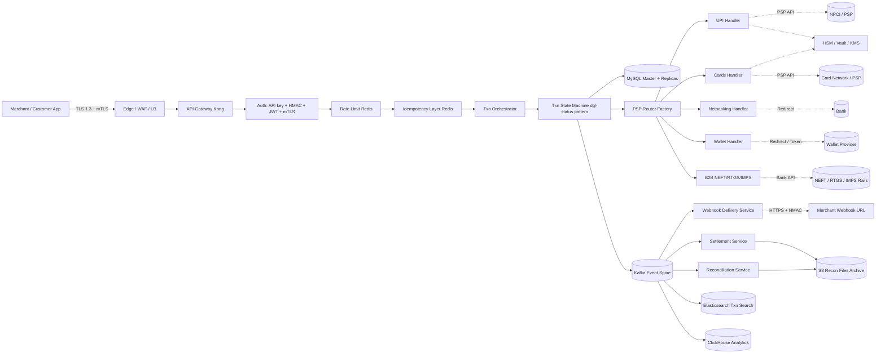
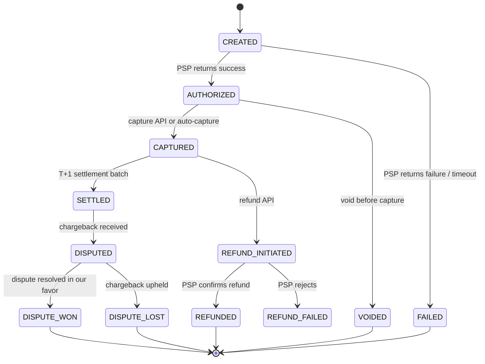
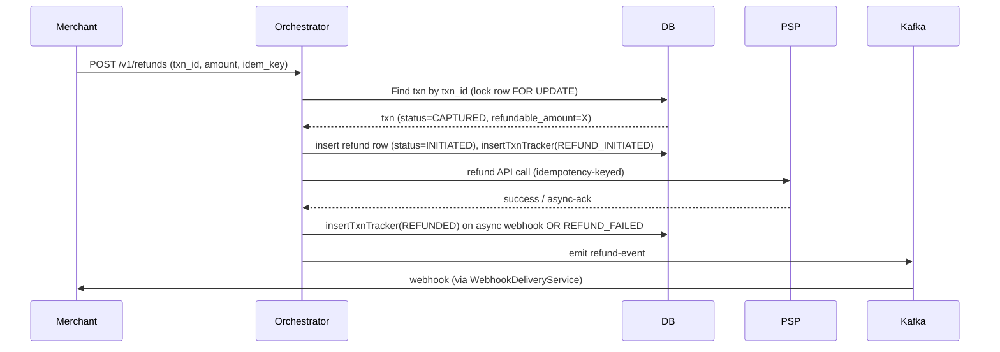

# File 19: Payment Gateway System Design — B2B + B2C at 10M+/day

> Goal: walk into any payment-gateway system-design round (Airtel, PayU peer, Razorpay-tier) and own it end-to-end — HLD, LLD, middleware picks with justification, scale math, security, and cross-questions.
>
> Anchored to your real PayU lending-stack code: `dgl-status` state machine + `TriggerServiceImpl` (file 05), `ApplicationStage` enum, `A_APPLICATION_STAGE_TRACKER`, Redisson `RLock` (STAR 2), `AutoDisbursalFactory` (file 18), AOP read-write split (STAR 7), GPay 3-layer security (STAR 3) + SFTP recon (STAR 6), `ANachLogsEntity` unique-constraint dedup. Cross-refs files 14, 17, 18, and v2 behavioral pack (file 16).

---

## SECTION 0 — THE 30-SECOND ANSWER

> *"Edge for TLS + auth; a stateless txn orchestrator behind an idempotency layer; a routing layer that picks the right PSP via a Factory; per-mode handler services (UPI, Cards, Netbanking, Wallets, B2B transfer); Kafka as the event spine; MySQL master + replicas for queryable state; Redis for hot reads + idempotency + rate limits; ElasticSearch for txn search; webhook delivery via the always-200 pattern; saga for refunds; HSM + tokenization for PCI; partner-failover routing for resilience."*

That's the 30-second answer. The next 30 minutes is filling in the *why*.

---

## SECTION 1 — REQUIREMENTS & CAPACITY MODEL

### 1.1 Functional requirements

**B2C (collect):**
- UPI (collect intent, push, QR, AutoPay mandate)
- Cards (debit + credit, 3DS 2.0, tokenized PAN)
- Netbanking (redirect flow with ~50 banks)
- Wallets (Paytm, MobiKwik, Amazon Pay, FreeCharge)
- EMI (bank EMI, no-cost EMI, cardless EMI via NBFC)

**B2B (payout):**
- NEFT (batched, ~30 min cycle, no upper limit, no lower limit since 2024)
- RTGS (real-time, ≥ ₹2L)
- IMPS (real-time, 24×7, ≤ ₹5L)
- UPI payout (≤ ₹1L per txn, lower for some channels)
- Beneficiary verification (Penny Drop)

**Lifecycle:**
- Refund (full + partial)
- Dispute / chargeback
- Settlement (T+1 default, T+0 express)
- Reconciliation (daily file from each PSP / rail)
- Reporting (merchant dashboard, internal BI)

### 1.2 Non-functional requirements

| Concern | Target |
|---|---|
| Throughput | 10M req/day ≈ **115 RPS average**, peak **~2000 RPS** (5-10x at IST shopping hours + EOD recon) |
| Latency p99 (auth path) | **< 500 ms** end-to-end, including PSP call |
| Latency p99 (webhook delivery) | **< 5 min** |
| Availability | **99.95%** for core auth path (≈ 4h 22min downtime / year) |
| Money correctness | **zero loss tolerance** — every paise reconciled |
| Compliance | PCI-DSS Level 1, RBI tokenization mandate, 2FA where applicable |
| Data retention | 7 years (RBI), audit-immutable |

### 1.3 The "10M/day" capacity math (do this out loud)

```
10,000,000 req/day
÷ 86,400 sec/day
≈ 115 RPS average

Peak factor 10x (Black Friday, festival sales, salary days)
≈ 1,150 RPS peak

EOD recon burst: 50 partners × ~10K txns each = 500K compute calls/hour
≈ ~140 additional RPS for ~2 hours
```

**Conclusion:** **~2000 RPS peak** is the design target. Not Stripe-scale (50K+ RPS); modest but realistic mid-sized India fintech scale. **Honesty point:** don't claim Stripe-scale numbers in interviews unless you've actually run them — the gotcha questions on "how did you handle Kafka rebalance at 50K RPS" will catch you.

### 1.4 Out of scope (call this out explicitly)

- KYC onboarding (separate domain)
- Merchant signup / underwriting
- BNPL underwriting
- Loan origination (different system — `dgl-services`)
- Card-network internals (Visa/MC authorization flow — we hit them via the PSP)

---

## SECTION 2 — HIGH-LEVEL DESIGN (HLD)

### 2.1 The diagram



### 2.2 The flow in 8 steps (memorize)

1. **Client → Edge** — TLS termination + DDoS protection.
2. **Edge → Gateway → Auth** — API key + HMAC verification.
3. **Auth → Rate limit** — Redis token-bucket per merchant.
4. **Rate limit → Idempotency** — first hit runs; subsequent identical hits return cached response.
5. **Idempotency → Orchestrator** — creates txn row, fires `CREATED` state, returns txn_id sync.
6. **Orchestrator → Router → PSP handler** — picks PSP, invokes its API, waits for `AUTHORIZED` or `FAILED`.
7. **State machine → Kafka** — every state transition fires an event; downstream consumers project to ES, settlement, webhooks, recon.
8. **Webhook delivery service → Merchant** — async; retries with exponential backoff; signed via HMAC.

### 2.3 What this design borrows from the lending stack

| Pattern | From | Used here for |
|---|---|---|
| Stateless orchestrator + state machine + audit table | `dgl-status` / `ApplicationStatusServiceImpl.insertApplicationTracker` | Single mutation chokepoint for txn state |
| `ApplicationStage` enum | `dgl-status` | Txn lifecycle stages |
| Partner-keyed event dispatch (Factory + Map) | `TriggerServiceImpl.partnerStageEventConfigMap` | PSP routing + per-PSP events |
| Idempotency via DB unique constraint | `ANachLogsEntity` `event_id` unique | Webhook + idempotency-key dedup |
| Distributed lock for per-key serialization | Redisson `RLock` keyed by `digio:upinach:callback:{mandateId}` (STAR 2) | Per-txn lock during high-contention paths |
| Read-write split via AOP | `@DataSource(SLAVE_DB)` (STAR 7) | Dashboard reads, recon scans |
| 3-layer security stack | GPay JWT + PGP + TLS 1.3 mTLS (STAR 3) | High-value partner integrations |
| Bouncy Castle hardening | Static-block register + verify + re-register (STAR 6) | All crypto code paths |

---

## SECTION 3 — COMPONENT-BY-COMPONENT DEEP DIVE

### 3.1 Edge / WAF / Load Balancer

**Responsibilities:** TLS 1.3 termination, mTLS for B2B clients, DDoS protection, geo routing, IP allowlisting per merchant, basic bot blocking.

**Tech picks:**
- **AWS ALB / NLB** for L4/L7 termination; **CloudFront** for global edge.
- **AWS Shield Advanced** + **Cloudflare** for DDoS mitigation.
- **AWS WAF** managed rule sets (SQL injection, XSS, common bot patterns).

**LLD details:**
- Two AZs minimum, three for production. Health check every 5s on `/healthz` (returns 200 if DB + Redis + Kafka reachable).
- Sticky sessions: **no** (stateless services).
- Connection draining: 30s grace before instance removal.

**Why TLS 1.3:** required for forward secrecy, smaller handshake (1-RTT, 0-RTT for resumption), removes weak ciphers. **Don't terminate below the gateway** — internal traffic should re-encrypt or use service mesh mTLS.

### 3.2 API Gateway

**Responsibilities:** request routing to right service, version routing (`/v1`, `/v2`), request transformation, basic rate limiting, observability hook.

**Tech picks:** **Kong** (open-source + enterprise tier), **Spring Cloud Gateway** (if Java team), **AWS API Gateway** (managed but vendor-lock + cold-start tax).

**LLD details:**
- Plugin chain: auth → rate-limit → request-transform → upstream-route → response-transform → log.
- Latency budget for gateway: **< 10 ms p99**.
- Horizontal scale: stateless, scale on CPU + connection count.

**Why not Nginx:** Nginx is great as a reverse proxy but lacks the plugin ecosystem (auth, rate-limit, observability) — you'd build it yourself.

### 3.3 Auth layer

**Multi-mode auth** (different clients, different needs):

| Mode | Used by | How |
|---|---|---|
| **API key + HMAC-SHA256** | Server-to-server B2B integrations | Header: `X-API-Key`, body signed with `HMAC-SHA256(secret, payload)` in `X-Signature`. Verify timestamp window (≤ 5 min) to prevent replay. |
| **JWT (RS256)** | Hosted checkout / merchant dashboard | Short-lived (15 min) access token + 24h refresh. Verify signature with rotating JWKS. |
| **mTLS** | High-trust B2B (banks, large enterprises) | Client cert presented at edge; cert thumbprint → merchant lookup. Anchor: **GPay 3-layer security** (STAR 3). |
| **OAuth 2.0** | Customer-facing payment flows where consent matters | Authorization Code + PKCE for SPA; refresh tokens for app installs. |

**Anchor:** the same three-layer pattern used for GPay term-loan integration — JWT for app auth + PGP for payload + TLS 1.3 mTLS for transport. Passed Google's security review on first attempt (STAR 3).

**LLD note:** **never** put the auth logic in the gateway plugin alone. Have a dedicated `auth-service` that the gateway delegates to, with its own cache, audit log, and ability to revoke API keys instantly (Redis-backed revocation list).

### 3.4 Rate limiting

**Algorithm:** **token bucket** via Redis Lua script (atomic).

```lua
-- Atomic token bucket. Args: key, capacity, refill_rate, now_ms, tokens_requested
local bucket = redis.call('HMGET', KEYS[1], 'tokens', 'last_refill')
local tokens = tonumber(bucket[1]) or tonumber(ARGV[1])  -- start full
local last = tonumber(bucket[2]) or tonumber(ARGV[3])
local elapsed = math.max(0, tonumber(ARGV[3]) - last)
tokens = math.min(tonumber(ARGV[1]), tokens + elapsed * tonumber(ARGV[2]) / 1000)
if tokens >= tonumber(ARGV[4]) then
    tokens = tokens - tonumber(ARGV[4])
    redis.call('HMSET', KEYS[1], 'tokens', tokens, 'last_refill', ARGV[3])
    redis.call('EXPIRE', KEYS[1], 3600)
    return 1
else
    return 0
end
```

**Limits per merchant tier:**

| Tier | RPS limit | Daily limit |
|---|---|---|
| Free | 10 RPS | 10K req/day |
| Standard | 100 RPS | 1M req/day |
| Enterprise | 500 RPS | unlimited |
| Whitelisted (banks, large telcos) | custom | custom |

**Anchor:** Redisson `RRateLimiter` does this out of the box. We use the Lua approach when we need custom per-merchant-per-mode limits (UPI vs Cards have different bank-side rate ceilings).

### 3.5 Idempotency layer

**The single most important pattern in any payment system.** Caller sends `Idempotency-Key` header on every mutating request; server caches the response keyed by `(merchant_id, idempotency_key)` for 24h.

```java
@PostMapping("/v1/payments")
public ResponseEntity<PaymentResponse> create(
        @RequestHeader("Idempotency-Key") String idemKey,
        @RequestHeader("X-Merchant-Id") String merchantId,
        @RequestBody PaymentRequest req) {

    String cacheKey = "idem:" + merchantId + ":" + idemKey;

    // 1. Fast path: cached response
    PaymentResponse cached = redis.opsForValue().get(cacheKey);
    if (cached != null) return ResponseEntity.ok(cached);

    // 2. Distributed lock to prevent concurrent first-runs of same key
    RLock lock = redisson.getLock("lock:" + cacheKey);
    if (!lock.tryLock(2, 30, TimeUnit.SECONDS)) {
        throw new TooManyRequestsException();
    }
    try {
        // Re-check inside lock (someone may have completed while we waited)
        cached = redis.opsForValue().get(cacheKey);
        if (cached != null) return ResponseEntity.ok(cached);

        // 3. DB unique constraint as final safety net
        try {
            paymentRepo.save(new Payment(idemKey, merchantId, req));
        } catch (DataIntegrityViolationException dup) {
            // Concurrent insert won; load and return existing
            return ResponseEntity.ok(loadByIdemKey(merchantId, idemKey));
        }

        // 4. Process + cache result
        PaymentResponse resp = process(req);
        redis.opsForValue().set(cacheKey, resp, Duration.ofHours(24));
        return ResponseEntity.ok(resp);
    } finally {
        if (lock.isHeldByCurrentThread()) lock.unlock();
    }
}
```

**Three layers of dedup:**
1. **Redis cached response** (fast path, sub-ms).
2. **Redisson `RLock`** (serializes concurrent first-runs).
3. **DB unique constraint on `(merchant_id, idem_key)`** (correctness fallback if Redis is down).

**Anchor:** same three-layer pattern as `ANachLogsEntity` + Redisson `RLock` + state-machine guard in the Digio NACH webhook flow (STAR 2 + file 18 Section 5.3).

### 3.6 Txn orchestrator + state machine

**The mutation chokepoint.** Every txn state transition goes through one method (`insertTxnTracker` in our hypothetical service), modeled on the `insertApplicationTracker` pattern from `ApplicationStatusServiceImpl` (file 05).

**Txn state diagram:**



**Why pragmatic enum + audit table, not Spring State Machine (STAR 4):**
- Per-PSP differences in trigger events (UPI emits collect-link-sent; cards don't).
- Need to query "show me all txns currently in `AUTHORIZED` for merchant X" — `WHERE current_status = 'AUTHORIZED'` on the audit table is trivial.
- Compliance auditor expects one immutable timeline per txn — `TXN_STAGE_TRACKER` table delivers it.
- No framework lock-in; pure Java enums + JPA.

**LLD — the `insertTxnTracker` flow:**

```java
@Transactional
public void insertTxnTracker(String txnId, TxnStage newStage, String type, Long typeId) {
    // 1. Mark current active row as inactive
    txnTrackerRepo.deactivatePrevious(txnId);
    // 2. Find prev stage (for trigger context)
    TxnStage prev = txnTrackerRepo.findCurrent(txnId).map(TxnTracker::getStage).orElse(null);
    // 3. Deactivate mutually exclusive stages (e.g. REFUND_INITIATED deactivates CAPTURED)
    deactivateDependentStages(txnId, newStage);
    // 4. Save new stage
    TxnTracker tracker = new TxnTracker(txnId, prev, newStage, type, typeId, /*isActive*/ true);
    txnTrackerRepo.save(tracker);
    // 5. Fire triggers (Kafka events) for downstream consumers
    triggerService.process(prev, newStage, txnId, type, typeId);
    // 6. Update admin / notification status
    updateMerchantStatus(txnId, newStage);
}
```

**Single mutation primitive.** All other code paths call `insertTxnTracker`. No direct UPDATE on `txn.current_status` from anywhere else. **Audit, idempotency, and trigger dispatch all happen in one place** — same chokepoint discipline as `dgl-status`.

### 3.7 PSP Routing layer

**Responsibilities:** given `(payment_mode, merchant, currency, country)`, pick which PSP to call.

**Pattern:** Factory + priority list, **exact same pattern as `AutoDisbursalFactory`** (file 18 Section 5; v2 behavioral pack Q12).

```java
public interface PspHandler {
    PaymentMode getMode();
    String getPspName();
    boolean canHandle(PaymentRequest req);
    PaymentResponse charge(PaymentRequest req);
    PaymentResponse refund(RefundRequest req);
    int getPriority();   // lower = preferred
    HealthStatus getHealth();  // CLOSED, HALF_OPEN, OPEN (circuit breaker state)
}

@Component
public class PspRouter {
    private final Map<PaymentMode, List<PspHandler>> handlers;

    public PspRouter(List<PspHandler> all) {
        // Spring auto-discovery, same as AutoDisbursalFactory
        this.handlers = all.stream()
            .collect(Collectors.groupingBy(PspHandler::getMode));
    }

    public PspHandler route(PaymentRequest req) {
        return handlers.get(req.getMode()).stream()
            .filter(h -> h.canHandle(req))
            .filter(h -> h.getHealth() != HealthStatus.OPEN)
            .min(Comparator.comparingInt(PspHandler::getPriority))
            .orElseThrow(() -> new NoPspAvailableException(req.getMode()));
    }
}
```

**Routing inputs (the "smart router" picks based on these):**

| Input | Why it matters |
|---|---|
| Payment mode | Cards-only PSPs (Stripe) can't do UPI |
| Merchant config | Some merchants on-board to specific PSPs only |
| Currency / country | International cards may need a different PSP |
| Recent success rate (last 5 min) | Real-time health, prefer high SR |
| Cost (MDR) | Cheaper PSP wins all else equal |
| Volume tier | High-volume merchants get the lowest-cost PSP |

**Circuit breaker per PSP:** Resilience4j. **Open after 5 consecutive failures or success rate < 95% over last 100 requests; half-open every 30s** with one probe. Failover happens automatically — when Razorpay's circuit opens, traffic shifts to Cashfree, then Juspay.

**Bulkhead per PSP:** dedicated thread pool of 50 connections so a slow PSP doesn't starve the others.

### 3.8 Mode handlers (one sub-section per mode)

#### 3.8.1 UPI handler

**Flows:**
- **Collect intent** — merchant generates collect request; customer pays from UPI app; PSP fires webhook on success.
- **Push** — merchant pushes payment to customer UPI; customer approves in app.
- **QR** — static / dynamic QR; customer scans + pays.
- **AutoPay** — recurring mandate (loan EMI, subscription); RBI-mandated 24h notification before charge.

**Latency profile:** customer-action gated, so async at the app level — but the PSP API call itself returns in <500 ms.

**Edge cases:**
- **Bank downtime** — NPCI rotates banks; PSP handles retry but sometimes returns `TXN_INITIATED` and the actual settlement is unclear for hours. **Always poll status if no webhook within 2 minutes.**
- **Duplicate UPI ID submission** — same customer hits collect twice from two devices. **Idempotency key handles this.**

#### 3.8.2 Cards handler

**Flows:**
- **Auth + capture** — debit/credit card with 3DS 2.0 challenge if risk-flagged.
- **Auth-only + later capture** — for travel/hotel where final amount is known later.
- **Tokenized cards** — post-RBI mandate Sep 2022, **no merchant stores raw PAN.** Network tokens (Visa Token Service, MasterCard Digital Enablement) or issuer tokens.

**3DS 2.0** — frictionless flow (issuer assesses risk silently) for ~80% of txns; challenge flow (OTP / biometric) for the rest.

**LLD critical:** the PAN never enters our system. **PCI-DSS Level 1 scope reduction** — we receive a network token from the PSP / network on first save, store the token + last-4 + expiry only.

#### 3.8.3 Netbanking handler

**Flow:** merchant initiates → our gateway constructs bank-specific redirect URL → customer redirects to bank login → bank confirms → callback to our gateway → we update txn state.

**The ugly truth about netbanking:**
- ~50 banks each with their own API quirks.
- ~5% of banks have unreliable webhooks — **always poll status on a 30s interval until terminal.**
- Some banks return the redirect HTML inline, others as a form POST — abstraction layer in the handler matters.

**LLD:** keep per-bank config in `psp_bank_config` table (endpoint, callback URL, signing key, polling URL). **Hot reload via ConfigNexus pattern** so no deploy needed when a bank changes its endpoint.

#### 3.8.4 Wallet handler

**Flow:** redirect-then-callback similar to netbanking, but auth is wallet-native (PIN, biometric). Some wallets (Paytm) support direct token exchange — no redirect.

**Latency profile:** customer-gated; same handling as UPI.

#### 3.8.5 EMI handler

**Three flavors:**
1. **Bank EMI** — card auth for full amount, bank converts to EMI on settlement.
2. **No-cost EMI** — merchant subvents the interest; full amount auth, merchant pays interest portion to bank.
3. **Cardless EMI** — NBFC underwrites the customer at checkout time; **becomes a loan, not a payment** — different flow.

**Anchor:** the cardless EMI flow is essentially what your PayU lending stack does — application → KYC → mandate → disbursal.

#### 3.8.6 B2B transfer handler

**Modes:**

| Rail | When | Limit | Cost | Settlement |
|---|---|---|---|---|
| **IMPS** | Real-time, 24×7 | ≤ ₹5L | ₹2-5 / txn | Instant |
| **NEFT** | Batched, half-hourly | No upper limit | ₹1-2 / txn | Same day |
| **RTGS** | Real-time, business hours | ≥ ₹2L | ₹15-50 / txn | Instant |
| **UPI** | Real-time, 24×7 | ≤ ₹1L (per txn) | Free | Instant |

**Beneficiary verification (Penny Drop):** before first payout to a new account, send ₹1 verify it lands, fetch the registered name from the bank response, match against merchant-provided name. **Critical for fraud prevention.**

**Why we hold funds in a single account:** simplifies recon; cheaper than per-merchant nodal accounts; RBI nodal account rules require strict ledgering (we can never co-mingle).

### 3.9 Settlement service

**Default T+1:** all captured txns of day D get aggregated, MDR + GST deducted, net amount paid to merchant on day D+1 morning.

**T+0 express:** premium feature; net amount paid same day after cutoff.

**Cycle:**

```
06:00 IST — read all txns captured between yesterday 06:00 and today 06:00
06:05 IST — group by merchant, compute gross + MDR + GST + net
06:15 IST — generate per-merchant settlement entries in DB (`settlement_batch` + `settlement_item`)
06:30 IST — initiate B2B transfer (NEFT batch / IMPS) to each merchant's bank account
07:00 IST — webhook to merchant: "Settlement X paid, see report"
07:30 IST — generate settlement report PDF, upload to merchant dashboard
```

**Schema:**

```sql
CREATE TABLE settlement_batch (
    batch_id        VARCHAR(36) PRIMARY KEY,
    merchant_id     VARCHAR(36) NOT NULL,
    settlement_date DATE NOT NULL,
    gross_amount    BIGINT NOT NULL,
    mdr_amount      BIGINT NOT NULL,
    gst_amount      BIGINT NOT NULL,
    net_amount      BIGINT NOT NULL,
    status          ENUM('PENDING','IN_PROGRESS','COMPLETED','FAILED'),
    bank_utr        VARCHAR(64),
    INDEX idx_merchant_date (merchant_id, settlement_date),
    UNIQUE KEY uk_merchant_date (merchant_id, settlement_date)
);
```

**Unique constraint on `(merchant_id, settlement_date)`** = at-most-one settlement per day per merchant. **Idempotency by DB invariant.**

### 3.10 Webhook delivery service

**The most important async component.**

**Always-200-to-source-on-intake** is for receiving webhooks from PSPs (STAR 2). When **we send webhooks to merchants**, we expect them to follow the same discipline — so we **retry hard**.

**Retry schedule:** 1m → 5m → 15m → 1h → 6h → 24h → DLQ. **6 attempts; 31h total window.**

**Implementation:**

```java
@Service
public class WebhookDeliveryService {
    private final KafkaTemplate<String, WebhookEvent> kafka;
    private final WebhookDeliveryRepository repo;

    @KafkaListener(topics = "txn-events")
    public void onTxnEvent(TxnEvent event) {
        // Project txn event into webhook delivery row
        WebhookDelivery delivery = new WebhookDelivery(
            UUID.randomUUID().toString(),
            event.getMerchantId(),
            event.getTxnId(),
            event.getStage(),
            buildPayload(event),
            DeliveryStatus.PENDING,
            0,
            Instant.now()
        );
        repo.save(delivery);
        // Fire to async delivery executor
        deliveryExecutor.submit(() -> attempt(delivery));
    }

    private void attempt(WebhookDelivery d) {
        String signature = "HMAC-SHA256=" + hmacSha256(d.getPayload(), merchantSecret(d.getMerchantId()));
        HttpResponse<String> resp = httpClient.send(
            HttpRequest.newBuilder()
                .uri(merchantWebhookUrl(d.getMerchantId()))
                .header("Content-Type", "application/json")
                .header("X-Signature", signature)
                .header("X-Event-Id", d.getId())
                .header("X-Timestamp", Long.toString(Instant.now().getEpochSecond()))
                .POST(BodyPublishers.ofString(d.getPayload()))
                .timeout(Duration.ofSeconds(10))
                .build(),
            BodyHandlers.ofString()
        );

        if (resp.statusCode() == 200) {
            d.setStatus(DeliveryStatus.DELIVERED);
            d.setDeliveredAt(Instant.now());
        } else {
            d.setAttempts(d.getAttempts() + 1);
            if (d.getAttempts() >= 6) {
                d.setStatus(DeliveryStatus.FAILED);
                deadLetterQueue.add(d);
                alerting.notify("webhook-delivery-permanent-failure", d);
            } else {
                d.setNextAttemptAt(Instant.now().plus(BACKOFF_SCHEDULE[d.getAttempts()]));
                d.setStatus(DeliveryStatus.RETRYING);
            }
        }
        repo.save(d);
    }
}
```

**HMAC signing:** the merchant verifies our signature with their secret. Prevents tampering, prevents replay (combined with `X-Timestamp` + 5-min window).

**DLQ:** dead-letter queue is a Kafka topic with infinite retention. Manual ops replay tooling reads from DLQ when a merchant says "we missed webhooks for the past 6 hours."

### 3.11 Refund + dispute service

**Refunds:** orchestration-style saga.



**Compensating action** (when PSP refund fails after our DB shows `INITIATED`):
- Move refund to `FAILED` after 3 PSP retries.
- Alert ops to manual investigation.
- Customer notification: "Refund will be processed within 7 business days" (RBI guideline).

**Disputes / chargebacks:** asynchronous lifecycle that can span weeks.

| Stage | Trigger | Action |
|---|---|---|
| Retrieval request | Issuer requests txn details | Auto-respond with receipt + proof |
| Chargeback initiated | Customer disputes via issuer | Reverse settled amount from merchant balance |
| Pre-arbitration | Merchant submits evidence | Forward to PSP |
| Arbitration | Network decides | Final amount disposition |
| Outcome | Won / lost | Settle correspondingly |

### 3.12 Reconciliation service

**Daily file from each PSP** — usually CSV / JSON via SFTP. **Anchor:** the GPay recon SFTP path (`GpayServiceImpl.uploadReconFileToSftpServer`, STAR 6).

**Recon engine:**

```
1. Pull file from PSP SFTP (or PSP pushes to ours).
2. Parse rows into staging table (`recon_psp_rows`).
3. Join with our internal txn table by (psp_txn_id, amount, date).
4. Three buckets:
   - MATCHED — same on both sides, no action.
   - PSP_ONLY — PSP has it, we don't. Investigate (missed webhook? lost record?).
   - INTERNAL_ONLY — we have it, PSP doesn't. Investigate (failed at PSP after our state moved? out-of-cycle?).
5. Exceptions go to ops queue (Slack alert + dashboard).
6. Auto-resolve known patterns (timezone offsets, fee adjustments) via configurable rules.
```

**Bouncy Castle anchor (STAR 6):** the SFTP upload path uses Bouncy Castle for OpenSSHv1 key parsing — `SftpClient.registerBouncyCastleProvider()` with static-block registration + `MessageDigest.getInstance("MD5", "BC")` verification + re-register fallback. **All crypto code paths in this design follow that pattern.**

### 3.13 Reporting / analytics

**Hot path:** OLAP store (ClickHouse) populated via Debezium CDC from MySQL → Kafka → ClickHouse sink. **Avoid dual-writes** (file 17 CQ10).

**Merchant dashboard:** reads from ClickHouse for analytics ("last 30 days revenue by mode"), reads from ES for txn search ("find txns from this customer last week").

**BI / risk:** internal team queries ClickHouse directly via Metabase / Superset.

**Anchor:** read-write split pattern (STAR 7) lets ops run heavy queries against the analytics layer without touching the OLTP master.

---

## SECTION 4 — DATA MODEL + SHARDING

### 4.1 Core tables

```sql
-- The main txn table
CREATE TABLE txn (
    txn_id          VARCHAR(36) PRIMARY KEY,        -- UUID
    merchant_id     VARCHAR(36) NOT NULL,           -- shard key
    amount          BIGINT NOT NULL,                -- paise
    currency        CHAR(3) NOT NULL,
    payment_mode    VARCHAR(20) NOT NULL,           -- UPI/CARD/NB/...
    psp_name        VARCHAR(50),                    -- which PSP we routed to
    psp_txn_id      VARCHAR(100),                   -- PSP's reference
    current_stage   VARCHAR(30) NOT NULL,
    customer_ref    VARCHAR(36),                    -- masked customer identifier
    metadata        JSON,
    created_at      TIMESTAMP(3) DEFAULT CURRENT_TIMESTAMP(3),
    updated_at      TIMESTAMP(3) ON UPDATE CURRENT_TIMESTAMP(3),
    INDEX idx_merchant_created (merchant_id, created_at),
    INDEX idx_psp_txn (psp_name, psp_txn_id),
    INDEX idx_stage (current_stage, created_at)
);

-- The audit/event log (one row per state transition)
CREATE TABLE txn_event (
    event_id        BIGINT AUTO_INCREMENT PRIMARY KEY,
    txn_id          VARCHAR(36) NOT NULL,
    prev_stage      VARCHAR(30),
    new_stage       VARCHAR(30) NOT NULL,
    type            VARCHAR(30) NOT NULL,           -- 'CALLBACK', 'API', 'CRON'
    type_id         VARCHAR(100),
    is_active       BOOLEAN NOT NULL DEFAULT TRUE,
    metadata        JSON,
    created_at      TIMESTAMP(3) DEFAULT CURRENT_TIMESTAMP(3),
    INDEX idx_txn_stage (txn_id, new_stage),
    INDEX idx_txn_active (txn_id, is_active)
);

-- Idempotency / dedup
CREATE TABLE idempotency_key (
    merchant_id     VARCHAR(36) NOT NULL,
    idempotency_key VARCHAR(128) NOT NULL,
    txn_id          VARCHAR(36) NOT NULL,
    response_body   JSON,
    created_at      TIMESTAMP DEFAULT CURRENT_TIMESTAMP,
    PRIMARY KEY (merchant_id, idempotency_key)
);

-- Webhook outbox
CREATE TABLE webhook_delivery (
    delivery_id     VARCHAR(36) PRIMARY KEY,
    merchant_id     VARCHAR(36) NOT NULL,
    txn_id          VARCHAR(36) NOT NULL,
    event_type      VARCHAR(50) NOT NULL,
    payload         JSON NOT NULL,
    status          ENUM('PENDING','RETRYING','DELIVERED','FAILED') NOT NULL,
    attempts        INT NOT NULL DEFAULT 0,
    next_attempt_at TIMESTAMP,
    delivered_at    TIMESTAMP NULL,
    INDEX idx_status_next (status, next_attempt_at)
);
```

### 4.2 Sharding strategy

**Pre-sharded:** when total OLTP volume < 500 GB and write RPS < 5K, **don't shard.** Master + 2 replicas + AOP routing (STAR 7) is enough.

**Sharded:** beyond that, **shard by `merchant_id`** (hash) — same merchant always lands on the same shard, enabling per-merchant joins without cross-shard pain.

**Why merchant_id:** every authenticated API call has the merchant in the URL or header. Routing is trivial. Cross-merchant queries are rare (only ops/recon).

**Why not by `txn_id` hash:** would force every per-merchant report to fan out across all shards.

**Vitess** for transparent sharding when we get there. Until then, app-level routing via a `ShardResolver` bean.

### 4.3 Sharding the audit log

`txn_event` is append-only and high write. **Partition by `created_at` month** (PARTITION BY RANGE) so old partitions can be archived to S3 + dropped cheaply.

---

## SECTION 5 — MIDDLEWARE CHOICES (the "which and why" section)

### 5.1 The full picks table

| Concern | Pick | Why this, not the alternative |
|---|---|---|
| **OLTP store** | MySQL 8 master + 2 replicas, Vitess at scale | Mature India fintech tooling (ProxySQL, orchestrator), strong ecosystem, AOP routing already proven in lending stack. PostgreSQL fine alternative but team familiarity wins. |
| **Event spine** | **Apache Kafka** (RF=3, min.insync.replicas=2, acks=all) | Durable replayable log; partitions for ordered per-key streams; Pulsar is technically nicer but ops overhead is higher. RabbitMQ not replayable. |
| **Cache + locks + rate limit** | **Redis Cluster + Redisson** | Sub-ms p99; rich data structures (sorted sets, HyperLogLog); Redisson gives `RLock`, `RRateLimiter`, `RBucket` out of the box. Memcached too thin (no locks, no sorted sets). Cross-ref file 20 for deep dive. |
| **Search** | **Elasticsearch** (via Debezium CDC from MySQL) | Faceted txn search, full-text, fast aggregations. Never source of truth (file 17). |
| **OLAP / BI** | **ClickHouse** (cheaper) or **Snowflake** (managed) | Columnar scan + aggregate, 100x faster than running these queries on OLTP master. |
| **Object storage** | **S3** (versioned, immutable) | Recon files, signed agreements, archive. PCI-friendly. |
| **Secrets** | **HashiCorp Vault** + **AWS KMS** | KMS-rooted with Vault for dynamic creds; rotation built-in; PCI-DSS scope reduction. |
| **HSM** | **AWS CloudHSM** or **Thales nShield** | For card-data crypto (PIN block, CVV verify). RBI-recommended. |
| **API gateway** | **Kong** (open-core) or **Spring Cloud Gateway** | Auth + rate-limit + routing in one place. AWS API Gateway has cold-start tax + vendor lock. |
| **Service mesh** (optional) | **Istio** | mTLS between services, traffic shifting for canary, distributed tracing. Skip if team can't operate it; YAGNI for early stage. |
| **Circuit breaker** | **Resilience4j** | Per-PSP isolation; lightweight; Hystrix is EOL. |
| **Distributed tracing** | **OpenTelemetry → Coralogix** | Anchor: existing Coralogix MCP investment. Standard OTel SDKs, vendor-neutral. |
| **Container orchestration** | **Kubernetes** (EKS / GKE) | Industry standard; ECS as cheaper alternative. |
| **CDC** | **Debezium → Kafka** | Avoids dual-writes (file 17 CQ10). Reliable binlog-based projection. |
| **Schema migrations** | **Liquibase** or **Flyway** + **gh-ost** for online DDL | PCI-grade audit trail; gh-ost prevents replication lag during large table changes. |
| **Feature flags / config** | **ConfigNexus** (your own — STAR 5) or LaunchDarkly | GitLab-MR-style governance for config changes; separation of duties. |
| **CI/CD** | **GitLab CI + ArgoCD** (GitOps) | Already in your stack; ArgoCD's drift detection valuable for compliance. |

### 5.2 Why Kafka, not RabbitMQ or SQS

| | Kafka | RabbitMQ | SQS |
|---|---|---|---|
| Retention | Days/weeks (replayable) | Until consumed | 14 days max |
| Ordering | Per-partition | Per-queue (FIFO) | FIFO queues only |
| Throughput | 100K+ msg/s/broker | ~50K msg/s | Limited |
| Replay | Yes (offset-based) | No | No |
| Operational complexity | High | Medium | Zero (managed) |
| Pull vs push | Pull (consumer-driven) | Push | Pull |

**Verdict:** Kafka for the event spine. Replayability is non-negotiable in payments — when a webhook delivery service comes back from a 4-hour outage, it consumes from where it left off.

### 5.3 Why MySQL, not Cassandra

Same arguments as file 17. **Money-moving workload = OLTP relational = MySQL.** Cassandra wins for click streams, CDR ingestion (Airtel), IoT telemetry — *not* for orders/txns where joins matter and consistency is strict.

---

## SECTION 6 — CRITICAL PATTERNS (cross-cutting)

| Pattern | Where used | Anchor |
|---|---|---|
| **Idempotency** | Every mutating endpoint | Section 3.5, STAR 2 |
| **State machine** | Txn lifecycle | Section 3.6, STAR 4, file 05 |
| **Webhook intake: always-200 + persist + async** | When PSPs call us | STAR 2 (Digio NACH) |
| **Webhook delivery: backoff + DLQ + HMAC** | When we call merchants | Section 3.10 |
| **Distributed locking** | Per-txn serialization across pods | Redisson `RLock`, file 18 Section 5.3 |
| **Saga (orchestration)** | Refund, dispute | Section 3.11 |
| **Circuit breaker** | Per PSP | Resilience4j, Section 3.7 |
| **Bulkhead** | Per-PSP thread pools | Section 3.7 |
| **Outbox pattern** | Any cross-system event emission | File 17 CQ10 |
| **CQRS** | Write to MySQL, read txn search from ES | Section 3.13 |
| **CDC** | MySQL binlog → Debezium → Kafka → ES/CH | Section 5.1 |

---

## SECTION 7 — SCALE & PERFORMANCE

### 7.1 Per-component capacity at 2000 RPS peak

| Component | Pods needed | Per-pod throughput | Bottleneck |
|---|---|---|---|
| Edge / LB | 2 (HA) | 10K+ RPS each | Bandwidth |
| API Gateway | 4 | ~1K RPS | CPU (auth + rate limit) |
| Auth service | 4 | ~2K RPS | Redis lookup for API key |
| Orchestrator | 8 | ~500 RPS (DB-bound) | MySQL write |
| PSP handlers | 4-8 per mode | ~500 RPS | PSP API latency |
| Webhook delivery | 4 (async) | N/A | Outbound HTTP |
| Settlement | 1 (cron) | N/A | Batch window |

**Compute headroom:** scale to 3x peak (6000 RPS) before hitting the next architectural change.

### 7.2 Read scaling

- **80%+ of reads** are cacheable (txn status, merchant config, PSP config).
- Redis cache hit ratio target: **90%+**.
- Read replicas serve dashboard + recon scans via AOP `@DataSource(SLAVE_DB)` (STAR 7).
- Master DB only sees: writes + critical reads (fund deduction, idempotency-key existence check).

### 7.3 Write scaling

- Single MySQL master handles ~5K writes/sec on a `db.r5.4xlarge` with NVMe and `innodb_flush_log_at_trx_commit=2`.
- Below that, **don't shard.** Vertical first (STAR 7 ladder, file 17 CQ6).
- Past 5K writes/sec or 500GB: shard by `merchant_id`.

### 7.4 Cache patterns by use case

| Cache | Pattern | TTL | Why |
|---|---|---|---|
| Idempotency key → response | Write-through | 24h | Must survive process restart |
| PSP routing config | Refresh-ahead | 5min | Updates rare, freshness matters |
| Merchant API key → merchant_id | Cache-aside | 15min | Read-heavy, OK to be 15min stale |
| Txn status (hot read) | Cache-aside with defensive evict at write site | 60s | **STAR 11 lesson — don't trust TTL for correctness** |
| Rate limit token bucket | Atomic (Lua) | N/A | Just storage, no read-then-write race |

### 7.5 Async vs sync paths

| Path | Sync or async? | Why |
|---|---|---|
| Auth + capture | **Sync** (≤ 500ms p99) | Customer is waiting |
| Webhook delivery to merchant | **Async** | Network may be slow / merchant may be down |
| Settlement | **Async** (cron-batched) | Daily; no user waiting |
| Recon | **Async** (cron-batched) | EOD; no user waiting |
| Refund | **Async** with sync ack | PSP refund APIs are often async themselves |
| Notification (email/SMS) | **Async** | Best-effort, retry-able |
| Analytics / audit | **Async** (CDC → Kafka → CH) | Don't add latency to write path |

---

## SECTION 8 — SECURITY (PCI-DSS, tokenization, HSM, mTLS, crypto hardening)

### 8.1 The three-layer security stack (anchor: STAR 3)

| Layer | What | Why |
|---|---|---|
| **Transport** | TLS 1.3 + mTLS at edge for B2B | Mutual auth; prevents server impersonation |
| **Auth** | JWT (RS256) for sessions; API key + HMAC for S2S | Per-request signing prevents tampering |
| **Payload** | PGP encryption for sensitive fields (PII, card data) | Defense in depth — even if TLS terminates upstream |

**Used in production:** the exact GPay term-loan integration that passed Google's security review on first attempt.

### 8.2 PCI-DSS scope

| In scope | Out of scope |
|---|---|
| Anything that touches raw PAN | Anything that touches only tokens / last-4 |
| Card data storage (we don't store PAN) | Tokenized card storage |
| HSM operations (CVV verify, PIN block) | Tokenization API responses |
| Logs that might contain PAN (must mask) | Application logs after PAN masking middleware |

**Scope reduction strategy:** **never let raw PAN into our boundary.** PSP returns a network token on first auth; we store token + last-4 + expiry. Subsequent transactions use the token. **Our PCI scope is reduced to the tokenization handler — a tiny, well-audited service.**

### 8.3 Tokenization (RBI mandate, Sep 2022)

- Merchants can no longer store raw card numbers.
- **Network tokens** via Visa Token Service, MasterCard Digital Enablement, Rupay tokenization.
- Lifetime: token tied to (PAN, merchant). Same PAN at a different merchant = different token.

### 8.4 HSM-backed crypto

For PIN block, CVV verify, and key wrap:
- **AWS CloudHSM** (FIPS 140-2 Level 3) or **Thales nShield**.
- Keys never leave the HSM in plaintext.
- All sensitive crypto ops go through HSM API.

### 8.5 Bouncy Castle hardening (anchor: STAR 6)

The lesson from the GPay SFTP recon incident applies to every crypto code path in this design:

1. **Static-block registration** so BC loads before any caller (`static { registerBouncyCastleProvider(); }`).
2. **Verification by actually using the provider** (`MessageDigest.getInstance("MD5", "BC")`) — `getProvider("BC") != null` lies if BC is registered-but-broken.
3. **Remove-and-re-register fallback** if existing BC is broken.

Applied to: SFTP key parsing (recon), JCE-based AES (payload), HSM signing path, PGP encrypt/decrypt.

### 8.6 Other controls

| Control | What |
|---|---|
| **Encryption at rest** | AES-256 for MySQL, S3, RDS snapshots, EBS volumes |
| **Secret rotation** | Vault dynamic creds; 30-day rotation for static |
| **Audit log immutability** | Append-only log table + S3 with object lock |
| **Separation of duties** | ConfigNexus 4-role split (STAR 5) for config + refund approvals over threshold |
| **Penetration testing** | Annual third-party PT (Synack / Cobalt) |
| **Bug bounty** | HackerOne for public-facing endpoints |

---

## SECTION 9 — RELIABILITY (multi-region, partner failover, failure handling)

### 9.1 Multi-region topology

**Active-active across two AWS regions** (Mumbai `ap-south-1` primary + Hyderabad `ap-south-2` secondary).

- **MySQL** — Group Replication or async with manual failover; replication lag monitored; per-region write authority by merchant shard.
- **Redis** — Redis Enterprise active-active (CRDTs) or per-region Redis Cluster with no cross-region replication for idempotency keys (region-stickiness instead).
- **Kafka** — MirrorMaker 2 for cross-region topic replication; consumers prefer local broker.
- **DNS** — Route 53 weighted routing; health checks every 10s; automatic failover.

### 9.2 Failure scenarios (and what we do)

| Failure | Detection | Action |
|---|---|---|
| PSP outage | Circuit breaker open after 5 failures | Failover to next PSP in priority list |
| MySQL master failover | Replication lag alarm + read replica promotion | ~2 min recovery; idempotency layer + Kafka prevent data loss |
| Redis primary failure | Sentinel detection | Auto-failover to replica; <30s impact |
| Kafka broker failure | ZK/KRaft re-election | Producer retry; consumer rebalance |
| Region outage | Route 53 health check | DNS shift to secondary region in 30-60s |
| Webhook delivery service down | Kafka consumer lag alarm | Replay from last offset; no lost webhooks |
| Settlement cron failure | Cron exit non-zero | Re-run idempotently (UNIQUE on `merchant + date`) |

### 9.3 Chaos testing

**Quarterly game-days:**
- Kill a random pod (Litmus)
- Block a PSP at the network level
- Add 500ms latency to MySQL (toxiproxy)
- Drop a Kafka broker
- Region failover drill

---

## SECTION 10 — OBSERVABILITY

### 10.1 RED method (per service, per PSP)

- **Rate** — requests/sec
- **Errors** — error rate (4xx + 5xx)
- **Duration** — p50 / p95 / p99 latency

### 10.2 SLOs

| SLO | Target | Burn-rate alert at |
|---|---|---|
| Auth path availability | 99.95% | 2% / 1h budget burn |
| Auth p99 latency | < 500ms | 5% breach |
| Webhook delivery p99 | < 5min | 5% breach |
| Settlement on-time delivery | > 99.5% | Any miss |
| Recon match rate | > 99% | < 99% for 24h |

### 10.3 Traces, logs, metrics

- **Traces** — OpenTelemetry SDK in every service → OTel collector → Coralogix (your existing investment).
- **Logs** — structured JSON; PII-masking middleware (mask PAN, CVV, OTP); ship to Coralogix; 7-year retention for compliance subset.
- **Metrics** — Prometheus + Grafana for infra; service-level metrics via Micrometer → Coralogix.

### 10.4 Alerting tiers

| Tier | Examples | Channel |
|---|---|---|
| **P0 / page** | Auth path down, MySQL master unreachable | Phone + Slack + email |
| **P1 / on-call** | PSP circuit open, settlement failure | Slack + email |
| **P2 / next-business-day** | Cache hit rate degraded, p99 budget breach | Email + JIRA ticket |

---

## SECTION 11 — CROSS-QUESTIONS WITH DETAILED ANSWERS

### CQ1. "Walk me through a UPI collect flow end-to-end."

**Opener:** *"Merchant initiates collect → our gateway hits the PSP → PSP sends collect to NPCI → customer pays from UPI app → callback flows back → state machine fires."*

"Step-by-step:

1. Merchant calls our `POST /v1/payments` with `mode=UPI`, `customer_vpa=name@bank`, idempotency key.
2. Gateway → auth → rate limit → idempotency check.
3. Orchestrator creates a `txn` row with `current_stage=CREATED`, returns `txn_id` synchronously.
4. PspRouter picks UPI PSP based on health + cost (e.g. Razorpay > Cashfree).
5. PSP handler calls Razorpay UPI collect API; gets back `psp_txn_id` + `expires_in=300s`.
6. We fire `insertTxnTracker(AUTHORIZATION_PENDING)`. Return `pending` to merchant.
7. Customer gets a UPI app notification (PSP → NPCI → bank → app).
8. Customer approves; bank debits; NPCI confirms to PSP; PSP fires our `/v1/webhooks/upi` callback.
9. Our webhook handler: **always-200 immediately** (STAR 2 pattern), Redisson `RLock` on `txn_id`, persist callback (unique on `psp_event_id` for dedup), then async fire `insertTxnTracker(CAPTURED)`.
10. State machine fires Kafka event → webhook delivery service → merchant gets HMAC-signed callback within seconds.
11. If no PSP callback within 2 minutes: status-poll PSP API as fallback; sometimes the webhook is dropped.

**Failure modes covered:** customer-cancellation → PSP fires `FAILED` callback → we fire `insertTxnTracker(FAILED)`. Customer-timeout → PSP fires `EXPIRED` → same path. Bank downtime → PSP retries internally, may return ambiguous status → polling kicks in."

---

### CQ2. "How do you ensure idempotency across retries?"

**Opener:** *"Three layers: Redis cached response, Redisson distributed lock, DB unique constraint. Belt-and-suspenders."*

"Caller sends `Idempotency-Key` on every mutating request. Three layers:

1. **Redis cache** — `idem:{merchant_id}:{idempotency_key}` → cached response. Sub-ms lookup. TTL 24h.
2. **Redisson `RLock`** — serializes concurrent first-runs for the same key across pods.
3. **DB unique constraint** on `(merchant_id, idempotency_key)` — even if Redis is down, a duplicate insert throws `DataIntegrityViolationException`, which we catch and load the existing record.

This is the exact same pattern as `ANachLogsEntity` + Redisson `RLock` + state-machine guard from the Digio NACH webhook (STAR 2). **Belt-and-suspenders matter** — if you lose Redis you don't lose correctness."

---

### CQ3. "Why a state machine for txn lifecycle, not flags?"

**Opener:** *"Auditability, single mutation chokepoint, transition validation, and replayable history. Same reasoning as `dgl-status` (STAR 4)."*

"Three reasons:

1. **Auditability** — `txn_event` is append-only. Compliance auditor asks 'show me the complete timeline of txn_id X' — one query.
2. **Single mutation chokepoint** — `insertTxnTracker(...)` is the only place state changes. Every other code path calls through it. Triggers (Kafka events), notifications, admin status updates — all happen automatically because they're in one method.
3. **Transition validation** — `if (currentStage != AUTHORIZED) throw InvalidStateException` is trivial. With flags scattered across columns, you can accidentally `CAPTURED=true` while `REFUNDED=true`.

**Why pragmatic enum + DB audit table, not Spring State Machine** (STAR 4 in the v2 behavioral pack): partner-specific events per stage; Spring SM couples state→action at the framework layer, but our problem needs partner-keyed state→action. The `partnerStageEventConfigMap` pattern (file 05) scales to 15+ partner builders without framework gymnastics."

---

### CQ4. "How do you handle a partner outage in the middle of a payment?"

**Opener:** *"Circuit breaker per PSP + routing layer failover + idempotency-keyed retry. Customer sees no disruption."*

"**Detection:** Resilience4j circuit breaker on each PSP handler. Opens after 5 consecutive failures or success rate < 95% over last 100 requests.

**Failover:** when Razorpay's circuit opens, PspRouter automatically picks the next handler in priority (Cashfree, then Juspay). **The retry of the same payment uses the same idempotency key** — if the first attempt actually succeeded at Razorpay and we just didn't see the response, the second attempt at Cashfree could double-charge **without idempotency**. So: idempotency-keyed retries + a reconciliation pass that detects 'we routed to PSP1 but PSP2 also confirmed' as a known anomaly (rare; handled via T+1 recon exception queue).

**Customer experience:** for sync flows, we hold the response for up to 30s while we try alternates; for redirect flows, we re-render with the alternate PSP's redirect URL.

**Recovery:** half-open every 30s; one probe; if successful, close the circuit and resume. **Never** flap-back instantly — wait for 5 successive probes."

---

### CQ5. "How do you ensure no double-charge?"

**Opener:** *"Idempotency key from the merchant + idempotency token to the PSP + reconciliation as the final safety net."*

"Three lines of defense:

1. **Merchant idempotency key** — same key returns same response (Section 3.5).
2. **PSP-side idempotency** — every PSP API call from our system includes our internal `txn_id` as their idempotency token. If our retry hits the PSP twice, they dedup on their side.
3. **Reconciliation** — daily T+1 file from PSP vs our internal txns. Any mismatch (PSP says 2 txns, we say 1) goes to exception queue. **The recon is the ultimate truth check — if PSP records say we charged twice, we issue automatic refund.**

**The cost of getting this wrong:** the mandate-retry incident (backup STAR 6 in file 16) — same transaction id reused on retry, double-booked mandates, manual refunds for 24 hours. **Idempotency is not optional.**"

---

### CQ6. "PCI-DSS scope — what's in scope, what's out?"

**Opener:** *"In scope: anything that touches raw PAN. Out: anything that only touches tokens. Goal is to minimize the in-scope surface."*

"PCI-DSS Level 1 (the strictest, for systems processing > 6M txns/year) requires:

- Quarterly internal scans + annual external pen test by a QSA (Qualified Security Assessor).
- Network segmentation between in-scope and out-of-scope systems.
- Encryption at rest + in transit for cardholder data.
- Access logs retained 1 year (3 months immediately available).
- Restricted physical + logical access.

**Our scope-reduction strategy:** the **tokenization handler is the only service that ever touches raw PAN**, and only momentarily — receives from the PSP, exchanges for a network token, discards the PAN. Everything else handles tokens. **The other 95% of our services are out of scope.**

Logs that might contain PAN: PII-masking middleware in every service masks before any log write. PAN is replaced with `XXXX-XXXX-XXXX-1234` (last 4 only). Same middleware masks CVV and OTP."

---

### CQ7. "How do you handle webhook delivery failures?"

**Opener:** *"Persistent outbox + exponential retry + DLQ + HMAC signing. Six attempts over 31 hours, then DLQ for manual replay."*

"Architecture:

1. **Outbox row** persisted in DB at the same time as state transition (single txn).
2. **Async delivery service** consumes the outbox, attempts HTTP POST to merchant URL with HMAC signature.
3. **Exponential backoff** — 1m, 5m, 15m, 1h, 6h, 24h. 6 attempts total.
4. After 6 failures → **dead-letter queue** (Kafka topic with infinite retention).
5. **DLQ replay tool** for ops — 'merchant says they missed webhooks from 12pm-4pm, replay this slice.'

**HMAC signing:** `X-Signature: HMAC-SHA256(merchant_secret, payload)`. Merchant verifies on their side. **X-Timestamp + 5-min window prevents replay attacks.**

**One critical detail:** the outbox is in the **same DB transaction** as the state transition. If the state changes but the outbox write fails, both roll back. This is the **outbox pattern** (file 17 CQ10) — avoids dual-write inconsistency."

---

### CQ8. "How do you handle a refund when the original PSP is down?"

**Opener:** *"Queue the refund with retry, alert ops if outage exceeds SLA, fall back to manual bank transfer as the last resort."*

"Refunds are async by design — RBI allows 7 business days for refund credit. So a PSP outage isn't catastrophic, but we still need to handle it cleanly:

1. **Refund initiated** → DB state `REFUND_INITIATED`, customer-facing message: 'Refund will reflect in 5-7 business days.'
2. **PSP API call** → if circuit open, queue in `refund_retry` table with `next_attempt_at = now + 1h`.
3. **Retry every hour** for up to 72h.
4. After 72h still open → **ops alert** (P1). Manual investigation.
5. **Manual fallback** — if PSP unreachable indefinitely (rare; usually < 4 hours), ops can issue manual NEFT/IMPS via our B2B handler. Reconciled against the refund record by `psp_txn_id`.

**The principle:** refunds *will* eventually succeed; we trade time for correctness, not the other way around."

---

### CQ9. "How do you shard the txn table?"

**Opener:** *"By `merchant_id` hash. Same merchant = same shard. Routing trivial; cross-shard queries rare."*

"**Threshold:** don't shard until master can't keep up. ~5K writes/sec and 500GB are typical signals.

**Why merchant_id:** every authenticated API request has merchant in the URL or header. Routing is `shard = hash(merchant_id) % N`. Cross-shard joins (rare — only ops/recon) push to ClickHouse via CDC.

**Why not txn_id:** would force every per-merchant report (settlement, dashboard) to fan out across all shards.

**Why not by date:** time-based sharding seems clean but creates a permanent hotspot on the current shard; all writes go to one node.

**Tooling:** Vitess for transparent sharding when we get there. Until then, app-level routing via a `ShardResolver` bean that picks the right `DataSource` per request.

**Audit table partitioning:** `txn_event` is huge (one row per state change). **Partition by `created_at` month** — old partitions archive to S3 + drop cheaply."

---

### CQ10. "Why Kafka, not RabbitMQ?"

**Opener:** *"Replayability. When the webhook delivery service comes back from a 4-hour outage, it consumes from where it left off."*

"Three reasons Kafka wins for this workload:

1. **Replay** — RabbitMQ deletes after ack; Kafka retains for days. If a downstream service was down 4 hours, it catches up.
2. **Per-key ordering** — partition by `txn_id` so all events for one txn are processed in order. RabbitMQ FIFO queues exist but don't scale similarly.
3. **Throughput** — Kafka handles 100K+ msg/s per broker; RabbitMQ ~50K. Not the bottleneck yet at 2000 RPS, but headroom matters.

**Where RabbitMQ wins:** complex routing (topic exchanges), per-message ack/nack (vs Kafka's offset-based), simpler ops for small teams. **Not our needs here.**"

---

### CQ11. "Why MySQL, not Postgres or Cassandra?"

**Opener:** *"MySQL for team familiarity + ecosystem maturity. Postgres is a fine alternative. Cassandra is wrong shape for OLTP."*

"**MySQL vs Postgres:** technically Postgres has nicer JSON support, window functions, and partial indexes. **But India fintech ecosystem is MySQL-heavy** — ProxySQL, orchestrator, Vitess, gh-ost, PT-toolkit all mature on MySQL. Hiring is easier. AOP read-write split (STAR 7) is already proven on MySQL.

**MySQL vs Cassandra:** Cassandra is the wrong shape (file 17 Section 3.3). Money-moving workload needs ACID + joins + ad-hoc queries. Cassandra punishes ad-hoc analytics and forces denormalization per query pattern. **MySQL master + replicas + Redis cache + ES for search beats Cassandra at this scale.**

**The migration we'd consider:** Vitess at ~50K writes/sec or 5TB. Until then, MySQL stays."

---

### CQ12. "How do you do recon and what triggers an exception?"

**Opener:** *"Daily file from each PSP, three-way match against our internal ledger. Three buckets: matched, PSP-only, internal-only."*

"Daily SFTP pull from each PSP (anchor: GPay SFTP path, STAR 6). Parser loads into `recon_psp_rows` staging table. Three-way match by `(psp_txn_id, amount, date)`:

| Bucket | What it means | Action |
|---|---|---|
| **Matched** | Both sides agree | No action; archive |
| **PSP_ONLY** | PSP has it, we don't | We missed a webhook; replay from `psp_txn_id` |
| **INTERNAL_ONLY** | We have it, PSP doesn't | Possible failed-at-PSP-after-our-state-moved; manual investigation |

**Auto-resolve patterns** (configurable): timezone offsets, MDR rounding, T+0 vs T+1 boundary cases. **Manual queue** for everything else; ops works through it before next business day.

**SLO:** > 99% match rate. < 99% for 24h → P2 alert."

---

### CQ13. "How do you handle replay attacks?"

**Opener:** *"Two layers: HMAC signature + timestamp window + nonce/idempotency key. Same payload after 5 minutes = rejected."*

"For webhooks we send: `X-Signature: HMAC-SHA256(...)` + `X-Timestamp: epoch_seconds`. Merchant verifies (a) signature matches, (b) `|now - X-Timestamp| < 5 min`, (c) optionally `X-Event-Id` hasn't been seen before (idempotency on their side).

For webhooks we receive: same checks. We persist `psp_event_id` with unique constraint → duplicates rejected at DB level.

For API requests: API key + HMAC over body + `X-Timestamp` header. Replay window 5 min. Each request also has an `Idempotency-Key` we dedup on."

---

### CQ14. "How would you scale from 10M/day to 100M/day?"

**Opener:** *"Vertical first, then read replicas exhaustively, then cache aggressively, then shard MySQL, then split mode-handlers, then Kafka partition count, then multi-region active-active."*

"The scaling ladder (same as file 17 CQ6, applied here):

1. **Vertical scaling** — bigger MySQL master, more RAM for buffer pool. Buys 5-10x.
2. **More read replicas** — 4 replicas instead of 2; route 80%+ of reads off master.
3. **Cache hit ratio improvement** — go from 90% to 98% on hot reads (PSP config, merchant config).
4. **Kafka partition increase** — per-topic partitions from 12 to 60; more consumer parallelism.
5. **Mode-handler scale-out** — UPI handler from 4 pods to 20; bulk of traffic.
6. **MySQL shard by merchant_id** — Vitess. Past 5K writes/sec.
7. **Multi-region active-active** — Mumbai + Hyderabad with per-merchant region affinity.
8. **Compute autoscaling** — HPA on CPU + queue depth.

**What we'd avoid:** rewriting MySQL to Cassandra. Migration cost is months; the underlying access patterns (relational, joins, strict consistency) don't suddenly change at 100M/day."

---

### CQ15. "What's your B2B settlement flow?"

**Opener:** *"Daily cron, aggregate by merchant, deduct MDR + GST, initiate NEFT/IMPS to merchant bank, webhook + dashboard report."*

(See Section 3.9 for full details.)

---

### CQ16. "How do you handle a partial refund?"

**Opener:** *"Track `refunded_amount` cumulatively; refundable = captured - refunded; allow refund up to refundable. Each partial refund is a separate `refund` row with its own state."*

"Schema: `txn.captured_amount` and `txn.refunded_amount`. `refund` table has `refund_id`, `txn_id`, `amount`, `status`. Multiple `refund` rows per `txn`. Trigger:

```sql
UPDATE txn
SET refunded_amount = refunded_amount + :refund_amount
WHERE txn_id = :txn_id
  AND captured_amount - refunded_amount >= :refund_amount;
```

If 0 rows affected → refund amount > refundable; reject the request. **Atomic, no lock needed** — the DB row-level lock handles it (file 18 CQ16, atomic update pattern)."

---

### CQ17. "How do you detect fraud in real time?"

**Opener:** *"Rules engine pre-check + risk score from ML model + post-event analysis. Block on rules; flag on score; review on velocity anomalies."*

"Three layers:

1. **Rules engine pre-check** — synchronous, < 50ms. Block on hard rules (IP from blocklist, card BIN from issuer block, amount > merchant limit).
2. **Risk score from ML model** — synchronous, < 100ms. Score 0-1; > 0.8 → trigger 3DS challenge or block.
3. **Velocity / pattern analysis** — async via Kafka → Flink. Detect 'same card across 5 merchants in 10 min' or 'IP at 100 txns/hour.' Updates the rules engine + risk model.

**Where this lives:** dedicated `risk-service` called pre-PSP. Latency budget is tight — we can't add 500ms to every txn for fraud check. The async layer handles things that don't need sync answer."

---

### CQ18. "Webhook signature verification — what algorithm and why?"

**Opener:** *"HMAC-SHA256 with merchant secret + timestamp. Symmetric, fast, RBI-acceptable, well-understood."*

"`X-Signature: HMAC-SHA256(merchant_secret, X-Timestamp + '.' + payload)`. Merchant verifies on their side. Why this and not RSA / ECDSA:

| | HMAC-SHA256 | RSA / ECDSA |
|---|---|---|
| Speed | < 1ms | ~10ms |
| Key management | Shared secret per merchant | Public-private keypair |
| Key rotation | Trivial | Requires JWKS / discovery |
| Crypto strength | Same security level | Same |
| Standard | RFC 2104, HMAC-SHA256 | More complex |

**For higher-trust integrations** (bank-grade) we offer RSA-PSS as an option. Default is HMAC because rotation + verification are simpler."

---

### CQ19. "Card tokenization — what changed post RBI mandate 2022?"

**Opener:** *"Merchants can no longer store PAN; network tokens replace card numbers. PCI scope shrinks dramatically."*

"Sep 30, 2022 RBI mandate: merchants and aggregators cannot store CoF (Card-on-File) data — only the **issuer or card network** can. Acquirers / PSPs implement Card-on-File Tokenization (CoFT):

- First txn: customer enters PAN. PSP calls network (Visa Token Service / MDES) to mint a **network token** unique to (PAN, merchant). PSP returns token to us; we store token + last-4 + expiry + brand.
- Subsequent txns: we send token to PSP, PSP detokenizes at network, charges card.

**What we get:** PCI scope reduction (95% of services don't see PAN); customer doesn't re-enter card every time; PAN compromise at one merchant doesn't expose others.

**What we lose:** can't migrate tokens across PSPs (token is tied to PSP relationship). Re-token if we switch PSPs."

---

### CQ20. "How does 3DS 2.0 differ from 1.0?"

**Opener:** *"3DS 2.0 is risk-based, mobile-friendly, lower friction. ~80% of txns are frictionless; 1.0 always challenged."*

"3DS 1.0: every txn redirected customer to issuer page for OTP. High friction; mobile UX terrible; ~30% drop-off.

3DS 2.0: issuer evaluates risk silently based on 100+ data points (device, geo, velocity, BIN-merchant combination). **Frictionless flow** for ~80% of txns. Challenge flow (OTP/biometric) only for the rest. Native SDK on mobile (no redirect). Strong Customer Authentication compliant.

**Adoption:** mandatory in India for cross-border + high-risk; many merchants opt in for everything because the SR (success rate) is higher."

---

### CQ21. "NEFT vs RTGS vs IMPS — when to use which?"

**Opener:** *"IMPS for ≤ ₹5L real-time; NEFT for batched no-limit; RTGS for ≥ ₹2L real-time."*

(See Section 3.8.6 table.)

---

### CQ22. "How do you handle a dispute / chargeback?"

**Opener:** *"Multi-stage lifecycle — retrieval, chargeback, pre-arb, arbitration. Reverse settlement immediately; collect evidence; let network decide."*

(See Section 3.11 dispute table.)

---

### CQ23. "What's your strategy for handling EOD spikes?"

**Opener:** *"Pre-scale ahead of cycle, batch-friendly settlement design, async recon, partition Kafka topics for parallel processing."*

"EOD = settlement cron at 6 AM IST + recon ingestion. **Two cycles, both batch-friendly.**

- **Pre-scale**: KEDA-based autoscale on Kafka consumer lag; pods scale from 8 to 32 at 5:45 AM, scale back at 8 AM.
- **Settlement batching**: per-merchant grouping; per-merchant txn count is bounded (< 100K) so single pod can handle one merchant in a few seconds. Parallelize across merchants.
- **Recon files**: ingest in parallel (one Kafka consumer per PSP file); shard by `psp_txn_id` hash.
- **Read traffic during EOD**: dashboard reads spike (merchants checking settlement); already handled by read-replica routing (STAR 7); add a 4th replica during EOD."

---

### CQ24. "How do you do canary releases for a payment service?"

**Opener:** *"Traffic-percentage canary at the API gateway level + per-merchant pinning for low-risk testing. Roll back on metric breach."*

"Three-stage canary:

1. **Internal traffic** — synthetic txns from a test merchant, 100% of canary capacity. 10 minutes.
2. **Per-merchant pin** — flag a few small low-risk merchants to canary via merchant_id-based routing rule. 1 hour.
3. **Traffic-percentage** — 5% → 25% → 50% → 100% over 4 hours, with metric guard rails:
   - p99 latency increase > 20% → auto-rollback
   - Error rate > baseline + 0.5% → auto-rollback
   - PSP success rate drop > 1% → auto-rollback

**Tooling:** Argo Rollouts on Kubernetes; metrics from Coralogix; automatic rollback via Argo's analysis templates. **What I'd avoid:** instant 100% rollout. Even with great testing, prod has surprises (file 16 STAR 6 — the BC SFTP failure)."

---

### CQ25. "How would you build a 'split payment' flow (one txn → multiple beneficiaries)?"

**Opener:** *"One inbound txn, multiple settlement entries. Atomic at the settlement layer; the inbound charge is a single PSP call."*

"Architecture (anchor: STAR 8 split payment engine):

1. **Inbound charge** is a single txn — customer pays X to a marketplace.
2. **Settlement-side split** — when the txn moves to `CAPTURED`, we expand into N `settlement_item` rows per the merchant's split config (e.g., 80% to seller, 15% to marketplace, 5% to platform).
3. **Atomic split** — all N rows insert in one DB txn. If a beneficiary fails validation (Penny Drop failed), the entire split rolls back; merchant resolves manually.
4. **Reconciliation** — recon checks `sum(settlement_item.amount) == txn.amount` per source txn. Mismatch → exception.

**What I'd avoid:** splitting at the inbound charge level (multiple PSP calls). Too many edge cases (partial PSP success). Keep PSP simple; split downstream where we control consistency."

---

## SECTION 12 — RAPID-FIRE Q BANK (30 one-liners)

1. **"Default settlement cycle?"** → T+1 morning IST.
2. **"What's MDR?"** → Merchant Discount Rate; ~2% for cards, 0% for UPI (mandated by govt).
3. **"What's UTR?"** → Unique Transaction Reference; bank-generated identifier for inter-bank transfers.
4. **"What's ARN?"** → Acquirer Reference Number; card network identifier for tracking.
5. **"What's a nodal account?"** → RBI-mandated escrow account holding settlement funds; can't co-mingle with company funds.
6. **"What's Penny Drop?"** → Send ₹1 to verify beneficiary account + name match.
7. **"3DS bypass for which txns?"** → ≤ ₹15K via RBI 'small value e-mandate' exemption; some recurring AutoPay.
8. **"What's a chargeback liability shift?"** → 3DS-authenticated txns shift liability to issuer; non-3DS, liability stays with merchant.
9. **"What's CIN?"** → Customer Identification Number; bank's internal customer ID.
10. **"What's a sub-merchant?"** → Aggregator's merchants (e.g. Razorpay's customers); each gets a sub-merchant ID.
11. **"What's a payment intent?"** → Stripe-popularized term; represents a "I intend to charge X" before customer actually pays.
12. **"What's setup_future_usage?"** → Save card on file for future merchant-initiated charges (subscriptions).
13. **"What's strong customer authentication (SCA)?"** → EU PSD2 / India RBI requirement: 2 of 3 factors (knowledge + possession + inherence).
14. **"What's a hosted checkout?"** → Merchant redirects customer to PSP-hosted page (reduces PCI scope).
15. **"What's a Pay-By-Link?"** → Async payment flow: PSP generates link, merchant shares with customer.
16. **"What's an instant settlement?"** → T+0 (same day); premium feature with higher MDR.
17. **"What's a reverse charge for refund?"** → Settlement deduction when refund is processed.
18. **"What's a void vs refund?"** → Void before capture (no $ moved); refund after capture (return moved $).
19. **"What's a webhook signature?"** → HMAC of payload + timestamp; receiver verifies authenticity.
20. **"What's a chargeback fee?"** → Network-imposed fee on merchant when chargeback received; ~₹500-2000.
21. **"What's a card-not-present (CNP)?"** → Online txn; higher fraud risk; 3DS recommended.
22. **"What's an EMV chip?"** → Embedded chip on physical card; cryptographic auth; card-present only.
23. **"What's a BIN?"** → Bank Identification Number; first 6-8 digits of PAN; identifies issuer.
24. **"What's a Pay-Out vs Pay-In?"** → Out = we send money to merchant/customer; In = we collect.
25. **"What's escrow time?"** → Hold period between capture and merchant settlement; standard T+1.
26. **"What's PCI Level 1?"** → Highest tier; > 6M txns/year; quarterly scans + annual QSA audit.
27. **"What's KYC for merchants?"** → Same as for customers but business-grade (GST, PAN, bank proof, owners, MoA).
28. **"What's e-mandate?"** → RBI recurring payment authorization; UPI AutoPay + card EMI use this.
29. **"What's NSDL TIN?"** → Tax info system; mandatory PAN linkage for high-value txns.
30. **"What's a soft decline vs hard decline?"** → Soft = retry-able (insufficient funds, network); hard = don't retry (card blocked, fraud).

---

## SECTION 13 — REAL ANCHOR STORIES

### 13.1 "Tell me about a payment system you've worked on"

> Lead with the lending platform; bridge to the gateway design.

"At PayU I worked on the lending platform — `dgl-services` for orchestration, `dgl-status` for state machine + trigger dispatch, NACH service for mandate management. **The payment-gateway-shaped piece** was the disbursal + repayment side: routing per partner via factories (`AutoDisbursalFactory`), state-machine-driven transitions (`insertApplicationTracker`), Redisson-locked webhook intake from Digio (STAR 2), GPay settlement via SFTP recon (STAR 6). All the patterns you'd see in a payment gateway HLD — idempotency, state machine, partner routing, recon, multi-layer security — I've built end-to-end in this domain."

### 13.2 "Tell me about a tricky payment integration"

> GPay 3-layer security (STAR 3) + Bouncy Castle SFTP recovery (STAR 6).

"The Google Pay term-loan integration. Three-layer security stack — JWT + PGP + TLS 1.3 mTLS — passed Google's security review on first attempt. **Then the deployment surprise:** recon SFTP upload silently failed in prod after working in UAT for weeks, because Bouncy Castle wasn't on the runtime classpath despite being in pom.xml. The defensive pattern that came out of it — static-block registration + verify-by-use + remove-and-re-register fallback — is now applied to every crypto path in my designs."

### 13.3 "Tell me about a payment bug you debugged"

> Meesho auto-disbursal cache bug (STAR 11).

"We rolled out auto-disbursal for Meesho via `AutoDisbursalFactory`. Soon after, ~12 loans fired against pre-update eligibility state — stale `@Cacheable` `ApplicationBean`. Root cause: TTL was being treated as a coherence mechanism when it's only an availability one. Fix: defensive `cacheEvictByKey.evictApplicationCache` at the eligibility entry point + write-site eviction hygiene + idempotency check at the factory boundary. **The discipline that came out of it: TTL is availability, not correctness.** That principle reshapes how I think about cache layers in every system design now."

### 13.4 "Design a payment gateway like Razorpay in 30 mins"

> The whole file. Use Sections 0 → 2 → 5 → 6 → 7 in that order.

---

## SECTION 14 — FINAL CHECKLIST (the night before)

- Read Sections 0, 1, 2 word-for-word — they're your opener if asked to design a gateway.
- Memorize the **HLD mermaid** (Section 2.1) and be ready to draw it on a whiteboard.
- Memorize the **middleware picks table** (Section 5.1) — every cell is a potential "why this" cross-question.
- Drill **CQ1, CQ2, CQ3, CQ4, CQ5, CQ6, CQ7, CQ10, CQ11, CQ14** — the most likely interview questions.
- Pre-load the **3 anchor stories** (Section 13) — match story to question, don't hesitate.
- Glance at **rapid-fire Q bank** — should be reflexive.
- Cross-reference with **file 14** (Airtel top-5 system design) if the interview is Airtel-specific.
- Cross-reference with **file 18** (locking) and **file 17** (SQL vs NoSQL) if the interview drills into middleware.
- Cross-reference with **file 20** (Redis deep pack) if the interview drills into caching.
- Close this file. Sleep.

> **The senior-IC marker:** when asked to design a payment gateway, don't just rattle off components. **Frame the workload first** (B2B vs B2C, modes, scale, NFRs), **propose with reasoning** (Section 4 decision framework from file 17), **name what you'd avoid** (Cassandra for OLTP, dual-writes, RabbitMQ for event spine). The pattern is the same in every system-design round — *decide correctly out loud*.
